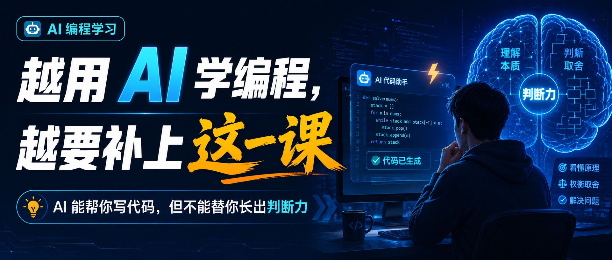

# 用 AI 学编程，重点已经不是让它写代码

## 发布定位

- 平台：微信公众号
- 账号：AI生命克劳德
- 系列：别把学习外包给 AI
- 篇序：02 / 编程篇
- 类型：Human3.0 方法论 / AI 编程学习 / 工程师能力模型
- 关联主题：AI 时代工程师新能力模型 / Prompt、Context、Harness
- 核心判断：AI 时代学编程，要从“学会写代码”升级到“学会定义任务、组织事实、设计验证闭环”。NotebookLM 适合搭资料底座，Claude Learning mode 适合做小步练习，真实项目和 Harness 负责验收。

## 采证结论

- 是否足够支撑写作：足够。
- 主要原因：Prompt / Context / Harness 能力模型已有明确的一手来源支撑；Claude Code 官方 Output styles 文档可支撑 Learning output style 的练习价值；NotebookLM 官方帮助可支撑资料底座、来源引用、学习指南、闪卡、测验和音频概览等学习用途；Anthropic AI 编程学习研究可支撑“直接委托代码会影响掌握度，解释、追问和概念问题更利于学习”的反向边界。

## 来源清单

1. Claude Code docs《Output styles》：<https://docs.claude.com/en/docs/claude-code/output-styles>  
   可用价值：Learning output style 会在编码过程中给出理解提示，并保留 `TODO(human)` 让用户完成关键小块。
2. Google NotebookLM Help《Learn about NotebookLM》：<https://support.google.com/notebooklm/answer/16164461>  
   可用价值：NotebookLM 基于用户上传来源工作，可生成学习指南、briefing、mind map、audio overview 等学习材料。
3. Google NotebookLM Help《Use chat in NotebookLM》：<https://support.google.com/notebooklm/answer/16179559>  
   可用价值：NotebookLM 回答基于来源并带引用，适合做编程资料问答和概念追踪。
4. Google NotebookLM Help《Add or discover new sources》：<https://support.google.com/notebooklm/answer/16215270>  
   可用价值：NotebookLM 支持导入 PDF、网页、YouTube 字幕、Google Docs/Slides、Markdown、音频等来源。
5. Anthropic《How AI assistance impacts the formation of coding skills》：<https://www.anthropic.com/research/AI-assistance-coding-skills>  
   可用价值：支撑“AI 学编程的关键在使用方式，不在是否使用 AI”。
6. Simon Willison《Not all AI-assisted programming is vibe coding》：<https://simonwillison.net/2025/Mar/19/vibe-coding/>  
   可用价值：支撑“vibe coding”和受控 AI 辅助编程的区别，强调 review、test、understand 的重要性。
7. OpenAI《Harness engineering: leveraging Codex in an agent-first world》：<https://openai.com/index/harness-engineering/>  
   可用价值：支撑“工程师价值上移到环境设计、反馈闭环和人类掌舵”。

## 关键事实

- Claude Code 的 Learning output style 不是只给解释，它会用 `TODO(human)` 等方式让用户亲自完成关键代码块，适合训练手感。
- NotebookLM 的优势是基于用户导入资料工作，并带引用。它更适合做资料底座、概念地图、学习指南、自测题和复习系统。
- NotebookLM 不是代码执行环境，不能替代真实项目里的运行、调试、测试和验收。
- Anthropic AI 编程学习研究提示，直接让 AI 代写代码的人掌握度更差；通过概念问题、解释和追问使用 AI 的人保留效果更好。
- vibe coding 代表了国外 AI 编程讨论里的一个传播母题：自然语言驱动代码生成降低了做出原型的门槛，但也放大了“不理解代码却继续接受输出”的风险。
- Prompt / Context / Harness 三层能力可以转化为学习路线：先学会定义任务，再学会组织项目事实，最后学会设计验证闭环。
- OpenAI Harness Engineering 的核心启发是：AI 负责执行后，人的价值会上移到任务定义、环境设计、反馈闭环和风险判断。

## 反向数据 / 限制条件

- 不能把 Claude Learning mode 理解成“打开一个模式就能学会编程”。如果用户跳过 `TODO(human)`，继续让 AI 补完答案，学习动作仍然被外包。
- NotebookLM 适合资料、引用、自测和复习，不适合替代 IDE、测试框架、调试器和代码审查。
- OpenAI / Anthropic 的 Harness 实践来自高能力团队和复杂工程环境，普通学习者应从最小项目、最小规则和最小验证开始，不需要一上来搭复杂系统。
- AI 编程学习的目标不能只看“代码能跑”，还要看学习者能不能复述设计、定位错误、迁移到相似任务。

## 立骨

### 一句话主旨

用 AI 学编程，最该补的能力已经不止某门语言语法，还包括 Prompt、Context、Harness 三层能力：把任务说清楚，把项目事实组织清楚，把 AI 执行过程验得住。

### 正文结构

1. 开场：很多人用 AI 学编程，学到最后只是更会让 AI 写代码。
2. 判断：AI 时代学编程的目标变了，从写代码能力扩展到组织 AI 编程系统的能力。
3. Prompt 学习法：用 AI 训练任务定义，而不是只要答案。
4. Context 学习法：用 NotebookLM 建资料底座和项目事实源。
5. 验证闭环：把 Harness Engineering 降维成个人学习闸门。
6. 7 天路线：从一个小项目练起 Prompt / Context / Harness。
7. 能力清单：读者要补哪些能力。
8. Human3.0 收束：AI 放大的是已经沉淀出来的系统能力。

## 标题备选

1. 用 AI 学编程，重点已经不是让它写代码
2. AI 时代学编程，真正要补的是这三层能力
3. NotebookLM + Claude：把 AI 变成你的编程训练系统
4. 程序员别只学 Prompt，要开始训练 Context 和 Harness
5. AI 会写代码以后，普通人该怎么学编程？
6. 用 AI 学编程的正确姿势：资料、练习、验收三件事
7. 想掌握 AI 编程，先补 Prompt、Context、Harness
8. Human3.0：别让 AI 替你学编程

## 推荐标题

用 AI 学编程，重点已经不是让它写代码



## 摘要

AI 时代学编程，要从“让 AI 写代码”升级到“训练自己定义任务、组织上下文、设计验证闭环”。NotebookLM 管资料，Claude Learning 管练习，真实项目和 Harness 管验收。

## 公众号正文

AI 学编程最危险的地方在于：它会让你在没有掌握的情况下，提前获得“我已经会了”的感觉。

一个 `POST /todos` 接口跑通了。

一个 React 页面显示出来了。

一个报错被 AI 修掉了。

一个小工具从目录结构到代码都生成好了。

你会很自然地产生一种判断：我好像正在快速学会编程。

但很多时候，真正发生的是另一件事：AI 完成了项目，你只是旁观了它完成项目。

国外这一轮 AI 编程讨论里，最火的词之一叫 vibe coding。

它描述的是一种很有诱惑力的状态：你不再一行行写代码，只要说出想法、接受 AI 的生成、继续描述下一步，软件就像被“对话”出来。

这个词能火，说明 AI 已经把“做出一个东西”的门槛打下来了。

它也放大了一个错觉：只要我能指挥 AI 写代码，我就算掌握了编程。

真正的问题会在下一次出现。

换一个需求，你不知道从哪里拆。

换一个报错，你不知道先看日志还是先看代码。

换一个项目结构，你不知道哪些文件能动，哪些文件不能动。

你知道怎么问 AI，却不知道怎么判断它写得对不对。你能复制一个 demo，却没法解释项目为什么这样拆。你能让 AI 修掉一个报错，却没有形成下一次自己定位问题的路径。

这就是“把学习外包给 AI”的典型症状：AI 完成了任务，你没有完成训练。

Anthropic 做过一项关于 AI 辅助编码和技能形成的研究，结论很适合放在这里：直接让 AI 代写代码，短期看起来顺，但对概念掌握和迁移能力并不友好；把 AI 用来解释、追问、拆解和反馈，学习保留效果更好。

所以这篇文章不会教你“怎么让 AI 更快替你写代码”。

读完以后，你应该能拿走三样东西：

第一，知道 AI 时代学编程到底要补哪些新能力。

第二，知道怎么把 NotebookLM、Claude Learning 和真实项目组合成一套训练系统。

第三，拿到一套 7 天就能开始执行的练习路线，用来判断自己到底是在掌握编程，还是只是在消费 AI 的答案。

AI 时代学编程，真正要补的不只是语法、框架、API。

更重要的是三层能力：

Prompt：把任务定义清楚。

Context：把项目事实组织清楚。

Harness：把执行过程验证清楚。

这三个词听起来像工程术语，放到学习里其实很具体。

Prompt 训练的是：你能不能把一个模糊需求拆成目标、范围、约束和验收。

Context 训练的是：你能不能让 AI 知道正确资料、项目背景、历史决策和常见坑。

Harness 训练的是：你能不能让 AI 在测试、日志、审查和复盘里工作，避免它自我宣布完成。

这才是 AI 时代学编程最值得补的新能力模型。

## 1. 先别急着学工具，先看清目标变了

过去学编程，很多人默认只问一个问题：我能不能自己写出代码。

这个问题仍然重要，但现在还要多问三个问题。

第一个问题：我能不能把需求拆到 AI 可以稳定执行？

第二个问题：我能不能给 AI 足够可信的资料和项目事实？

第三个问题：我能不能用测试、日志和复盘证明这次练习真的有效？

AI 时代的程序员新能力模型，可以先拆成三个词：Prompt、Context、Harness。

工程视角下，它回答的是：AI 时代合格工程师该补什么能力。

学习视角下，它回答的是：普通人怎么用 AI 学会编程。

如果 AI 只是替你交付代码，你会越来越依赖它。

如果 AI 被组织成训练系统，它才会逼你补上任务拆解、上下文组织和验证闭环。

这也是为什么我不建议把“学会 AI 编程”理解成“学会几个提示词”。

提示词只是入口。

真正决定你能不能长期变强的，是你有没有一套让 AI 反复训练你的流程。

## 2. Prompt：别问“帮我写”，要训练任务定义能力

很多人用 AI 学编程，第一句就是：

```text
帮我写一个 todo 新增接口。
```

这句话最大的问题，不在提示词技巧。

问题在于它没有训练你定义任务。

真实工程里，一个“todo 新增接口”至少要说清楚这些问题：

- 接口路径是什么？`POST /todos` 还是别的路径？
- 输入字段有哪些？`title` 是否必填？
- 成功时返回什么？失败时返回什么？
- 数据先存在内存、文件，还是数据库？
- 只改路由文件，还是要改服务层和测试？
- 怎么验证成功、空标题、重复提交这些情况？
- 哪些文件暂时不要动？

AI 可以帮你补，但第一轮必须你自己先尝试拆。

你可以这样练：

```text
我正在学习 Node.js 后端接口。
请不要直接写代码。

我先尝试把任务拆成：
1. 目标：新增 POST /todos 接口；
2. 范围：只改 routes/todos.js 和对应测试；
3. 约束：先使用内存数组，不接数据库，不引入新框架；
4. 验收：title 为空返回 400，正常创建返回 201，并能在列表接口查到。

请先 review 我的任务拆解，指出缺失的风险和验收项。
然后再给我一个最小练习，不要直接给完整实现。
```

这就是 Prompt 层的学习。

重点不在写出漂亮提示词，重点在训练自己把模糊任务拆成可执行规格。

你每这样练一次，都会比“帮我写代码”多长出一层能力。

因为你在训练的是需求理解、边界表达、验收设计。

这些能力会迁移到任何编程任务里。

## 3. Context：用 NotebookLM 搭一个编程资料底座

学编程最容易出现两个极端。

一个极端是资料太少，只靠 AI 临场回答。

另一个极端是资料太多，官方文档、教程、博客、视频、项目笔记混在一起，看起来很努力，实际没有结构。

NotebookLM 适合解决第二个问题。

它的定位是基于来源工作的资料系统，不承担代码执行环境的职责。你可以把官方文档、教程 PDF、网页、YouTube 视频字幕、Markdown 笔记、项目 README 放进去，然后让它基于这些来源回答问题并给引用。

如果你要学 Node.js 接口，不要只问：

```text
帮我总结 Express。
```

这个问题太大，得到的答案通常正确但空。

你可以这样问：

```text
请基于我上传的 Express 官方文档、课程笔记和项目 README，
整理出完成 POST /todos 新增接口必须掌握的 10 个概念。

每个概念请说明：
1. 它解决什么问题；
2. 初学者最容易误解什么；
3. 可以用什么 20 分钟练习验证；
4. 请附来源引用。
```

这时候 NotebookLM 才真的进入学习系统。

它帮你做三件事：

第一，把资料变成概念地图。

第二，把概念变成可练习任务。

第三，把学习过程变成可复习材料。

你还可以继续让它生成闪卡、测验、学习指南、音频概览。

但要记住它的边界：NotebookLM 不能替你跑代码，不能替你调试真实项目，也不能证明你真的会了。

它负责 Context 层。

真正的编码手感，还要回到 IDE、终端、测试和项目里。

## 4. Claude Learning：让 AI 留作业，不要替你交作业

Claude Code 的 Learning output style，很适合做编程学习里的练习层。

它的价值不止解释代码。

更重要的是，它会在过程中给理解提示，并保留 `TODO(human)` 这类需要你自己完成的小块。

这个细节很关键。

普通 AI 编程最容易发生的事，是模型把“思考、拆解、编码、调试、解释”一口气包完。你拿到的是完整答案，失去的是中间的判断训练。

Learning output style 反过来设计：AI 可以搭脚手架、给方向、提示关键概念，但战略性的小块要留给人完成。

这个设计对学习编程非常关键。

因为编程能力长出来，靠的不是看完整答案。

靠的是你自己写过那几个关键判断：

- 这个函数怎么拆？
- 这个条件应该放在哪里？
- 这个异常要不要抛？
- 这个测试怎么写？
- 这个错误怎么定位？

你可以这样要求 Claude：

```text
请用 Learning output style 带我完成一个最小练习。

主题：用 Node.js 写一个 POST /todos 新增接口。

规则：
1. 不要直接给完整代码；
2. 先说明这个练习训练什么能力；
3. 把任务拆成 3-5 个步骤；
4. 至少保留 2 个 TODO(human) 让我自己写；
5. 我写完后，你再 review；
6. 最后给我测试或手动验收标准。
```

这段 prompt 的关键，是让 AI 从交付答案，转向设计练习。

你可以让 AI 降低难度，但不能让它吃掉练习。

如果你每次都让 AI 直接补完 `TODO(human)`，Learning mode 也救不了你。

学习动作仍然被外包了。

## 5. Harness：真正掌握，要靠项目验收

很多人学编程时，会停在“我看懂了”。

但工程世界不承认“看懂了”。

工程世界只承认证据。

功能能不能跑？

测试能不能过？

换一个类似需求，你能不能自己改？

报错出现时，你能不能定位？

AI 生成的代码，你能不能说出风险？

这就是把 Harness Engineering 放到个人学习里的核心。

在 AI 工程里，Harness 指的是模型之外的整套支撑系统：规则、工具、权限、测试、评估、日志、反馈、任务拆解、人工确认节点。

OpenAI 在讨论 Codex 这类 agent-first 编程方式时，把 Harness Engineering 单独拿出来讲，原因很直接：模型越能干，系统外部的环境设计、反馈闭环和人工掌舵越重要。

放到团队里，这通常对应测试、评估、权限、日志、review、回滚和任务边界。

放到个人学习里，可以先做得很小。

你不需要一上来搭复杂平台。

比如你正在练 `POST /todos`。

没有 Harness 的做法是：让 AI 写完代码，你运行一下没报错，就觉得自己会了。

有 Harness 的做法是：先写 3 步计划，限定只改 `routes/todos.js`，要求至少验证成功创建和空标题两种情况，再让 AI review 边界条件。最后把这次踩过的点沉淀成一张“新增接口 checklist”。

这套动作很小，但它把“AI 写完了”变成了“我能证明自己会了”。

这也是国外很多 AI 编程实践文章反复提到的现实：代码生成变快以后，瓶颈很快会转移到上下文是否准确、测试是否覆盖、review 是否跟得上、维护成本是否失控。

学习者也一样。

你真正要练的是：少让 AI 多吐几屏代码，多让每一次输出进入可验证、可解释、可复盘的闭环。

你只需要给每个练习加 6 个小闸门：

| 闸门 | 学习问题 | 最小做法 |
| --- | --- | --- |
| Plan | 我知道自己要做什么吗 | 先写 3 步计划 |
| Scope | 我知道自己改哪里吗 | 限定文件和模块 |
| Test | 我知道怎么验证吗 | 至少一个测试或手动验收 |
| Explain | 我能解释为什么吗 | 用白话复述设计 |
| Review | 我能发现风险吗 | 让 AI review，但不直接改 |
| Asset | 我能沉淀下来吗 | 变成 checklist / prompt / demo |

这就是个人学习版的 Harness。

它会让你从“代码能跑”走向“能力能迁移”。

## 6. 一套 7 天训练路线

如果你想真正开始，别先定“我要学会编程”这种大目标。

选一个很小的项目。本文就用 `POST /todos` 这个 Node.js 接口做例子。

你也可以换成 Python 文件整理脚本、React todo 页面、SQL 查询练习，或者 Shell 自动化脚本。项目可以不同，但训练顺序不要乱。

然后按 7 天跑一轮。

第 1 天：建资料底座。

把 Express 官方文档、教程、项目 README、自己的问题清单放进 NotebookLM。让它整理概念地图、学习路径和错题清单。

第 2 天：训练 Prompt。

围绕 `POST /todos`，先自己写任务规格：目标、范围、输入、输出、约束、验收、风险。再让 AI review，不要直接写代码。

第 3 天：训练 Context。

让 AI 先判断它需要哪些资料、哪些文件、哪些限制。你补充资料，再让它复述计划。

第 4 天：进入 Claude Learning 练习。

要求它保留 `TODO(human)`，你亲手完成输入校验、返回结构或测试断言。完成后让它 review。

第 5 天：训练调试。

故意制造一个错误。先自己写猜测，再让 AI 帮你设计最小验证步骤。不要直接让它修。

第 6 天：做项目验收。

跑测试，写手动验收步骤，记录失败日志。让 AI 根据证据判断有没有遗漏。

第 7 天：沉淀自己的学习 Harness。

把这轮最有效的规则写成一页：

```md
## 我的 AI 编程学习规则

1. 问 AI 前先写自己的任务拆解。
2. 新概念先进入 NotebookLM 资料库。
3. 每次练习必须保留至少一个自己写的关键代码块。
4. 测试没跑，不算完成。
5. 每次错误都要沉淀成 checklist。
```

这 7 天跑完，你会明显感觉到区别。

你不再只是会问 AI。

你开始建立一套让自己持续变强的编程学习系统。

## 7. 读者到底要补哪些能力

把这篇文章收成一张能力清单，就是 9 项。

| 能力 | 对应层级 | 你要练什么 |
| --- | --- | --- |
| 任务澄清 | Prompt | 把一句需求拆成目标、范围、验收 |
| 边界表达 | Prompt | 说清哪些文件不能动、哪些风险要暂停 |
| 输出设计 | Prompt | 要求 AI 输出 diff、测试、风险说明 |
| 资料整理 | Context | 用 NotebookLM 建官方文档、笔记和项目资料库 |
| 引用核对 | Context | 不接受无来源总结，重要结论要能追到来源 |
| 上下文压缩 | Context | 用索引、摘要、问题树控制资料范围 |
| 小步练习 | Harness | 用 Claude Learning 保留关键代码块 |
| 验证设计 | Harness | 给每个练习配置测试、日志或手动验收 |
| 复盘沉淀 | Harness | 把错误变成 checklist、prompt、模板或 demo |

这张表比“我要不要学某个新框架”更重要。

框架会变。

工具会变。

模型也会变。

但这 9 项能力会迁移。

它们决定你停在消费 AI 答案，还是开始建设自己的编程能力系统。

## 8. 最后，别让 AI 替你长出编程手感

AI 当然可以帮你学编程，而且应该用。

它可以解释概念，整理资料，生成练习，陪你调试，帮你 review，提醒你复盘。

但编程手感不会从完整答案里自动长出来。

它来自你自己做过的判断，来自你自己写过的小块代码，来自你自己读过的报错，来自你自己跑过的测试。

也来自你把一次错误变成下一次 checklist 的过程。

这也是 Human3.0 里最重要的学习边界：工具可以更强，人的判断权、练习动作和资产沉淀不能交出去。

NotebookLM 可以帮你管资料，Claude Learning 可以帮你拆练习，真实项目和 Harness 可以帮你验收。

但方向要你定，判断要你做，关键小块要你亲手写，复盘要沉淀到自己的系统里。

用 AI 学编程，最重要的一句话是：

别让 AI 替你完成学习。

让 AI 训练你完成学习。

## 下一次练习，先问自己这三个问题

如果你想从今天开始，可以先选一个小项目，然后问自己三个问题：

```text
我能不能把任务拆成可执行规格？
我有没有一个可信资料底座？
我怎么证明自己真的会了？
```

下一篇我会继续拆“用 AI 学写作”：AI 可以帮你改结构、找反例、做诊断，但表达权和判断权必须留给自己。

## 朋友圈转发文案

这一篇写的是“别把学习外包给 AI”系列第二篇：用 AI 学编程。我的判断是，AI 时代学编程最该补的已经不止语法，还包括 Prompt、Context、Harness 三层能力：把任务定义清楚，把项目事实组织清楚，把执行过程验证清楚。NotebookLM 管资料，Claude Learning 管练习，真实项目和测试管验收。

## 公众号发布包

- 推荐标题：用 AI 学编程，重点已经不是让它写代码
- 摘要：AI 时代学编程，要从“让 AI 写代码”升级到“训练自己定义任务、组织上下文、设计验证闭环”。NotebookLM 管资料，Claude Learning 管练习，真实项目和 Harness 管验收。
- 封面文案：用 AI 学编程 / 别只让它写代码
- 标签：AI学习、AI编程、Claude、NotebookLM、Prompt工程、程序员、Human3
- 评论区引导：你现在用 AI 学编程时，最缺的是任务拆解、资料整理，还是验证闭环？

## 诊文结论

- 建议动作：补齐封面后发布。
- 主要原因：主线和系列开篇一致，且把 Prompt / Context / Harness 能力模型转成了“如何学习和训练这些能力”的公众号稿。文章已经从工具清单和普通编程教程里拉开距离，读者能拿走 7 天训练路线、9 项能力清单和具体 prompt。

## 仍需注意

1. 文章长度偏长，公众号可发；如果要改成小红书，需要另拆卡片。
2. 标题不宜过度焦虑化，建议保持“用 AI 学编程，重点已经不是让它写代码”。
3. 封面最好突出三层系统：NotebookLM / Claude Learning / Harness。

## 出刊检查

- 建议：补齐封面后发布。
- 阻塞项：
  - [ ] 最终标题需用户确认。
  - [ ] 公众号封面图需用户确认是否生成。
  - [ ] 是否进入 Human3.0 成书归档审查需用户确认。
- 不阻塞项：
  - 正文已完成。
  - 摘要、标签、朋友圈文案、评论区引导已完成。
  - 工程师能力模型已经转化为学习路线，正文可独立阅读。

## content_state

```yaml
content_state:
  project:
    name: "AI 学习主权系列"
    account: "AI生命克劳德"
    long_term_goal: "Human3.0"
  request:
    raw_intent: "从主题“如何利用AI来学习和掌握编程”和工程师新能力模型出发，走文昌完整内容流程，目标平台为微信公众号。"
    current_stage: "出刊"
    target_platforms:
      - "微信公众号"
  audience:
    primary: "想用 AI 学编程、希望补齐 AI 时代程序员新能力模型的普通学习者、初中级工程师和 AI 编程工具用户"
    pain_points:
      - "会让 AI 写代码，但不知道自己是否真的掌握"
      - "不知道 AI 时代程序员要补哪些新能力"
      - "缺少资料底座、练习系统和验收闭环"
  topic:
    series_name: "别把学习外包给 AI"
    selected_title: "用 AI 学编程，重点已经不是让它写代码"
    core_angle: "用 AI 学编程，要训练 Prompt、Context、Harness 三层能力。"
    long_term_value: "可沉淀为 Human3.0 的学习主权、结构杠杆和工程师能力模型资产。"
  research:
    confidence: "High"
    sources:
      - "Prompt / Context / Harness 工程师新能力模型"
      - "Claude Code Output styles"
      - "NotebookLM official help"
      - "Anthropic AI assistance coding skills study"
      - "Simon Willison on vibe coding and AI-assisted programming"
      - "OpenAI Harness Engineering"
    contrarian_points:
      - "NotebookLM 不是代码执行环境，不能替代测试和调试。"
      - "Claude Learning mode 也可能被用户跳过练习动作。"
      - "vibe coding 降低原型门槛，但不能等同于掌握编程。"
      - "复杂 Harness 不适合所有初学任务，应从最小项目开始。"
  draft:
    status: "公众号正文已完成"
    file: "ai_study/02-ai-programming-learning-engineer-model-wechat.md"
  diagnosis:
    recommendation: "补齐封面后发布"
    key_issues:
      - "最终标题待确认"
      - "公众号封面待生成"
      - "是否进入 Human3.0 成书归档待确认"
    edit_notes:
      - "已压缩重复的目标变化论述。"
      - "已重写开头钩子，用“掌握幻觉”承接 vibe coding 讨论。"
      - "已用 POST /todos 作为贯穿案例。"
      - "已补入国外 vibe coding 和 AI 编程技能形成讨论，提升信息密度。"
      - "已澄清 Harness Engineering 到个人学习验证闭环的转译关系。"
      - "已重写结尾，使 Human3.0 收束更贴近学习边界。"
  publish_assets:
    title: "用 AI 学编程，重点已经不是让它写代码"
    summary: "AI 时代学编程，要从“让 AI 写代码”升级到“训练自己定义任务、组织上下文、设计验证闭环”。NotebookLM 管资料，Claude Learning 管练习，真实项目和 Harness 管验收。"
    cover_text: "用 AI 学编程 / 别只让它写代码"
    tags:
      - "AI学习"
      - "AI编程"
      - "Claude"
      - "NotebookLM"
      - "Prompt工程"
      - "程序员"
      - "Human3"
    images: []
    share_copy: "AI 时代学编程最该补的已经不止语法，还包括 Prompt、Context、Harness 三层能力。"
    comment_prompt: "你现在用 AI 学编程时，最缺的是任务拆解、资料整理，还是验证闭环？"
  distribution:
    primary_platform: "微信公众号"
    secondary_platforms: []
  archive:
    should_review_for_book: true
    material_type: "Human3.0 方法论 / AI 编程学习 / 工程师能力模型"
    suggested_bucket: "Part 2 认知主权 / Part 3 结构杠杆"
  next_step:
    skill: "imagegen / human3-book-guardian"
    reason: "出刊后封面生成和成书归档属于用户判断节点。"
    user_decision_needed: true
  handoff:
    from_stage: "出刊"
    to_stage: "配图/归档"
    accepted_inputs:
      - "公众号正文"
      - "公众号发布包"
      - "content_state.publish_assets"
      - "Prompt / Context / Harness 能力模型"
    ignored_context:
      - "不适合本次公众号目标的知乎/小红书发布包"
    stop_condition: "需要用户确认最终标题、是否生成公众号封面、是否进入 Human3.0 成书归档。"
```
