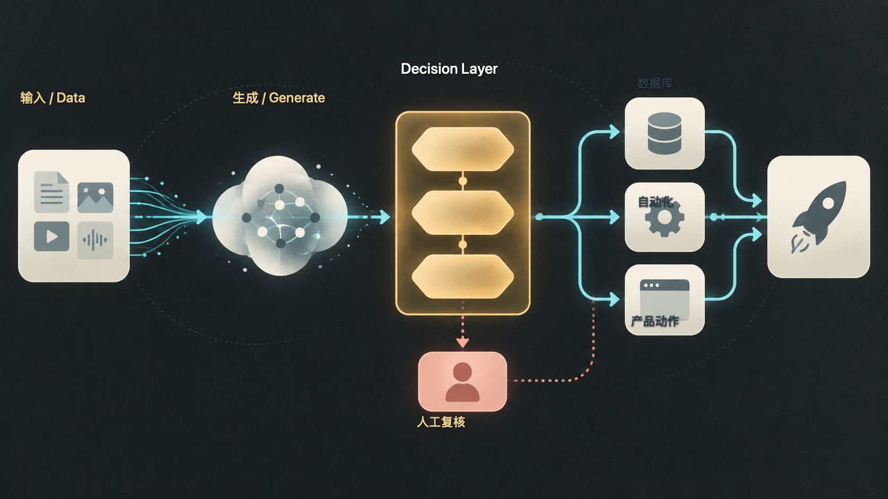
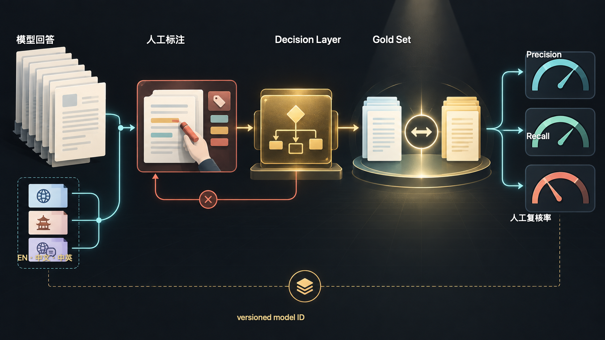

# Jev 到底在解决什么问题？AI 应用正在从“生成”走向“判断”

> Jev 实战指南 00｜引导篇

很多 AI 工作流看起来像这样：

```text
输入一段内容
      ↓
请模型分析
      ↓
生成一大段解释
      ↓
人再从里面找真正需要的答案
```

可你真正想知道的，常常只有一个判断：

```text
这是不是广告？
这个客户有没有购买意图？
这条回答是否通过审核？
品牌有没有被明确推荐？
这条线索要不要进入下一步？
```

如果最后只需要一个字段，为什么要先生成一篇小作文，再把它解析回数据库？

这就是我准备研究 Jev 的起点。

## 很多 AI 任务只需要一个可执行判断

过去，用 GPT 或 Claude 处理分类、评分、审核、路由很自然。写一段 Prompt，让模型返回 JSON，再接到程序里，几分钟就能跑起来。

当任务规模变大，问题会逐渐显现：输出可能比需要的多，字段描述需要持续维护，偶尔出现的格式变化会打断后续流程，解释文字也很难直接进入数据库、看板和自动化。

这些问题并不说明通用大模型没有价值。开放式理解、长文生成、研究和复杂推理，依然需要生成式模型。问题在于，软件真正消费的那一小段结果，能不能拥有更清晰的接口？

## Jev 把重点放在 Decision Layer

TypeSafe 官方把 Jev 定义为它的首个 System One model：输入一个 state，再提出 typed questions，模型直接返回结构化答案，供代码分支、排序或路由使用。[TypeSafe AI Introduction](https://docs.typesafe.ai/introduction)

可以先用这张图理解它在系统里的位置：



*图：生成模型之后增加 Decision Layer，再把结构化判断交给数据库、自动化、产品动作或人工复核。*

```text
用户 / 数据
    ↓
Generator：GPT / Claude
    ↓
文本回答、候选方案、研究结果
    ↓
Decision Layer：Jev / Judge / Rules
    ↓
结构化判断 + 概率信号
    ↓
数据库 / 自动化 / 产品动作
```

通用 LLM 更像一个会写报告的分析师。Jev 更像一个面对判断表的审核员：先把问题的答案空间写清楚，再返回一个软件可以直接读取的结果。

这里的关键变化不在于“输出 JSON”四个字。通用 LLM 也可以用 Structured Outputs 约束 JSON schema；Jev 的接口从问题类型、候选空间和概率信号开始设计，目标是让判断本身成为机器可用的对象。

## 三个原语，分别处理三种判断

官方文档目前把 Jev 的问题类型分成三类。[TypeSafe AI Primitives](https://docs.typesafe.ai/primitives)

| 问题类型 | 适合问什么 | 你可以怎么理解 |
| --- | --- | --- |
| Choice | 从固定选项中选一个 | “它属于哪一类？” |
| Score | 按有序 rubric 评分 | “它处于什么程度？” |
| Noul | 判断一个陈述为真的概率 | “这件事成立的可能性有多大？” |

Choice 返回选项、各选项概率和 confidence。Score 返回等级、概率分布和一个可能落在等级之间的加权分数。Noul 返回 0 到 1 的 yes 概率，没有另一个单独的 confidence 字段。[TypeSafe AI Choice](https://docs.typesafe.ai/primitives/choice)


*图：Choice 处理固定选项，Score 处理有序等级，Noul 返回 yes 概率。*

大纲里把这类问题概括成 Boolean。为了和官方命名保持一致，后续文章会用 Noul；在系统设计上，它确实可以承担一个带阈值的 Boolean gate。

这三个原语带来的一个提醒是：先写清楚判断空间，再决定调用模型。一个“这段回答好不好”的大问题，可能需要拆成事实是否完整、是否满足要求、语气是否合适几个独立问题，再由代码组合结果。

## Confidence 给系统留出“先别急着做”的位置

Jev 的 Choice 和 Score 会返回概率分布与 confidence。官方建议根据任务风险设置阈值：低风险场景可以自动继续，高风险或低置信度场景交给人工、补充信息或另一个模型。[TypeSafe AI Confidence](https://docs.typesafe.ai/confidence)

这不等于模型把正确率写在了结果里。概率校准描述的是一批预测的统计关系，不能保证某一次判断一定正确。真正的阈值要用自己的标注数据测出来。

因此，一个更可靠的流程会长这样：

```text
高置信度 → 代码继续执行
中等置信度 → 请求确认或进入抽样复核
低置信度 → 人工 / 通用 LLM / 重新提问
```

软件获得的能力，是把“不确定”也纳入流程。

## 我准备把它放进 China Clearly 的实验

假设我问某个模型：

> Best private China tour companies for American families

模型返回一段旅行建议。过去我可能需要人工逐条阅读，判断品牌有没有出现、是否真的被推荐、推荐力度如何、是否适合这个家庭。

如果只做几次，这样没有问题。要研究几十个问题、多个模型和多次重复，人工阅读就会变成主要成本。

我准备把这个任务拆成几种可标注的判断：



*图：先人工标注 gold set，再比较 Decision Layer 的判断与 precision、recall、人工复核率。*

```text
AI Response
      ↓
Jev Decision Layer
      ├── brand_mentioned
      ├── explicit_recommendation
      ├── recommendation_strength
      ├── traveler_fit
      └── reason_categories
      ↓
AI Visibility Dataset
```

这里有一个细节很重要：`reason` 不会直接让 Jev 写一段解释。更稳妥的实验设计，是把原因拆成预定义类别，例如行程匹配、家庭适配、价格、服务和可信度；需要自然语言说明时，再交给通用 LLM。

第一轮实验只回答几个朴素问题：

- 和人工 gold set 相比，Jev 的 precision、recall、F1 怎么样？
- 哪些样本最容易把“被提及”误判成“被推荐”？
- confidence 阈值提高后，人工复核率和漏判率如何变化？
- 一次判断的真实输入、用量和端到端成本是多少？

当前这部分属于 **PLAN/TARGET**：我还没有用 Jev 得出任何品牌排名、推荐结论或市场结论。

实验记录还要把语言和模型版本写清楚。China Clearly 的回答可能包含英文、中文或中英混合文本，不能默认英文样本上的结果可以直接迁移；`jev-latest` 也会随版本更新，复现实验时应保存响应里的版本化 model ID。

结果可能支持它，也可能暴露它不适合这个任务。两种结果都值得记录。

## Jev 适合什么，仍然要交给通用 LLM 什么

我会先用一个简单的分工规则：

```text
规则能解决的 → 先写代码
语义判断明确、答案空间有限 → 尝试 Jev
需要开放式理解、推理或生成 → 使用通用 LLM
高风险动作 → 保留人工确认
```

这条规则比“所有判断都交给一个 Judge”更实用。模型能给出结构化结果，系统仍然需要 rubric、阈值、gold set、fallback 和人工边界。

## 这个系列接下来会做什么

后续我会按一条实验路线推进：

1. 先拆清 Choice、Score、Noul 的问题边界。
2. 跑通一次最小 API 调用，保存原始输入和响应。
3. 用 rubric 设计一个可复核的判断任务。
4. 把 Jev 与 GPT Structured Outputs、规则和人工放进同一个 gold set。
5. 记录准确性、稳定性、用量、速度和人工复核率。
6. 把实验接到 AI Distribution 与 China Clearly 的真实分析任务。
7. 最后再讨论 Generator、Judge、Rules 和 Human 如何组合成可审计的系统。

这个系列真正想追的主题，可以先写成一句话：

> 当 AI 不再只负责生成内容，我们要怎样设计一个会判断、能复核、可回滚的 AI 系统？

下一篇从最基础的问题开始：Jev 的三个原语到底该怎么选？
