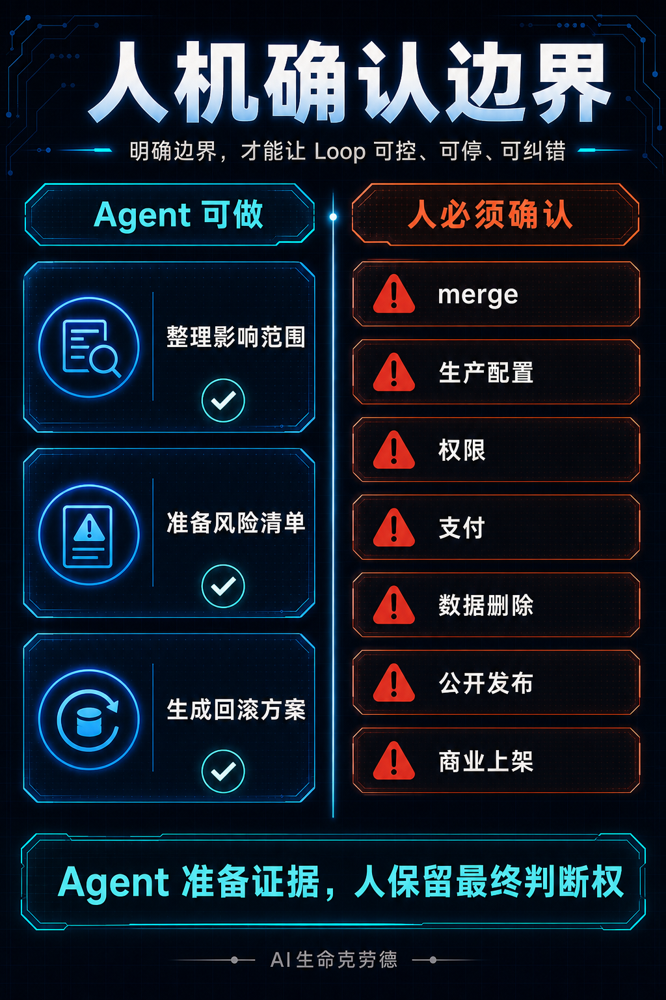

# AI Agent 自动化怎么防失控？一张 Loop 断路器清单

> Loop Engineering 从入门到进阶手册 · 风险控制篇

上一篇讲了怎么用 Codex 搭一个最小 CI 修复 Loop。

很多人看完以后，更担心另一个问题：

**跑起来以后，它会不会失控？**

比如你只是想让 Agent 修一个失败测试。

第一轮，它改了一个函数。

测试没过。

第二轮，它开始改测试预期。

第三轮，它顺手重构了半个 auth 模块。

第四轮，它告诉你“问题已经解决”，但你打开 diff 一看，发现它改了 12 个文件，还没解释为什么。

这才是做 Agent Loop 最容易踩的坑。

问题不在 Agent 写不出东西。更危险的是：它一直写、一直试、一直自我确认，直到你已经不知道这轮改动还能不能信。

所以这一篇只解决一个问题：

**AI Agent 自动化怎么防失控？**

你读完应该拿走三样东西：

- 10 个 Loop 断路器。
- 一个可以直接复制的 `TODO.md` 片段。
- 一套必须人工确认的风险动作清单。

这篇不讲企业级安全治理，也不讲复杂 Harness。目标很窄：帮个人开发者、内容创作者、小团队，把第一个 Agent Loop 管住。

> 【插图位 1：10 个 Loop 断路器总览图】

---

## 先让 Loop 学会停

很多人设计 Loop 时，第一反应是想让它更勤快：

- 多跑几轮。
- 多试几个方案。
- 多看一些文件。
- 多修几个问题。

这些方向都没错，但顺序要反过来。

第一个 Loop 最重要的能力，是及时停止。连续运行要排在后面。

一个没有停止规则的 Loop，本质上是把你的判断权交给了惯性。

它不会主动承认“我不该继续了”。它更可能继续补上下文、继续猜原因、继续扩大范围，直到 token 花掉、文件改乱、你开始重新人工排查。

好的 Loop 至少要回答四个问题：

- 什么情况下继续？
- 什么情况下停止？
- 什么情况下回滚？
- 什么情况下交给人？

这四个问题写不清，先不要上自动化。

---

## 失控通常从小目标开始

Loop 失控很少一开始就长得很危险。

它通常从一个很小、很合理的任务开始：

```text
修复 login.test.ts 中 Expected 401, received 500 的失败测试。
```

这个目标看起来没问题。

真正的问题出在后面：

- 没有写清只能改哪些文件。
- 没有写清测试不能随便改。
- 没有写清连续失败几次必须停。
- 没有写清涉及权限、支付、生产配置时必须交给人。
- 没有记录每一轮到底做了什么。

于是 Agent 的行为会慢慢变形。

它先修函数，失败后改测试，再失败后改调用链，最后把一个失败测试变成一场局部重构。

你以为自己在跑一个修复 Loop，实际得到的是一个不断扩大范围的改动机器。

所以断路器的价值，不在于让 Agent 变聪明。

它的价值是把“不能继续”的条件写进系统。

---

## 断路器 1：目标写不成清单，就停

**触发信号：**

你的目标只能写成这种话：

```text
优化一下项目。
让系统更稳定。
修一下 auth 模块。
把这块做得更优雅。
```

**立刻动作：**

停止进入 Loop，先改成一次性 Planner。

让 Agent 只做一件事：把目标拆成 checklist。

**为什么：**

Loop 需要可验收目标。目标无法验收，后面的 Maker 和 Checker 都会失去依据。

一个能进入 Loop 的目标，至少要长这样：

```text
修复 test/auth/login.test.ts 中 Expected 401, received 500 的问题。
只允许修改 auth handler 相关文件。
修复后运行 npm test -- test/auth/login.test.ts。
```

**最小提示词：**

```text
先不要修改文件。
请把这个任务拆成可验收 checklist。
如果无法写出成功标准，请说明为什么不适合进入 Loop。
```

---

## 断路器 2：没有外部反馈，就停

**触发信号：**

Loop 的结果只能靠 Agent 自己判断：

```text
我觉得修好了。
代码看起来没问题。
这版应该更合理。
```

**立刻动作：**

停止修复，只做分析或人工确认。

**为什么：**

没有测试、日志、diff、评分表、用户确认这些外部反馈，Loop 很容易变成自我确认。

代码任务最好有测试、lint、type check 或构建结果。

内容任务至少要有评分表、读者获得感、事实来源和发布检查。

学习复盘任务至少要有来源记录、概念表和行动清单。

**最小提示词：**

```text
在继续前，请列出本任务的外部反馈信号。
如果没有测试、日志、评分表或用户确认方式，只输出分析，不进入执行。
```

---

## 断路器 3：第一轮想直接写文件，就停

**触发信号：**

你刚给任务，Agent 第一轮就准备改文件。

**立刻动作：**

改成只读侦察。

**为什么：**

第一轮最重要的是判断问题适不适合交给 Loop，而不是急着修。

第 5 篇 CI 修复实战里，我建议第一轮只让 Codex 读取 `AGENTS.md`、`TODO.md` 和测试输出，输出五件事：

- 失败信号。
- 相关文件。
- 推荐修复范围。
- 验收命令。
- 是否适合进入修复 Loop。

这一步做完，再决定是否让 Maker 进入写入阶段。

**最小提示词：**

```text
你是 Read-only Scout。
只读取文件和日志，不修改文件。
请输出失败信号、相关文件、推荐修复范围、验收命令，以及是否适合进入下一轮。
```

---

## 断路器 4：同类失败连续 2 次，就停

**触发信号：**

同一个测试、同一个构建错误、同一个检查项连续失败 2 次。

**立刻动作：**

停止重试，写失败报告。

**为什么：**

连续失败通常说明当前策略不对。

继续让 Agent 原地重试，很容易消耗 token，却没有新的信息增量。

失败报告至少写三件事：

- 试过什么。
- 为什么失败。
- 下一步需要人判断什么。

**最小提示词：**

```text
如果同一个验收项连续失败 2 次，请停止。
不要继续尝试第三次。
请写出失败报告：已尝试动作、失败现象、可能原因、需要人工判断的问题。
```

---

## 断路器 5：超过时间预算，就停

**触发信号：**

单次运行超过预设时间，例如 30 分钟。

**立刻动作：**

停止执行，摘要当前状态。

**为什么：**

Agent 卡住时，常见表现未必是报错，更多是继续搜索、继续解释、继续补材料。

时间预算可以强迫 Loop 交接。

它不一定解决问题，但至少让人能接手。

**最小提示词：**

```text
本轮最大运行时间 30 分钟。
达到预算后停止执行。
请输出当前状态、已完成动作、未完成事项、建议下一步。
```

---

## 断路器 6：范围从单文件扩大到多模块，就停

**触发信号：**

任务原本只涉及一个测试或一个文件，但 Agent 开始修改多个模块。

**立刻动作：**

停止，等待用户确认。

**为什么：**

很多失控并非源于错误代码，常常源于“顺手重构”。

Agent 可能觉得顺手调整调用链、封装公共函数、修改旁路逻辑会更合理，但这些动作会把一个小修复变成大改动。

第一个 Loop 的原则应该非常窄：

- 一个失败信号。
- 一个修复范围。
- 一个验收命令。

**最小提示词：**

```text
只允许修改与失败信号直接相关的文件。
如果需要扩大到其他模块，请停止并列出原因，等待人工确认。
```

---

## 断路器 7：需要改测试才能通过，就停

**触发信号：**

Agent 准备修改测试预期、删除测试、跳过测试，或者降低检查标准。

**立刻动作：**

停止，要求人工确认。

**为什么：**

修复失败和迎合测试结果是两件事。

如果测试本身错了，当然可以改测试。但这个判断不能由 Maker 自己做。

至少要经过 Checker 或用户确认。

**最小提示词：**

```text
不要修改测试预期、删除测试或跳过测试。
如果你判断测试本身错误，请停止并说明理由，等待人工确认。
```

---

## 断路器 8：碰到权限、支付、数据、生产配置，就停

**触发信号：**

任务涉及这些动作：

- 权限变更。
- 支付或账单。
- 数据删除或批量改写。
- 生产配置。
- 对外发送消息。
- 公开发布。
- 商业上架。

**立刻动作：**

停止执行，输出风险清单和人工确认卡。

**为什么：**

这些动作的风险不只在代码层面。

它们会影响用户、账号、资产、收入、合规或外部声誉。

Agent 可以准备证据，可以整理方案，可以生成回滚清单，但最终判断必须留给人。

**最小提示词：**

```text
遇到权限、支付、数据删除、生产配置、公开发布、商业上架相关动作时，停止执行。
只输出风险清单、影响范围、回滚方案和需要人工确认的问题。
```

---

## 断路器 9：状态文件和真实 diff 对不上，就停

**触发信号：**

`TODO.md` 里写着只改了 A 文件，但 `git diff` 显示还改了 B、C、D。

或者状态文件记录测试已通过，但没有对应命令输出。

**立刻动作：**

停止，重新对账。

**为什么：**

Loop 的状态不能只靠聊天上下文。

上下文会丢，任务会中断，Agent 也可能忘记上一轮为什么这样判断。

状态文件和真实 diff 对不上，说明这个 Loop 已经失去可交接性。

**最小提示词：**

```text
请对照 TODO.md、运行日志和 git diff。
如果状态记录与真实变更不一致，请停止，不要继续修改。
先输出差异清单和需要修正的状态项。
```

---

## 断路器 10：成本超过预算，就停

**触发信号：**

token、时间、API 调用次数或人工 review 成本超过预算。

**立刻动作：**

停止，缩小任务。

**为什么：**

Loop 的成本增长通常很隐蔽。

一次 Maker，一次 Checker，失败后再重复两轮，看起来只是“小修复”，实际已经变成一串调用。

第 5 篇里我提到过，本地一次多文件烟测，只读侦察、Maker、Checker 三步都可能出现不小的 token 消耗。

所以成本预算必须写进 state file。

**最小提示词：**

```text
本轮最大轮次 3 次，最大时间 30 分钟。
超过预算后停止。
请输出当前状态、成本消耗原因、是否值得继续。
```

---

## 第一版 TODO.md 可以这样写

> 【插图位 2：TODO.md 状态文件结构图】

如果你只想先跑一个最小 Loop，可以直接从这段开始。

```markdown
# TODO.md - Agent Loop 状态

## Goal
- [ ] 处理一个有明确反馈信号的小任务
- [ ] 只允许处理当前目标
- [ ] 不做无关重构
- [ ] 如果失败，记录尝试过程和阻塞原因

## Budget
- 最大轮次：3
- 同类失败上限：2
- 单次运行时长：30 分钟
- 最大修改范围：与当前失败信号直接相关的文件

## Feedback
- 验收命令：
- 预期结果：
- 人工验收点：

## Current Attempt
- Issue:
- Allowed files:
- Last command:
- Last result:
- Next action:

## Stop Rules
- [ ] 目标无法写成 checklist
- [ ] 没有外部反馈信号
- [ ] 第一轮需要直接写文件
- [ ] 同类失败连续 2 次
- [ ] 超过时间或 token 预算
- [ ] 修改范围扩大
- [ ] 需要修改测试预期
- [ ] 涉及权限、支付、数据删除、生产配置、公开发布或商业上架
- [ ] TODO.md 与真实 diff 不一致

## Log
| 轮次 | 动作 | 结果 | 下一步 |
|---|---|---|---|
| 1 | | | |
```

这份 `TODO.md` 的重点不是好看。

它的作用是把 Loop 的状态放到模型外面，让人能接手、能复盘、能停止。

---

## 人工确认清单

> 【插图 3：Agent 与人的确认边界图】
>
> 

下面这些动作，不建议交给 Agent 自行决定：

- merge。
- 生产配置变更。
- 权限变更。
- 支付、账单或额度变更。
- 数据删除或批量改写。
- 公开发布。
- 商业上架。
- 对外发送邮件、消息或通知。
- 扩大到计划外目录、仓库或账号。

Agent 可以做三件事：

- 整理影响范围。
- 准备风险清单。
- 生成回滚方案。

最终是否执行，交给人。

这条边界越早写清楚，后面越少返工。

---

## 第一周先低频运行

如果你准备把一个 Loop 放进真实工作流，我建议第一周只做三件事：

第一，低频运行。

每天一次，比每小时一次更适合起步。

第二，只读优先。

先让 Agent 做侦察和排序，观察它找问题的质量，再决定是否开放写入。

第三，复盘状态文件。

每轮结束后看 `TODO.md`：

- 它有没有记录真实动作？
- 它有没有写清失败原因？
- 它有没有触发本该停止的规则？
- 它有没有产生可复用模板？

如果连续几轮都没有价值，就停掉。

Loop 的目的不在于让系统更忙，重点是让人的判断更省力、更可追溯。

---

## 最后

AI Agent 自动化最容易被低估的能力，是停止。执行反而更容易被看到。

能停，才有机会纠错。

能停，才有机会交接。

能停，人才保留最终判断权。

如果你正在搭第一个 Agent Loop，先不要追求复杂编排。

先把这 10 个断路器写进 `TODO.md`。

等它能稳定地停下来，再让它跑得更远。

如果你想看后续版本，可以在评论区告诉我：

1. 你最担心哪种失控：成本、权限、范围、测试，还是上下文污染？
2. 你想看 Codex、Claude Code、Cursor，还是内容生产 Loop 的断路器版本？
3. 你希望我把哪类任务做成完整案例？
