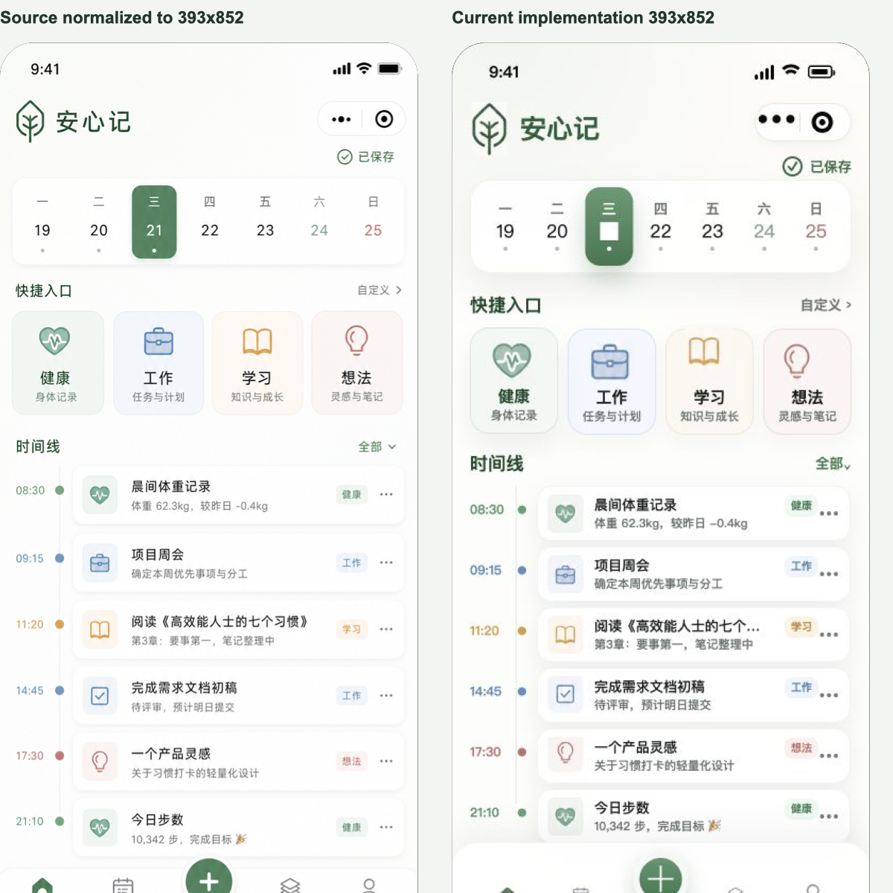
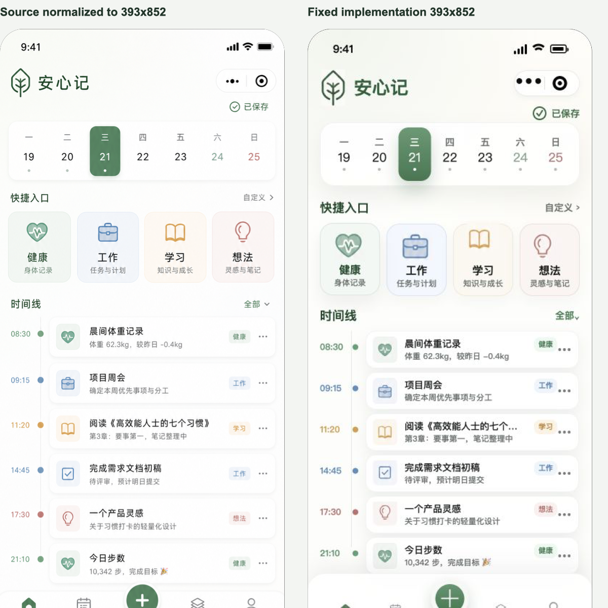
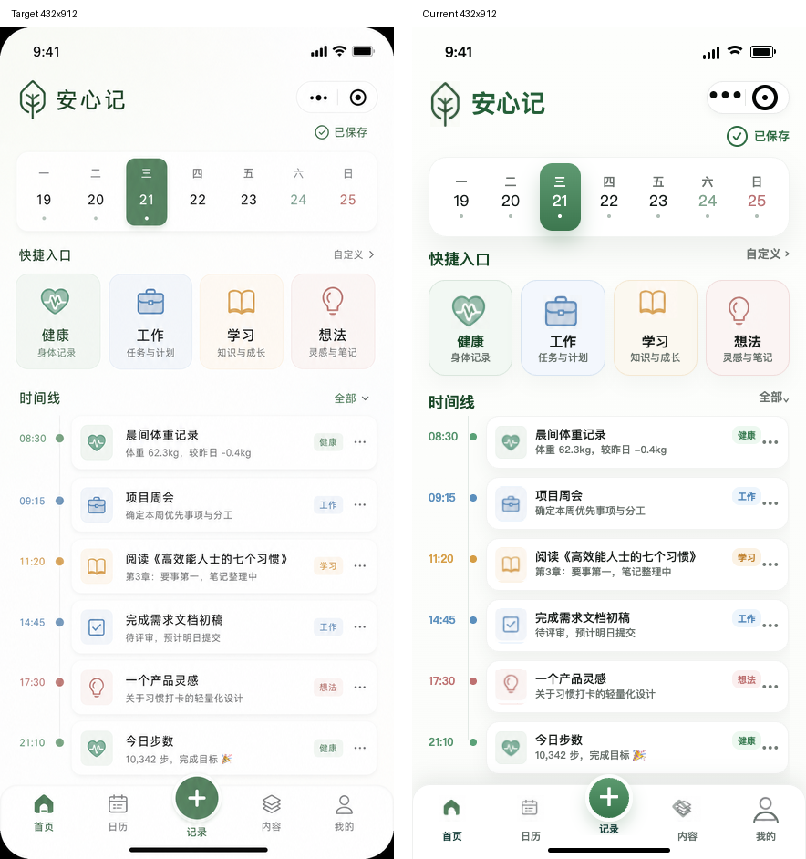

# Loop Engineering 从入门到进阶手册

副标题：从 Prompt 到可控循环：AI Agent 自动化的结构、模式与实战模板

作者：AI生命克劳德

版本：公开版 v1.1

---

## 版权说明

本书由作者原创文章整理、扩写和重组而成。部分基础内容曾发布在作者本人内容账号。除本次投稿或发布平台协议约定的必要授权外，作者保留完整版权，未经作者书面许可，第三方不得进行商业电子出版或再授权。

书中插图由作者自制，或经 AI 辅助生成后由作者二次编辑；未使用第三方受版权保护素材，图像版权和使用责任由作者承担。

本书关注 AI Agent 自动化的结构设计、反馈闭环和实践边界。书中涉及的工具能力会随版本变化，具体命令以当前工具帮助、官方文档和本地验证结果为准。

本书不鼓励读者把高风险操作交给无人值守系统。涉及生产配置、权限、支付、数据删除、合并代码、公开发布和商业上架的动作，都应保留人工确认。

---

## 目录

- 前言：为什么需要一本 Loop Engineering 手册
- 使用指南：读完之后你应该能做什么
- 第一部分：为什么需要 Loop Engineering
  - 第 1 章：从提示词到循环系统
  - 第 2 章：Loop 到底是什么
- 第二部分：Loop 的结构和模式
  - 第 3 章：六块积木：一个 Loop 靠什么跑起来
  - 第 4 章：五种 Loop 模式：不同任务怎么选
  - 第 5 章：三角色闭环：谁规划、谁生成、谁验收
- 第三部分：辅助工具：把任务做成 Loop
  - 第 6 章：loop-builder：把模糊任务变成受控 Loop
- 第四部分：两种真实实践：CI 自动修复与 UI 精准复刻
  - 第 7 章：两种真实实践：CI 自动修复与 UI 精准复刻
- 第五部分：风险、个人系统与进阶
  - 第 8 章：失败案例：Loop 最容易在哪里失控
  - 第 9 章：从工具使用者到系统设计者
  - 第 10 章：从 Codex Loop 到 Agent Harness
- 附录 A：Loop Engineering 模板包
- 附录 B：术语表
- 附录 C：事实边界和使用建议

---

## 前言：为什么需要一本 Loop Engineering 手册

很多人学习 AI 编程，第一反应是研究提示词。

这条路没有错。清楚的任务描述、完整的上下文、明确的验收标准，确实会显著提高模型输出质量。一个写得好的 prompt，可以让 Agent 少走很多弯路，也能减少你反复解释需求的成本。

但真实工作很快会超过单条 prompt 的承载范围。

你会遇到这样的情况：今天让 Agent 修一个 bug，它能理解；明天换一个上下文，它又从零开始。你把项目结构、测试命令、禁区文件解释了一遍又一遍，最后发现自己成了调度器。Agent 看起来在工作，真正承担连续性的人仍然是你。

还有一种更隐蔽的情况：Agent 每次输出都很完整，语气也很自信，但结果没有被外部验证。它说测试通过了，你还要去看命令是否真的运行。它说问题修好了，你还要检查有没有顺手改测试预期。它说没有风险，你还要看 diff 里有没有权限、支付、生产配置相关改动。

当任务只发生一次，这些问题还能靠人工盯住。

当任务要每天运行、每周运行、跨多个轮次运行，单靠提示词就不够了。

你需要的是一个循环系统。

这个系统至少要回答六个问题：

- 目标是什么？
- 当前状态在哪里？
- 谁负责执行？
- 谁负责验收？
- 用什么反馈判断成败？
- 什么时候必须停下来交给人？

这就是本书讨论的 Loop Engineering。

Loop Engineering 不是把 Agent 放出去自由发挥，也不是把 cron job 换成大模型。它更像一种工程组织方式：把目标、状态、工具、反馈、停止规则和人的判断边界组合起来，让 Agent 在可观察、可纠错、可交接的范围内持续做事。

本书的目标很具体。

读完之后，你应该能判断一个任务是否适合做成 Loop，能设计一个最小可运行的 Loop，也能用 Codex CLI 跑通一个 CI 自动修复样板。你还应该知道哪些事情不该自动化，哪些节点必须保留人工确认，以及怎样把一次 AI 协作沉淀成长期可复用的数字生产资料。

本书适合四类读者。

第一类是开发者。你已经在用 Codex、Claude Code、Cursor 或类似工具写代码，但希望把它们从一次性助手升级成可控工作流。

第二类是技术管理者。你关心团队如何把 AI Agent 用在真实项目里，又不希望自动化放大风险。

第三类是产品人和内容创作者。你不一定每天写代码，但你也会面对选题、研究、写作、复盘、发布这些可循环任务。

第四类是个人系统建设者。你关心的不只是某个工具，而是怎样把 AI 协作经验沉淀成模板、清单、流程和长期资产。

本书也不适合所有人。

如果你只想找几个万能提示词，本书会显得偏工程化。如果你期待一个无人值守的自动程序员，本书会显得谨慎。如果你还没有一个可验证的小任务，建议先不要急着搭 Loop，先把目标和验收标准写清楚。

本书的主实操路径使用 Codex CLI。Claude Code、Cursor、自建 Agent Harness 会作为扩展方向讨论，但不会混入 Codex 实操命令。原因很简单：工具不同，命令不同，权限边界不同。一本入门手册最重要的是让读者跑通一条可靠路径，而不是把所有工具能力混成一个模糊大包。

最后要强调一点：Loop Engineering 的价值，不在于让 AI 替人做所有决定。它的价值在于把重复任务、工具调用、反馈机制和判断边界组织成系统，让人的注意力从反复调度中释放出来，回到目标判断、风险判断和最终责任上。

---

## 使用指南：读完之后你应该能做什么

这本书可以按三条路线阅读。

| 读者类型 | 推荐路径 | 目标 |
|---|---|---|
| 想建立概念 | 前言 -> 第 1 章 -> 第 2 章 -> 第 9 章 | 理解 Loop Engineering 的意义 |
| 想设计系统 | 第 2 章 -> 第 3 章 -> 第 4 章 -> 第 5 章 | 掌握结构、模式和角色分工 |
| 想动手实践 | 第 6 章 -> 第 7 章 -> 附录 A | 设计并跑通一个带外部反馈的最小 Loop |

如果你只想快速上手，可以先读第 6 章和第 7 章。但更稳的做法，是至少先读第 2 章和第 5 章。第 2 章让你知道什么是合格 Loop，第 5 章让你知道为什么不能让 Agent 自己生成又自己验收。

阅读时建议带着一个真实任务。

这个任务最好满足三个条件：

- 它重复出现。
- 它有外部反馈。
- 它失败后不会造成严重损失。

例如：

- 每天检查一个项目的失败测试。
- 每周整理一次 issue。
- 定期检查文章里的断链。
- 自动生成周报初稿，再由人审核。
- 检查小型仓库里的 lint 或类型错误。

不要用第一个 Loop 处理支付、权限、生产配置、数据删除、自动部署、商业发布这类高风险任务。它们可以进入 Human-in-the-Loop 模式，但不适合新手直接放给 Agent 连续执行。

读完本书后，你应该能拿到四类能力。

第一，判断能力。你能判断一个任务适合 prompt、workflow、agent 还是 loop，不会为了追赶新概念而把简单任务复杂化。

第二，设计能力。你能把一个循环拆成目标、状态、执行、反馈、停止规则和人工边界。

第三，验收能力。你能区分 Maker、Checker、Evaluator 的职责，知道怎样降低 Agent 自我确认带来的风险。

第四，沉淀能力。你能把一次任务中的规则、模板、失败经验写进 AGENTS.md、TODO.md、Skill、检查清单和复盘文档里，让下一轮协作更稳。

本书里会反复出现一个原则：

先跑通最小闭环，再提高自动化程度。

一个能稳定运行的小 Loop，比一个口号很大但无法验收的自动化系统更有价值。

---

# 第一部分：为什么需要 Loop Engineering

## 第 1 章：从提示词到循环系统

AI 编程的第一阶段，是提示词。

你告诉模型：“帮我写一个函数”“帮我修这个 bug”“帮我解释这段代码”。模型给出结果，你检查，满意就用，不满意就继续追问。

这个阶段的问题很清楚：效率提高了，但人仍然是每一轮的调度器。

你要不断补上下文、解释约束、检查结果、指出问题。Agent 像一个很强的执行者，但每一步都要你推一下。

这在短任务里没问题。

写一个正则表达式、解释一个报错、改一段文案、生成一个小函数，这些任务本来就适合 prompt。它们目标短、上下文少、验收快。你不需要为它们搭系统。

问题出现在任务变长以后。

### 场景一：反复修同一类 CI 问题

一个项目每周都会出现几个小型 CI 失败。可能是 lint，也可能是类型检查，也可能是单测里某个边界条件没有处理。

你每次都把失败日志贴给 Agent，让它分析、修复、跑测试、解释结果。

第一次这样做很省时间。

第十次这样做，你会发现自己在重复同一组动作：

- 粘贴失败日志。
- 解释项目结构。
- 提醒不要改测试预期。
- 提醒只做最小修复。
- 让它运行指定测试。
- 检查 diff 是否越界。
- 写 PR 摘要。

这些动作不是创意工作，它们是可结构化的工作流。继续靠 prompt 调度，人的注意力会被浪费在重复解释上。

更好的做法，是把这些步骤写成一个 CI 修复 Loop：它读取失败信号，挑一个小问题，按规则修复，独立验收，失败就停止并写报告。

### 场景二：内容生产里的周期性研究

内容创作者也会遇到类似问题。

你每周要观察一个领域里的新趋势，筛选选题，判断哪些适合公众号，哪些适合小红书，哪些适合知乎。每次都临时问模型“最近有什么热点”，很容易得到一堆泛泛结果。

更稳的方式，是把流程拆成循环：

- 固定收集来源。
- 去重和归类。
- 判断平台适配度。
- 记录来源和可信度。
- 生成候选选题。
- 人最终选择。

这里的关键，是让 AI 持续整理信息，帮你维护一个可审阅的选题池，最终选题仍由人决定。

这也是 Loop。

### 场景三：项目维护里的长期记忆

很多项目不是一次写完的。

你今天修一个接口，明天补一条测试，后天整理一份文档。Agent 如果只靠聊天上下文，很难知道上一轮做过什么、为什么停下、哪个问题还没有解决。

于是你会反复解释：

- 上次修到哪里。
- 哪个方案已经试过。
- 哪个文件不能碰。
- 哪个测试还没有通过。

这些状态不应该只留在聊天里。

它们应该写进模型外部：TODO.md、issue、任务表、数据库、项目日志。Loop 每一轮都先读状态，再更新状态。这样即使会话中断，人和 Agent 都能接上。

### 场景四：高风险任务需要人做判断

有些任务可以让 Agent 执行，但不能让它决定。

例如权限系统、支付流程、生产配置、数据删除、公开发布、商业上架。Agent 可以帮你整理方案、查影响面、准备 diff、写检查清单，但关键节点必须停下来。

这类任务如果只靠 prompt，容易出现两种极端。

一种是你全程手动盯着，自动化价值很低。

另一种是 Agent 一路跑到底，风险被放大。

Loop Engineering 提供了第三种处理方式：把人工确认节点写进系统。Agent 走到高风险动作时必须停止，输出需要人判断的信息。人确认后，系统再继续有限执行。

### 一个实用判断：任务到底该放在哪一层

很多人会卡在一个问题上：我现在遇到的任务，到底应该继续写 prompt，还是应该沉淀 context，或者直接搭 Loop？

可以用下面四个问题判断。

第一个问题：这件事会不会重复出现？

如果答案是否定的，通常先用 prompt。一次性任务不值得搭系统。比如解释一个陌生报错、改一段邮件、临时生成一份会议纪要，prompt 足够。

第二个问题：每次做这件事时，你是不是都要重复解释同一组背景？

如果答案是肯定的，说明你缺 context。此时不要急着做 Loop，先把稳定背景写下来。例如项目规则、术语解释、接口约定、测试命令、禁区文件。很多“Agent 不懂我”的问题，本质上是上下文没有资产化。

第三个问题：这件事是否需要真实工具和真实反馈？

如果答案是肯定的，你开始需要 Harness。Agent 不能只在聊天框里想象结果，它要能读文件、跑测试、看日志、查 diff、调用工具。Harness 的价值，是把模型接到真实环境里，同时限制它能做什么。

第四个问题：这件事是否需要跨轮次持续推进？

如果答案是肯定的，才进入 Loop。Loop 关心的不只是这一轮结果，还关心下一轮从哪里开始，失败如何记录，何时停止，何时交给人。

用一个内容生产例子看：

- 让 AI 帮你改一个标题：Prompt。
- 让 AI 每次都知道你的账号定位和禁用表达：Context。
- 让 AI 能读取素材库、历史文章、平台规则：Harness。
- 让 AI 每周自动收集选题、去重、打分、等待你选择：Loop。

用一个代码维护例子看：

- 让 AI 解释一个报错：Prompt。
- 让 AI 了解项目测试命令和代码规范：Context。
- 让 AI 能读仓库、运行测试、查看 diff：Harness。
- 让 AI 定期扫描失败 CI、选择小问题、修复、验收、记录：Loop。

这个判断很重要。过早做 Loop 会增加复杂度，过晚做 Loop 会让人长期充当调度器。好的工程判断，是把任务放在刚好够用的层级。

### Prompt、Context、Harness、Loop 的四层演进

把这些场景放在一起，可以看到 AI 协作的四层演进。

| 层级 | 人主要做什么 | 系统解决什么 | 典型产物 |
|---|---|---|---|
| Prompt | 写清单轮任务 | 让模型完成一次回答 | 一段提示词 |
| Context | 提供项目背景 | 减少每轮重复解释 | AGENTS.md、项目说明 |
| Harness | 组织工具和规则 | 让模型能调用真实环境 | 工具权限、任务队列、检查器 |
| Loop | 设计反馈闭环 | 让系统持续做事并受控停止 | 状态文件、调度器、停止规则 |


图注：从一次性 Prompt，到稳定 Context，再到连接真实工具的 Harness，最后进入可反馈、可停止、可交接的 Loop。

这四层不是替代关系。一个好的 Loop 仍然需要清楚的 Prompt，也需要稳定的 Context，还需要 Harness 承载工具和规则。

关键变化在于：人的工作重心上移了。

你不再只问“这句话怎么写得更好”，还要问：

- 这个任务是否值得循环？
- 每一轮怎么判断成功？
- 哪些状态必须写在模型外？
- 谁来生成，谁来验收？
- 失败几次必须停？
- 哪些动作永远需要人确认？

### 什么时候继续用 prompt

并非所有任务都值得做成 Loop。

如果任务满足下面这些条件，继续用 prompt 就够了：

- 一次性完成。
- 上下文很少。
- 成败容易人工判断。
- 失败成本很低。
- 不需要跨轮次记忆。

例如解释代码、改一段文案、生成一个 SQL 草稿、补一个小脚本，都可以先用 prompt。

把这些任务硬做成 Loop，会增加流程成本。

### 什么时候值得上 Loop

当任务具备下面几个特征时，就值得考虑 Loop：

- 重复出现。
- 每轮有相似步骤。
- 有明确反馈信号。
- 需要跨轮次保存状态。
- 人工调度成本开始变高。
- 失败后需要可追溯记录。

例如 CI 修复、依赖巡检、内容选题池维护、文档链接检查、issue 分类、每周项目健康报告，都适合从最小 Loop 开始。

### 本章行动清单

- 找一个你反复让 AI 做的任务。
- 写出它当前依赖你手动调度的步骤。
- 标出哪些步骤可以自动执行，哪些步骤必须人工确认。
- 判断它现在处于 Prompt、Context、Harness、Loop 哪一层。
- 如果它没有外部反馈，先不要做 Loop。

---

## 第 2 章：Loop 到底是什么

一个 Loop 不是简单重复。

如果你只是每小时让 Agent 运行同一句提示词，那更像定时任务。它可能省一点手工操作，但没有真正的反馈闭环。

一个可控 Loop 至少包含六个要素。

| 要素 | 作用 | 缺失后的问题 |
|---|---|---|
| 目标 | 定义要解决什么 | Agent 容易发散 |
| 状态 | 记录当前进展 | 每轮都像冷启动 |
| 执行 | 让 Agent 处理任务 | 只有计划，没有产出 |
| 反馈 | 用测试、日志、diff 等验证 | Agent 容易自我确认 |
| 停止规则 | 决定何时停下 | 循环失控、成本失控 |
| 人工边界 | 明确哪些动作交给人 | 自动化越权 |

Loop Engineering 的核心，是让 Agent 在有边界的系统里循环，而不是单纯拉长运行时间。

### Loop 和 Prompt 的区别

Prompt 解决的是单次表达问题。

你把目标、背景、限制写清楚，让模型完成一次任务。任务结束后，结果由人接住。

Loop 解决的是连续执行问题。

它关心下一轮从哪里开始，上一轮结果是否可信，失败后如何记录，什么时候继续，什么时候停止，什么时候交给人。

可以用一个简单问题区分：

如果任务失败了，系统是否知道下一步做什么？

如果答案是否定的，它还停留在 prompt 层。

### Loop 和 Workflow 的区别

Workflow 是流程编排。它可以很稳定，但不一定有智能判断。

例如一个固定流程：

```text
拉取代码 -> 安装依赖 -> 运行测试 -> 生成报告
```

这是 workflow。

如果在测试失败后，系统能分析失败信号、判断是否适合自动修复、选择一个候选问题、调用 Maker 修复、再让 Checker 验收，这就开始接近 Loop。

Workflow 更强调固定步骤。

Loop 更强调状态、反馈和下一步判断。

### Loop 和 Agent 的区别

Agent 是执行者。

Loop 是组织 Agent 的系统。

一个 Agent 可以调用工具、阅读文件、修改代码、运行测试。但它本身不一定知道该在什么边界内运行，也不一定有可靠的停止规则。

很多 Agent 失败，根因常常在系统边界没有定义清楚：

- 它能改哪些文件。
- 它不能碰哪些模块。
- 它要运行哪些验证。
- 它失败几次必须停。
- 它完成后谁来验收。

Loop 把这些边界写出来。

### Loop 和 Cron Job 的区别

Cron Job 按时间触发。

Loop 可以被时间触发，也可以被事件触发，但触发只是入口。

一个每天 9 点运行的脚本，如果只做固定动作，没有根据反馈更新状态，也没有停止规则，它仍然只是定时任务。

一个每天 9 点运行的 Loop，会先读取状态，判断今天是否有候选任务，再根据反馈决定继续、停止或交给人。

### 判断一个 Loop 是否合格的四条标准

第一，是否可验证。

一个 Loop 必须有外部信号。代码任务可以看测试、lint、type check、CI 日志、diff。内容任务可以看结构清单、事实来源、标题承诺、平台适配度。没有外部信号，Agent 很容易把“看起来合理”当成“已经完成”。

第二，是否可停止。

循环必须知道什么时候停。连续失败几次停？运行多久停？遇到高风险文件停？缺少权限停？成本超过阈值停？这些规则要提前写清楚。

第三，是否可纠错。

一个 Loop 不该只记录成功，也要记录失败。失败报告至少包括：试过什么、为什么失败、下一步需要谁判断。这样人接手时不需要重新排查。

第四，是否可交接。

如果一个 Loop 只能靠当前聊天上下文理解状态，它就很脆。合格的 Loop 应该让另一个人、另一个 Agent、甚至几天后的你自己都能接手。状态文件、执行日志、决策记录、PR 摘要，都是可交接性的基础。


图注：一个合格 Loop 至少要可验证、可停止、可纠错、可交接；缺任意一项，自动化都会变成不可控的重复执行。

### 三个反例

反例一：没有反馈的 Loop。

每天让 Agent “优化项目”，但没有测试、没有指标、没有 review 标准。它可能每天都产出一份长报告，实际价值很低。

反例二：没有停止规则的 Loop。

Agent 修一个测试失败，失败后继续尝试，尝试后继续改，最后改动范围越来越大。没有连续失败上限，没有时间上限，也没有高风险文件限制。

反例三：只会自我确认的 Loop。

同一个 Agent 写代码，再由它自己检查，然后它宣布“完成”。这种循环越快，错误扩散越快。

### 最小 Loop 示例

一个最小 CI 修复 Loop 可以这样运行：

1. 每天检查一次失败测试。
2. 从失败日志里选一个范围小的问题。
3. 让 Maker 做最小修复。
4. 让 Checker 独立验收。
5. 测试通过就留下 PR 摘要。
6. 连续失败两次就停止并交给人。

它不复杂，但它有目标、状态、执行、反馈、停止规则和人工边界。

### 不适合做 Loop 的任务

以下任务暂时不要做成自动循环：

- 一次性决策。
- 目标还没有定义清楚。
- 没有任何可验证信号。
- 失败成本很高。
- 需要大量主观判断。
- 涉及生产、支付、权限、数据删除。

这些任务可以先做 Planner 分析，或者放进 Human-in-the-Loop，等人确认后再执行受限步骤。

### Loop 的最小验收卡

在你真正启动一个 Loop 前，可以先写一张最小验收卡。

```text
任务名称：
目标：
外部反馈：
状态位置：
执行者：
验收者：
连续失败上限：
最大运行时长：
禁止动作：
人工确认节点：
```

这张卡不需要复杂，但必须完整。

如果你填不出“外部反馈”，说明这个 Loop 容易自我确认。

如果你填不出“状态位置”，说明下一轮很可能冷启动。

如果你填不出“验收者”，说明生成和评估混在一起。

如果你填不出“禁止动作”，说明权限边界还不清楚。

最小验收卡的作用，是在动手前暴露问题。很多 Loop 失败，并不是运行中才发生，设计阶段就已经注定会失控。

### 本章行动清单

- 给你的任务写一句明确目标。
- 写出一个外部验收信号。
- 写出一个停止条件。
- 写出一个必须交给人确认的动作。
- 判断这个任务是否能被另一个人接手。

---

# 第二部分：Loop 的结构和模式

## 第 3 章：六块积木：一个 Loop 靠什么跑起来

一个 Loop 能跑起来，通常需要六块积木。

它们不在同一层级。有的是基础设施，有的是协作约束，有的是状态系统。

这里使用 Automations、Worktrees、Skills、Connectors、Sub-agents、Memory 作为方法论层面的抽象分类，用来描述一个 Loop 需要具备的能力，不等同于任何特定工具的正式功能名。

| 积木 | 层级 | 作用 |
|---|---|---|
| Automations | 触发层 | 让 Loop 按时间或事件启动 |
| Worktrees | 隔离层 | 让多个尝试互不污染 |
| Skills | 知识层 | 把经验写成可复用规则 |
| Connectors | 工具层 | 连接真实系统和数据 |
| Sub-agents | 协作层 | 拆分生成和验证角色 |
| Memory | 状态层 | 把进展写在模型外面 |


图注：Automations 负责触发，Worktrees 负责隔离，Skills 沉淀稳定规则，Connectors 接入真实工具，Sub-agents 拆分协作角色，Memory 保存跨轮次状态。

为了便于理解，我们用一个贯穿例子：

每天早上检查项目里的失败测试和开放 issue，挑一个低风险问题起草修复，运行相关测试，通过后生成 PR 摘要，卡住就停下来交给人。

这个例子会贯穿本章。

### Automations：让 Loop 有心跳

Automations 解决触发问题。

没有触发机制，Loop 只能跑一次。触发可以是时间，也可以是事件。时间触发常见于每日检查、每周复盘、定期扫描。事件触发常见于 CI 失败、PR 更新、issue 新增、监控告警。

在贯穿例子里，最简单的触发是每天早上跑一次。

为什么不一开始就每小时跑？

因为新 Loop 最容易出现噪音。它可能找不到有价值的问题，可能重复报告同一件事，可能消耗大量 token 却没有明确产出。每天一次可以让你观察质量，也方便人工 review。

Automations 解决的是“什么时候再来一轮”，不解决“这一轮是否有价值”。

错误用法是把自动化当成质量保证。一个坏流程自动运行，只会更稳定地制造坏结果。

最小实践方式：

- 先手动跑 3 次。
- 确认每次输出都有价值。
- 再设成每天一次。
- 一周后复盘噪音、成本和实际产出。

### Worktrees：让多个尝试互不污染

Worktrees 解决隔离问题。

当 Agent 开始改代码，隔离就很重要。一个 Loop 可能会尝试不同修复路径。如果都在同一个工作区里做，很容易出现脏 diff、互相覆盖、回滚困难。

Git branch、Git worktree、临时目录，都是隔离手段。工具选择服务于同一个目标：保证每次尝试可以独立检查、独立丢弃、独立合并。

在贯穿例子里，如果早上发现三个失败测试，不要让一个 Agent 在同一个目录里连续处理。更稳的方式是每个候选问题一个隔离空间，每个隔离空间只处理一个目标。

但 worktree 也有边界。

它能解决机械碰撞，不能解决人的 review 带宽。你可以同时开十条尝试，不代表你能认真审十组 diff。

错误用法是把并行数量当作效率指标。真实效率取决于通过验收并被人理解的改动，而不是启动了多少 Agent。

最小实践方式：

- 新手先用一个分支。
- 稳定后再用两个 worktree。
- 每个 worktree 只绑定一个候选问题。
- 结束后必须清理状态和记录结果。

### Skills：让知识不再每次从零开始

Skills 解决知识沉淀问题。

如果你每次都要告诉 Agent 怎么跑测试、哪些文件不能碰、怎么写 PR 摘要，那说明经验还没有沉淀。

一个项目里，稳定知识应该写下来。

例如：

- 安装命令。
- 测试命令。
- 代码风格。
- 禁止修改的目录。
- 高风险操作清单。
- PR 摘要格式。
- 常见失败定位路径。

Skill 和 Memory 要分开。

Skill 记录“这个项目通常怎么做”。Memory 记录“这一次已经做到哪里”。

例如，“测试命令是 npm test -- auth”属于 Skill。“今天 auth/login.test.ts 已修复，token.test.ts 还失败”属于 Memory。

错误用法是把所有东西都塞进 Skill。变化状态放进 Skill，会让长期规则越来越脏。下次 Agent 读到旧状态，可能做出错误判断。

最小实践方式：

- 写一份 AGENTS.md。
- 写清安装、测试、禁区、人工确认节点。
- 每次任务结束后，只把稳定经验沉淀进去。
- 临时进度放到 TODO.md 或 issue。

### Connectors：让 Loop 接触真实工具链

Connectors 解决真实反馈问题。

Loop 需要真实反馈，很多反馈来自外部系统。

例如：

- GitHub 或 GitLab 提供 PR、CI、issue。
- 数据库提供真实状态。
- 日志平台提供错误信号。
- 邮件、Slack、飞书提供通知入口。
- 浏览器提供页面状态和控制台错误。

只会读本地文件的 Loop 能力有限。真实工作里的状态往往分散在工具链中。

但连接越多，权限越要谨慎。

起步时只接一个最常用、风险最低、反馈最清晰的工具。通常是 CI 或 issue tracker。

错误用法是刚开始就给 Agent 写权限、发消息权限、部署权限、生产数据权限。这样做会扩大事故半径。

最小实践方式：

- 第一阶段只读。
- 只读 CI 日志、issue、PR diff。
- 写入动作先限制在本地状态文件。
- 外部系统写入必须经过人工确认。

### Sub-agents：让生成和验证分开

Sub-agents 解决角色拆分问题。

如果同一个 Agent 既负责修改，又负责宣布自己修改成功，风险会很高。

最小拆法是 Maker + Checker。

Maker 负责最小修复。Checker 负责只读验收。

这个拆分会增加一点成本，但能显著降低自我确认风险。

在贯穿例子里，Maker 处理失败测试，Checker 检查 diff、测试命令、风险文件和状态记录。Checker 不替 Maker 修改代码，也不替 Maker 找理由。

错误用法是只换一个名字，却仍然让同一个 Agent 在同一段上下文里自评。角色 prompt 可以改善行为，但结构隔离更可靠。能分开会话、分开模型、分开权限时，尽量分开。

最小实践方式：

- Maker 用 workspace-write。
- Checker 用 read-only。
- Checker 不允许改文件。
- Checker 的输出必须包含通过、不通过或需要人工确认。

### Memory：让 Loop 记得昨天做到哪里

Memory 解决状态问题。

聊天上下文不适合当唯一记忆。上下文会截断，会丢失，也很难被人审阅。更稳的方式，是把状态写到模型外面，例如 TODO.md、issue、数据库、任务表。

一个最小状态文件至少记录：

- 当前目标。
- 候选问题。
- 当前尝试。
- 最近命令。
- 最近结果。
- 下一步。
- 运行日志。
- 停止原因。

状态文件的价值不只是给 Agent 看，也给人看。

当 Loop 失败时，人不应该重新翻聊天记录。状态文件应该直接告诉人：试过什么、失败在哪里、下一步需要谁判断。

错误用法是把状态写成流水账。状态要能支持下一轮决策，只记录“Agent 运行了”没有价值。

最小实践方式：

- 用 TODO.md 作为 state file。
- 每轮只更新当前尝试和日志。
- 每次停止写清原因。
- 每次人工介入后写清决策。


图注：Skill 保存长期稳定的做事规则，Memory 保存这一轮任务的进展和状态；两者分开，Loop 才不会被旧状态污染。

### 六块积木的最小装配顺序

第一次搭 Loop，不需要一次配齐所有高级能力。

推荐顺序：

1. 写清项目规则。
2. 定义可验证目标。
3. 建立状态文件。
4. 先只读侦察。
5. 再开放最小写权限。
6. 引入 Checker。
7. 最后加定时调度。

这个顺序故意把 Automations 放在最后。

很多人一开始就想定时运行，实际更应该先证明手动链路能跑通。一个手动都不稳的流程，自动化后只会更难排查。

### 六块积木的自检表

你可以用下面这张表检查自己的 Loop 缺哪块。

| 问题 | 缺的积木 | 典型表现 |
|---|---|---|
| 每轮都要手动启动 | Automations | 人忘了跑，系统就停 |
| 多个尝试互相覆盖 | Worktrees | diff 很脏，回滚困难 |
| 每次都解释项目规则 | Skills | token 浪费，输出不稳定 |
| 拿不到真实日志和 CI | Connectors | 只能根据片段猜测 |
| Agent 自己宣布成功 | Sub-agents | 自我确认风险高 |
| 中断后接不上 | Memory | 人要重新排查历史 |

自检时不要追求一次补齐。

如果你现在连状态文件都没有，优先补 Memory。

如果你已经能记录状态，但每轮仍然靠你复制失败日志，下一步补 Connector。

如果你已经能读取真实反馈，但结果常常需要你重审，下一步补 Checker。

如果你已经手动跑通三轮，再考虑 Automations。

这个顺序能避免一个常见误区：先买引擎，再发现没有刹车。

Loop 的基础不是自动触发，基础是状态和反馈。

### 本章行动清单

- 给你的项目补一份 AGENTS.md。
- 写一个 TODO.md 状态文件。
- 找到一个真实反馈源：测试、日志、CI 或 diff。
- 明确第一个 Loop 暂时只读，还是允许最小写入。
- 把 Maker 和 Checker 分开。

---

## 第 4 章：五种 Loop 模式：不同任务怎么选

Loop 不是一种固定形态。

不同任务适合不同循环。选错模式，比不用 Loop 更浪费时间。

修一个 lint 错误，用一套复杂的长期工作流，太重。排查一个原因未知的线上故障，只让 Agent 原地重试，太窄。涉及支付、权限、生产发布，还想一路自动跑到底，风险太高。

本章给出五种常见模式。

| 模式 | 适合任务 |
|---|---|
| Retry Loop | 目标明确，反馈清楚 |
| Plan-Execute-Verify | 步骤复杂，需要拆解 |
| Explore-Narrow | 原因未知，需要排查 |
| Human-in-the-Loop | 风险高，需要人判断 |
| Lifecycle Loop | 长期维护，周期运行 |


图注：五种模式不是能力等级，而是任务类型选择；先判断任务风险、反馈信号和持续周期，再选择合适的 Loop 结构。

### 模式一：Retry Loop

Retry Loop 是最轻的 Loop。

基本结构：

```text
执行 -> 验证 -> 失败则最小修复 -> 再验证 -> 达到上限后停止
```

它适合目标明确、失败信号清楚、修复范围小的任务。

例如：

- 一个测试失败。
- 一个 lint 报错。
- 一个格式校验失败。
- 一个简单接口调用没有跑通。

Retry Loop 的好处是轻。它不需要复杂规划，也不需要长时间探索。只要有明确 pass/fail 信号，就可以让 Agent 尝试修复。

但它也很容易被误用。

最大的风险是重复同一种错误策略。Agent 第一次用错思路，第二次仍然沿用同样思路，第三次只是换个写法。最后看起来重试了很多轮，本质没有变化。

适合场景：

- 失败信号清楚。
- 修改范围局部。
- 验收命令稳定。
- 失败后可以快速回滚。

不适合场景：

- 原因未知。
- 影响范围大。
- 需要产品判断。
- 修复路径可能涉及架构选择。

最小例子：

```text
目标：修复 lint 报错。
反馈：npm run lint。
停止规则：同一错误连续失败 2 次后停止。
人工边界：不允许改构建配置，不允许大规模格式化。
```

成本风险：

Retry Loop 看起来便宜，但如果没有失败上限，成本会被重复尝试放大。每一次重试都要读上下文、分析错误、生成修改、运行验证。小任务也可能跑出大开销。

### 模式二：Plan-Execute-Verify

Plan-Execute-Verify 适合步骤复杂但目标清楚的任务。

基本结构：

```text
规划 -> 执行 -> 验证 -> 回写状态 -> 继续下一步
```

这个模式的重点是 Planner。

Planner 要把一句话需求拆成可执行 checklist，并明确每一步的验收方式。没有计划就直接执行，Agent 很容易越改越远。

适合场景：

- 增加一个小功能。
- 改造一个接口。
- 拆分一个模块。
- 迁移一组配置。
- 补一套测试。

不适合场景：

- 任务只有一步，用 Retry Loop 就够。
- 原因完全未知，需要先探索。
- 涉及高风险决策，需要人工确认。

最小例子：

```text
目标：给登录接口增加失败次数限制。
计划：读现有登录逻辑 -> 确认计数存储位置 -> 增加失败计数 -> 补测试 -> 跑相关测试。
反馈：登录相关测试通过。
停止规则：发现权限或支付链路影响时停止。
```

成本风险：

最大的风险是对错误计划过度承诺。Planner 一开始理解错，后面每一步都会在错误方向上推进。所以计划阶段也需要验证：让 Planner 标出不确定点，让人或 Checker 先看计划是否合理。

### 模式三：Explore-Narrow

Explore-Narrow 适合原因未知的问题。

基本结构：

```text
广泛侦察 -> 收窄假设 -> 验证假设 -> 输出下一步
```

这类任务一开始不要急着改代码。

例如线上接口偶发 500、某个耗时突然增加、一个 bug 复现条件不稳定。你不知道原因在哪里，第一轮就让 Agent 写修复，很容易写错方向。

适合场景：

- 线上故障原因未知。
- 性能瓶颈不明确。
- 多个模块都可能相关。
- 需要查日志、代码、配置、最近变更。

不适合场景：

- 已有明确失败测试。
- 修复范围很小。
- 缺少任何可读证据。

最小例子：

```text
目标：解释某接口偶发 500 的可能原因。
第一轮只读：查错误日志、最近变更、相关配置、调用链。
输出：最多 3 个假设，每个假设对应证据和下一步验证方式。
停止规则：没有证据时不进入写代码阶段。
```

成本风险：

Explore-Narrow 容易上下文爆炸。并行探索多条路径，每条路径都消耗上下文。如果不及时剪枝，很快就会变成长报告。

预防方式是限制探索宽度：

- 最多 3 条假设。
- 每条假设最多 2 步验证。
- 无证据路径立即剪掉。
- 每轮输出一份简短调查表。

### 模式四：Human-in-the-Loop

Human-in-the-Loop 适合高风险任务。

基本结构：

```text
Agent 准备方案 -> 人确认 -> Agent 执行受限步骤 -> 人验收
```

这里的关键，是明确哪些节点必须由人判断。

适合场景：

- 权限系统。
- 支付流程。
- 数据删除。
- 生产配置。
- 自动 merge。
- 对外发布。
- 商业上架。

不适合场景：

- 低风险、反馈清楚的小任务。
- 每一步都需要人工审批，导致自动化价值很低。

最小例子：

```text
目标：整理生产配置变更方案。
Agent 可做：读取配置、列出影响面、生成变更步骤、准备回滚方案。
必须人工确认：真正修改生产配置。
反馈：人工确认记录、变更后监控指标。
```

成本风险：

最大风险是审批粒度不合理。

如果每个小动作都问人，Loop 会变成打扰系统。如果关键动作不问人，风险会被自动化放大。

更稳的方式，是按影响面划分权限：

- 只读分析自动执行。
- 本地草稿自动生成。
- 低风险格式修正可以自动处理。
- 生产、权限、支付、数据删除必须停止。

### 模式五：Lifecycle Loop

Lifecycle Loop 适合长期项目维护。

基本结构：

```text
扫描 -> 排序 -> 处理 -> 验收 -> 记录 -> 下次继续
```

它属于长期系统。

例如：

- 每日扫描失败 CI。
- 每周整理 issue。
- 定期检查依赖风险。
- 持续生成项目健康报告。
- 长期维护一套内容选题池。

Lifecycle Loop 的关键是状态。它必须知道上次做了什么，这次该接着哪里做。没有状态，它每轮都会从零开始。

适合场景：

- 任务重复出现。
- 每轮都有新输入。
- 需要积累经验。
- 需要长期记录。

不适合场景：

- 一次性任务。
- 没有明确反馈。
- 没有人负责复盘结果。

最小例子：

```text
目标：每周整理项目健康报告。
输入：CI 状态、open issue、最近 PR、错误日志。
输出：本周风险、已解决问题、下周建议。
停止规则：发现生产事故或权限问题时停止并通知人。
```

成本风险：

Lifecycle Loop 最容易变成噪音源。它可能每周生成一份长报告，但没有人读，也没有后续动作。

预防方式：

- 报告必须短。
- 每次只给 3 个重点。
- 没有新问题时只写状态。
- 每月复盘一次是否继续运行。

### 决策表

| 任务特征 | 推荐模式 | 不建议做法 |
|---|---|---|
| 单个测试失败，原因清楚 | Retry Loop | 直接让 Agent 重构整个模块 |
| 功能步骤多，但目标清楚 | Plan-Execute-Verify | 一次性让 Agent 自由发挥 |
| 线上故障，原因未知 | Explore-Narrow | 第一轮就写代码 |
| 涉及权限、支付、生产配置 | Human-in-the-Loop | 无人值守自动修改 |
| 长期项目维护 | Lifecycle Loop | 每次从零解释背景 |


图注：决策图的用途不是替人选择，而是把任务特征显性化：反馈是否清楚、风险是否可控、是否需要长期状态，决定了该用哪种 Loop。

### 模式组合

真实项目里，五种模式经常组合使用。

例如 CI 自动修复：

- Lifecycle Loop 负责每天扫描。
- Explore-Narrow 负责筛选失败原因。
- Retry Loop 负责修一个明确测试。
- Checker 负责独立验收。
- Human-in-the-Loop 负责最终合并。

模式组合的关键是分层。不要把所有能力塞进一个 prompt。先定义这轮处于哪种模式，再决定权限、反馈和停止规则。

### 一个任务如何从轻到重升级

同一个任务，可能随着规模增长，从轻模式升级到重模式。

以“修复失败测试”为例。

第一阶段，它只是 Retry Loop。

项目里偶尔有一个测试失败，你让 Agent 看日志、修一行、跑测试。任务简单，反馈清楚，不需要长期系统。

第二阶段，它变成 Plan-Execute-Verify。

失败测试开始涉及多个文件，修复前需要先读调用链、确认影响面、拆步骤。此时先规划，再执行，再验证。

第三阶段，它变成 Explore-Narrow。

失败不稳定，偶发出现，可能跟数据库、缓存、网络、并发有关。此时不能直接修，要先探索假设，再收窄。

第四阶段，它进入 Human-in-the-Loop。

修复可能涉及权限、生产配置或用户数据。Agent 可以准备方案，最终改动必须由人确认。

第五阶段，它升级为 Lifecycle Loop。

团队每周都有 CI 失败，需要定期扫描、分类、处理、沉淀经验。此时才值得加入调度、状态、报告和长期复盘。

这个升级过程说明一件事：Loop 模式表达的是当前任务复杂度。

同一个任务在不同阶段可能适合不同模式。你要根据目标清晰度、反馈信号、风险等级、持续周期来选择，而不是为了显得先进直接上最重的架构。

### 本章行动清单

- 选一个你想自动化的任务。
- 判断它属于哪一种模式。
- 写出它的反馈信号。
- 写出它的停止规则。
- 写出它需要人工确认的节点。
- 如果需要组合模式，先写清主模式，再写子模式。

---

## 第 5 章：三角色闭环：谁规划、谁生成、谁验收

很多 Agent 任务失败，并不是因为模型完全不会做。

更常见的问题是：同一个 Agent 既规划、又实现、又给自己打分。

这会放大两个问题。

第一，上下文焦虑。

Agent 拿到大量信息后，容易为了“看起来完整”而扩大范围。它会开始解释很多背景，改很多文件，最后偏离最初目标。当上下文越来越长，它还可能提前收工，在一个看似合理的地方结束，而任务其实没有完成。

第二，自我评估偏误。

生成者天然倾向于相信自己的结果。让它自己宣布“我已经完成”，风险很高。尤其在代码 review、设计评审、文档质量判断这类任务中，自评很容易变成确认偏误。

一个更稳的结构，是三角色闭环。

| 角色 | 负责什么 | 不负责什么 |
|---|---|---|
| Planner | 拆目标、定约束、写验收标准 | 不直接实现 |
| Generator / Maker | 按计划生成或修改 | 不宣布最终通过 |
| Evaluator / Checker | 独立验证、指出风险 | 不改代码 |


图注：Planner 定目标和边界，Generator / Maker 负责最小实现，Evaluator / Checker 独立验收；三者分离，是减少自我确认和范围失控的基础。

三角色闭环的价值在于分离。

Planner 负责把需求说清楚。Maker 负责把事情做出来。Checker 负责判断结果是否达标。每个角色都应该有自己的边界、输入和输出。

### Planner：把需求变成可执行 spec

Planner 的价值，是把模糊需求变成可执行计划。

很多失败任务从一开始就埋下问题。用户说“优化一下登录体验”，Agent 立刻开始改 UI、改接口、改错误提示、补状态管理。最后改了一堆文件，但没人知道“优化”到底指什么。

Planner 要先把目标拆开。

一个好的 Planner 输出至少包含：

- 目标。
- 非目标。
- 相关文件或模块。
- 执行步骤。
- 每一步的验收标准。
- 风险点。
- 需要人工确认的节点。

以“修复登录失败时返回 500”这个任务为例，Planner 不应该直接写代码。它应该先输出：

```text
目标：登录失败时返回 401，不返回 500。
非目标：不重构整个认证模块，不修改测试预期。
相关文件：auth handler、login test、错误处理中间件。
验收标准：相关登录测试通过，未引入权限配置变化。
风险点：不要吞掉真实服务器错误，不要改变成功登录逻辑。
人工确认：如果需要修改认证策略或权限模型，停止。
```

这份 spec 的价值，是让后续 Maker 有边界，让 Checker 有检查标准。

Planner 最常见的错误，是把计划写成愿望。

例如：

```text
1. 分析问题
2. 修复问题
3. 测试通过
```

这种计划没有约束，也没有验收细节。好的计划要足够具体，让另一个 Agent 能照着执行，让另一个 Checker 能照着验收。

### Generator / Maker：专注最小实现

Maker 的任务是做最小改动。

它不应该顺手重构，不应该扩大范围，不应该修改测试预期来适配错误实现。

Maker prompt 里要反复强调：

- 只处理当前任务。
- 只改相关文件。
- 修改前说明计划改哪些文件。
- 修改后运行指定验证命令。
- 失败要记录，不要硬撑。
- 遇到高风险文件必须停。

Maker 最大的诱惑是“顺手”。

顺手整理命名，顺手改格式，顺手抽一个 helper，顺手把附近代码也优化一下。对人类工程师来说，这些动作有时合理；对自动 Loop 来说，这会迅速扩大 review 面积。

第一个 Loop 的 Maker 应该保守。

它只做一件事：让明确失败信号被最小修复。

如果任务需要重构，那应该先由 Planner 拆成多个步骤，再进入 Plan-Execute-Verify 模式。不要让 Maker 在 Retry Loop 里自发重构。

### Evaluator / Checker：独立验收

Checker 的职责，是保护代码库和工作流。

它应该只读。它看 diff、看测试、看状态文件、看风险。它不负责鼓励 Maker，也不负责替 Maker 圆场。

Checker 至少检查：

- 是否只改相关文件。
- 是否存在无关重构。
- 是否修改测试预期。
- 验证命令是否真实运行。
- 结果是否真的通过。
- 是否引入权限、密钥、生产配置风险。
- 是否需要人工确认。

Checker 要“难说话”。

如果它只会写“整体不错，可以合并”，那它没有履行职责。好的 Checker 应该能指出具体风险，能把“看起来可以”拆成明确证据。

例如它应该这样输出：

```text
总体判断：需要人工确认。

通过项：
- 只修改了 auth_handler.py。
- 未修改测试预期。
- 登录失败测试已通过。

风险项：
- 错误处理中间件分支被修改，可能影响其他 500 错误返回。
- 需要补充一个成功登录测试，确认正常路径不受影响。

建议：
- 先补一条成功登录回归测试。
- 人工 review 错误处理中间件影响面。
```

这样的评估才有价值。

### Harness：让三角色按规则协作

Harness 是三角色之间的工程外壳。

它可以很复杂，也可以很简单。最小 Harness 可以只是：

- 一个 AGENTS.md。
- 一个 TODO.md。
- 一组 Planner / Maker / Checker prompt。
- 一套测试命令。
- 一条停止规则。

不要把 Harness 神秘化。它的核心作用，是把角色、工具、状态和规则组织起来。

当任务开始时，Harness 决定：

- Planner 读哪些文件。
- Maker 拥有什么权限。
- Checker 是否只读。
- 状态写到哪里。
- 哪些命令可以运行。
- 哪些动作必须停。

当任务失败时，Harness 决定：

- 是否允许重试。
- 是否需要换思路。
- 是否交给人。
- 失败报告写在哪里。

### Evaluator rubric 怎么写

Checker 适合判断客观问题，例如测试是否通过、diff 是否越界、是否修改测试预期。

Evaluator 适合判断更复杂的质量问题，例如设计质量、文档清晰度、架构合理性、内容可信度。

这类问题不能只用“通过 / 不通过”判断。你需要一个 rubric，也就是评分量表。

一个好的 rubric 至少包含四部分：

第一，评分维度。

维度要和任务目标相关。评估代码修复，可以看目标符合度、改动范围、验证充分性、风险控制、可维护性。评估文章，可以看主线清晰度、来源硬度、读者获得感、平台适配、表达自然度。

第二，分数定义。

不要只写“1 到 5 分”。要写清每个分数意味着什么。例如验证充分性 5 分表示“运行了约定测试，并补充了必要回归验证”；3 分表示“运行了部分测试，但覆盖不足”；1 分表示“没有可靠验证”。

第三，证据要求。

Evaluator 每给一个判断，都要引用证据。代码任务的证据可以是命令输出、diff、测试名。内容任务的证据可以是段落位置、来源链接、结构问题。

第四，决策建议。

评分服务于下一步决策。Evaluator 的输出要落到三类结论：通过、不通过、需要人工确认。

下面是一份通用 rubric：

| 维度 | 5 分 | 3 分 | 1 分 |
|---|---|---|---|
| 目标符合度 | 完整覆盖目标 | 覆盖主要目标 | 偏离目标 |
| 范围控制 | 只改必要范围 | 有少量可解释扩展 | 大量越界 |
| 验证充分性 | 验证命令清楚且通过 | 验证不足但有证据 | 缺少验证 |
| 风险控制 | 高风险已隔离 | 风险有提示 | 风险未识别 |
| 可维护性 | 清晰、简单、符合约定 | 可接受但有改进空间 | 难维护 |

Evaluator 的语气应该冷静、具体、可执行。

差的评估会写：“整体不错。”

好的评估会写：“目标符合度 4 分。登录失败状态码已改为 401，相关测试通过。但错误处理中间件有共享路径，需要人工确认是否影响其他 500 场景。”

这种评估能直接指导下一步。

### 一个完整小案例

假设任务是：

```text
修复用户登录失败时返回 500 的问题，期望返回 401。
```

Planner 输出：

```text
目标：
- 登录失败时返回 401。
- 相关测试通过。

非目标：
- 不重构认证模块。
- 不修改测试预期。
- 不改变成功登录逻辑。

相关文件：
- app/auth.py
- tests/test_auth.py

验收标准：
- 失败登录测试通过。
- 成功登录测试仍通过。
- diff 不涉及权限配置。

人工确认：
- 如果需要修改 token 策略，停止。
```

Maker 执行：

```text
准备修改 app/auth.py。
只处理登录失败分支。
修改后运行：
python3 -m unittest tests/test_auth.py
```

Checker 验收：

```text
检查 diff：
- app/auth.py 修改 1 行。
- tests/test_auth.py 未修改。

验证：
- python3 -m unittest tests/test_auth.py 通过。

风险：
- 未涉及生产配置、权限策略、数据删除。

结论：
- 通过，可生成 PR 摘要。
```

这个案例很小，但结构完整。

它的重点在于角色边界清楚：Planner 定义问题，Maker 最小修复，Checker 独立验收，最终是否合并仍由人决定。

### 三角色的常见误用

第一种误用：Planner 写得太虚。

Planner 只输出“先分析，再实现，再测试”。这类计划不能降低风险。Planner 应该写清文件范围、验收命令、非目标和人工确认节点。

第二种误用：Maker 重新定义需求。

Maker 拿到计划后，又开始解释“我认为更好的方案是”。如果它确实发现计划有问题，应该停止并反馈给 Planner 或人，而不是自作主张扩大目标。

第三种误用：Checker 参与修改。

Checker 一边审查一边修代码，角色又混在一起。第一次搭 Loop 时，Checker 最好只读。它只输出问题和建议，不直接改文件。

第四种误用：Evaluator 没有 rubric。

没有评分标准，Evaluator 只能凭感觉判断。主观任务尤其容易漂移。评分标准写得越清楚，Evaluator 越容易稳定。

第五种误用：三角色共用同一份混乱上下文。

如果 Planner、Maker、Checker 都背着同一段长聊天历史，角色分离效果会下降。更稳的做法是用结构化 artifact 交接：Planner 输出 spec，Maker 输出 diff 和验证结果，Checker 只看 spec、diff、测试和状态文件。

### 三角色和五种模式如何组合

三角色不是第 4 章五种模式之外的第六种模式。

它更像一套质量控制结构，可以嵌进不同模式里。

在 Retry Loop 里：

- Planner 可省略或很轻。
- Maker 修复。
- Checker 验证。

在 Plan-Execute-Verify 里：

- Planner 是核心。
- Maker 按步骤执行。
- Checker 每步验收。

在 Explore-Narrow 里：

- Planner 定义探索范围。
- Maker 或 Researcher 收集证据。
- Checker 判断假设是否有证据支撑。

在 Human-in-the-Loop 里：

- Planner 准备方案。
- Maker 只执行低风险动作。
- Checker 汇总影响面。
- 人在关键节点做判断。

在 Lifecycle Loop 里：

- Planner 负责周期计划。
- Maker 负责每轮执行。
- Checker 负责质量门禁。
- Memory 负责沉淀状态。

### 本章行动清单

- 把你常用的一个 prompt 拆成 Planner / Maker / Checker。
- 为 Checker 写一组只读检查项。
- 规定 Maker 不允许做的三件事。
- 把验收标准写成 checklist。
- 为高风险动作写人工确认规则。

---

# 第三部分：辅助工具：把任务做成 Loop

## 第 6 章：loop-builder：把模糊任务变成受控 Loop

前五章解决了一个问题：什么样的任务值得做成 Loop，以及 Loop 应该由哪些角色、反馈和停止规则构成。

真正开始实践时，另一个问题会立刻出现：每次面对一个新任务，谁来把模糊描述整理成可执行的工作逻辑？

很多人会直接写一个很长的 prompt，把目标、约束、角色、验收和禁止动作全塞进去。一次任务尚可应付，任务类型一多，就会反复从零设计。更稳的做法，是先用一个辅助工具完成任务判断和流程设计，再决定是否进入执行。

`loop-builder` 就是为这个环节准备的开源项目。它不替你无人值守地完成项目任务，也不替你承担最终责任。它的工作是把一句自然语言需求，整理成可确认、可验证、可停止、可交接的 Agent 工作流。

### 从一句话开始，而不是从复杂表单开始

用户可以只说：

```text
帮我复刻这个 UI 视觉稿。
```

或者：

```text
帮我修这个 CI，并把它做成可以重复运行的 Loop。
```

`loop-builder` 不应立刻生成执行指令。它先识别场景，检查当前信息是否足以支撑关键判断。目标图、失败测试、页面入口、允许修改范围、验收方式这类材料，决定了后续的复杂度、轮次和风险边界。

如果缺少关键材料，流程停在补问，而不是让 Agent 靠猜测开工。以 UI 复刻为例，目标视觉稿是硬输入；没有目标图，就无法可靠判断视觉差异和收敛方向。

### 五个阶段，把任务设计和任务执行分开

`loop-builder` 的固定流程可以概括为五步：

1. **Intake 与 Context Gate**：抽取已知目标、输入、约束和风险，找出缺失的必需材料。
2. **决策依赖检查**：判断当前证据能否支持复杂度、反馈信号、最大轮次和执行策略。
3. **任务卡预览**：把目标、输入、成功标准、允许动作、禁止动作、人工确认节点和推荐产物摆到同一张卡上。
4. **工作逻辑确认**：让人确认 Loop 模式、反馈信号、停止规则与边界；确认前不生成可直接执行的 Prompt 或模板。
5. **产物生成与复盘**：按任务形态生成最小有用产物，并在完成后判断是否值得沉淀为长期资产。

任务卡的价值在于把隐含判断显性化。它通常至少包含这些字段：

| 字段 | 要回答的问题 |
|---|---|
| 目标 | 这轮任务最终要改变什么？ |
| 输入材料 | 哪些文件、截图、测试结果或样本是必需的？ |
| 反馈信号 | 用什么证据判断本轮是否改善？ |
| 允许动作 | Agent 可以读取、修改和运行什么？ |
| 禁止动作 | 哪些范围、依赖和高风险操作不能碰？ |
| 人工确认 | 哪些决定必须由人做？ |
| 停止规则 | 达标、无改善、越界或成本超限时如何收口？ |

### 先选最小产物，再决定是否升级

并非每个重复任务都值得直接做成专用 Skill。`loop-builder` 的核心判断，是为当前任务选择最轻、同时足够可靠的产物。

| 任务形态 | 推荐产物 | 适用原因 |
|---|---|---|
| 一次性、反馈不足 | 一次性 Prompt | 先把任务说清，并留下检查点 |
| 反馈主要靠人判断 | Checklist / 人工验收表 | 先结构化人的判断 |
| 有反馈，关键动作需人确认 | Human-in-the-Loop 流程 | 保留状态、验收与确认点 |
| 有明确反馈，可多轮修正 | 完整 Loop 脚手架 | 生成 Planner、Maker、Checker、Evaluator 和状态文件 |
| 同一业务反复运行 | 专用 Loop Agent 包 | 固化输入、运行记录和规则候选 |
| 跨项目长期复用 | 专用 Skill | 先完成场景工作流建模和 Skill 协议草案 |

这张表也解释了为什么不能把“做过一次”直接等同于“应该 Skill 化”。专用 Skill 需要稳定的工作流、明确的输入契约、可复查的反馈和禁止动作。一次性任务先保留 Prompt 或 Checklist，已经跑通且跨项目重复的流程再沉淀，维护成本才值得。

### 这个工具在全书中的位置

你可以把 `loop-builder` 当成 Loop 的设计辅助工具。前几章给出了判断框架；它把框架压缩成任务卡、确认卡和可选产物；下一章则用两种真实任务验证同一套设计是否能落地。

开源项目地址：<https://github.com/yangchao228/loop-builder>

它不是第 7 章的必装前置。没有安装这个项目时，你仍然可以按本章的任务卡字段手工设计 Loop；它的价值在于减少重复拆解任务的成本，让成熟流程更容易复用。

### 本章行动清单

- 写下一个反复卡住你的真实任务，不要先写解决方案。
- 列出它的外部反馈、必需输入和不能触碰的边界。
- 先选择 Prompt、Checklist、人工确认流程或完整 Loop 中最轻的一种。
- 在生成执行材料前，确认目标、停止规则和人工确认点。
- 只有流程已跑通且会跨项目复用时，再考虑沉淀成 Skill。

---

# 第四部分：两种真实实践：CI 自动修复与 UI 精准复刻

## 第 7 章：两种真实实践：CI 自动修复与 UI 精准复刻

Loop 的骨架在不同场景里相同：明确目标，读取外部反馈，做最小动作，独立验收，记录状态，再决定继续、停止或交给人。

差异在于反馈信号。CI 修复依赖测试和日志，UI 复刻依赖目标图、当前截图和视觉差异清单。把两者放在一起看，更容易理解 Loop Engineering 关注的是反馈闭环，而不是某一种工具或任务。

### 实践一：CI 自动修复 Loop

第一个 Loop 不要选太大的目标。

不要从“自动维护整个项目”开始。更稳的选择，是 CI 自动修复。

原因很简单：

- CI 有明确失败信号。
- 测试可以作为外部反馈。
- diff 可以被人 review。
- 高风险动作可以先排除。
- 失败也能留下报告。

本章的目标，是搭一个最小可跑的 Codex CI 修复 Loop。

本章命令基于本机 `codex-cli 0.142.5` 验证。不同版本的参数和沙箱行为可能不同，动手前先运行 `codex exec --help` 核对当前帮助。

它做这些事：

1. 检查失败测试或明确 bug。
2. 选择一个可验证的小问题。
3. 生成最小修复。
4. 运行测试。
5. 写回状态。
6. 由 Checker 验收。
7. 留下可 review 的 diff 和 PR 摘要。

它暂时不做这些事：

- 不自动 merge。
- 不改生产配置。
- 不处理支付、权限、数据删除。
- 不做大重构。
- 不替人做最终判断。

### 场景设定

假设你有一个小型 Web 项目。最近 CI 里有一条测试失败：

```text
Expected status 401, received 500
```

这个问题适合做第一个 Loop，因为它有明确失败信号，也有明确验收标准。

它不需要产品判断，不涉及支付或生产配置，修复范围大概率在登录失败处理分支。

如果你的项目里没有这样的失败测试，可以先造一个练习项目。第一个 Loop 的价值是练流程，不是证明 Agent 能修复杂系统。

### 前置条件

项目至少满足五个条件。

| 条件 | 检查方式 |
|---|---|
| 有测试 | `npm test`、`pytest`、`python3 -m unittest` 等 |
| 是 Git 仓库 | `git status` |
| 有干净基线提交 | `git log --oneline -1` |
| 有项目规则 | `AGENTS.md` |
| Codex CLI 能运行 | `codex exec --sandbox read-only "只读取 AGENTS.md"` |

刚建的小项目，要先提交一次 baseline。否则 Checker 看 diff 时，会把所有文件都当成本轮改动。

环境烟测很重要。

在进入 Loop 前，先运行一条只读命令，确认 Codex CLI 能在当前目录工作。不同机器上的登录状态、沙箱权限、应用状态目录都可能影响执行。这个问题不属于 Loop 逻辑，但会让第一步直接失败。

### 项目规则文件

建议先写 AGENTS.md。

最小内容包括：

```markdown
# AGENTS.md

## Project

这是一个练习项目，用来验证 CI 自动修复 Loop。

## Commands

- 运行测试：python3 -m unittest

## Rules

- 只做最小修复。
- 不做无关重构。
- 未经人工确认，不修改测试预期。
- 不处理生产配置、权限、支付、数据删除。
- 修改后必须运行测试。
```

AGENTS.md 的作用，是把稳定规则写到项目里。不要每轮都靠口头提醒。

### 状态文件

第一个状态文件可以叫 TODO.md。

它要记录目标、候选问题、当前尝试和运行日志。

```markdown
# TODO.md - CI 修复 Loop 状态

## Goal

- [ ] 修复一个有明确失败信号的 CI 问题
- [ ] 相关测试通过
- [ ] 不做无关重构
- [ ] 如果失败，记录尝试过程和阻塞原因

## Candidate Issues

| 优先级 | 来源 | 失败信号 | 处理状态 |
|---|---|---|---|
| P1 | CI log | Expected status 401, received 500 | 待处理 |

## Current Attempt

- Issue: 登录失败时状态码错误
- Branch:
- Last command:
- Last result:
- Next action:

## Guardrails

- 同一个问题最多连续失败 2 次
- 只允许修改登录失败分支相关文件
- 不允许修改测试预期
- 发现权限或生产配置影响时停止

## Log

| 时间 | 动作 | 结果 | 下一步 |
|---|---|---|---|
| | | | |
```

这个文件是 Loop 的外部记忆。

每一轮都要读它、更新它。哪怕 Agent 中途断掉，人也能接手。

### 第一步：只读侦察

先不要让 Agent 改代码。

只读侦察的目标是筛选问题。

```bash
codex exec --sandbox read-only \
  "阅读 AGENTS.md、TODO.md 和最近的测试输出。
   找出一个最适合自动修复的问题。
   只允许输出分析，不要修改文件。
   输出内容包括：
   1. 失败信号
   2. 相关文件
   3. 推荐修复范围
   4. 验收命令
   5. 是否适合进入自动修复 Loop"
```

这一步要得到一个明确判断：

- 适合进入自动修复。
- 暂时只适合人工排查。
- 信息不足，需要补日志或补测试。

如果第一步都无法确认失败信号，后面不要进入写入阶段。

### 第二步：Maker 最小修复

侦察通过后，再让 Maker 处理。

Maker prompt 的关键是限制范围。

```bash
codex exec --sandbox workspace-write \
  "你是 Maker。
   读取 AGENTS.md 和 TODO.md。
   只处理 TODO.md 中优先级最高、且有明确失败信号的问题。
   要求：
   1. 先说明你准备修改哪些文件
   2. 只做最小修复，不做无关重构
   3. 未经人工批准，不要修改测试预期
   4. 修改后运行 TODO.md 中的验收命令
   5. 把运行结果写回 TODO.md
   6. 如果连续 2 次同一测试失败，停止并记录阻塞原因
   7. 不要 push，不要 merge，不要修改生产配置"
```

Maker 完成后，理想状态是留下三样东西：

- 小范围 diff。
- 测试命令输出。
- 更新后的 TODO.md。

如果 Maker 失败，也要留下失败报告。失败报告比一堆未解释的改动更有价值。

### 第三步：Checker 独立验收

Maker 完成后，不要让 Maker 自己宣布成功。

用 Checker 做只读验收。

```bash
codex exec --sandbox read-only \
  "你是 Checker。
   请审核当前 diff 和 TODO.md。
   只做验证，不要修改代码。
   检查项：
   1. 是否只修改了相关文件
   2. 是否存在无关重构
   3. 是否修改了测试预期
   4. 是否运行了约定测试
   5. 测试结果是否真的通过
   6. 是否引入安全风险、硬编码密钥或危险权限
   7. 是否修改生产配置、权限、支付或数据删除逻辑
   8. 如果不通过，请列出具体失败原因和下一步建议
   9. 如果通过，请生成 PR 摘要"
```

Checker 的输出应该像 review，不应该像鼓励。

它要给出证据：改了哪些文件，运行了什么命令，结果是什么，有没有风险，是否建议进入人工 review。

### 一个最小闭环案例

在一个只有 4 个文件的本地临时项目里，这条链路可以跑通。

测试项目的失败信号是：登录失败时返回 500，测试期望 401。Maker 只需要把错误分支的返回码从 500 改成 401。Checker 确认没有修改测试，也没有无关重构，并且相关测试通过。

这个案例的价值不在代码难度。

它验证了 Loop 的基本结构：

- 失败信号明确。
- 状态文件可读。
- Maker 只做最小修改。
- Checker 只读验收。
- 人保留最终判断。

第一个 Loop 只要证明这五点就够了。

### 成本记录

Agent 会话有固定开销。

即使是很小的项目，也会消耗上下文读取、环境初始化、命令执行、结果总结等 token。第一个 Loop 不要急着高频运行。

建议记录四类成本：

| 成本 | 记录方式 |
|---|---|
| token | 每轮估算或记录工具输出 |
| 时间 | 开始时间、结束时间 |
| 人工 review | 人看 diff 用了多久 |
| 失败次数 | 同一问题失败了几轮 |

如果一个 Loop 每次都消耗很多 token，却只能产出很少价值，先降低频率，或者缩小上下文输入。

### 失败回滚

第一个 Loop 必须容易回滚。

回滚策略可以很简单：

- 每轮前确认 git status。
- 每个问题一个分支或 worktree。
- Maker 只改相关文件。
- Checker 看 diff。
- 不自动 push。
- 不自动 merge。

如果 Maker 改动范围过大，直接丢弃这一轮比继续修补更稳。

不要把“已经花了 token”当成继续推进的理由。错误方向越早停，成本越低。

### 人工确认点

下面这些动作必须人工确认：

- 合并 PR。
- push 到主分支。
- 修改生产配置。
- 修改权限系统。
- 修改支付逻辑。
- 删除数据。
- 处理密钥、token、凭证。
- 上线部署。

第一个 Loop 最多做到：生成 diff、运行测试、写 PR 摘要。

是否提交、是否合并、是否发布，仍然由人决定。

### 从手动 Loop 到周期运行

第一个 Loop 跑通后，不要立刻定时运行。

建议按四个阶段推进。

第一阶段：手动运行。

你手动触发只读侦察、Maker、Checker。目标是确认 prompt、状态文件、测试命令和权限边界都能工作。

第二阶段：半自动运行。

你仍然手动触发，但每轮都使用固定模板。此时关注输出是否稳定，是否每次都能留下可 review 的状态。

第三阶段：低频自动触发。

每天或每周一次，让系统自动做只读扫描。注意，这一阶段可以只输出候选问题和建议，不必自动写代码。

第四阶段：受限写入。

只有当候选问题满足条件时，才允许 Maker 做最小修复。条件包括：失败信号明确、影响范围小、测试命令存在、不涉及高风险动作。

这四个阶段可以持续几周。

不要急着把“能跑一次”理解成“可以长期无人值守”。长期运行需要更多观察：噪音率、误报率、成本、人工 review 压力、失败恢复能力。


图注：CI 巡检 Loop 把触发、状态、隔离工作区、Maker 修复、Checker 验收和人工交付串起来；它的目标是生成可审查结果，不是自动合并。

### 一份运行记录示例

每次运行结束后，可以在 TODO.md 里保留一段简短记录：

```markdown
## Run 2026-06-18

- Trigger: manual
- Candidate: login failure returns 500
- Maker result: changed app.py status code 500 -> 401
- Verification: python3 -m unittest passed
- Checker result: pass
- Human action: review before commit
- Cost note: small repo, still has fixed agent session overhead
```

这类记录的价值很高。

它让你能在一周后回看：哪些任务适合自动修，哪些任务总是卡住，哪些检查项应该写进 Skill，哪些成本超出预期。

Loop 的长期价值来自复盘，不只来自单次修复。

### 一轮完整运行如何读懂

新手第一次跑 Codex Loop，最容易只盯着“代码有没有改对”。但真正要看的，是整条链路是否健康。

一轮完整运行至少要读四个层面。

第一，看任务入口。

任务入口是否足够窄？失败信号是否明确？如果入口写成“修复所有 CI 问题”，这一轮已经过大。如果入口写成“修复 login failed expected 401 received 500”，它更适合进入自动修复。

任务入口还要看来源。它来自 CI 日志、测试输出、issue、人工报告，还是 Agent 自己猜测？来源越清楚，Loop 越稳。来源不清楚时，先进入 Explore-Narrow，不要直接进入 Maker。

第二，看修改过程。

Maker 是否先说明准备修改哪些文件？是否只改了计划里的文件？是否把无关格式化、重命名、重构混进来？如果 Maker 没有先说明改动范围，Checker 就要更严格。

第三，看验证证据。

测试命令是什么？真的运行了吗？输出是什么？是否只运行了无关测试？是否跳过了失败测试？是否把测试改弱了？

很多“看起来修好了”的任务，问题都出在验证层。Agent 运行了一个容易通过的命令，然后把它当作完整验证。Checker 要对照 TODO.md 里的验收命令检查，而不是只看 Agent 的文字总结。

第四，看交接结果。

这一轮结束后，人是否能接手？

合格交接应该包含：

- 问题是什么。
- 改了什么。
- 怎么验证。
- 还有什么风险。
- 是否建议人工 review。
- 下一步是什么。

如果一轮结束后只留下“已完成”三个字，这个 Loop 没有可交接性。

### PR 摘要应该写什么

当 Checker 判定通过后，可以生成 PR 摘要。但 PR 摘要不是宣传稿，它要帮 reviewer 快速判断风险。

建议包含四部分。

第一，Summary。

用两到三条 bullet 写清楚修复内容。不要写“优化逻辑”这种模糊描述，要写“登录失败时返回 401，避免落入通用 500 错误分支”。

第二，Verification。

列出实际运行的命令和结果。这里要写真实命令，不要只写“测试通过”。

第三，Risk。

说明影响范围和排除范围。例如“只影响登录失败分支，不涉及成功登录路径，不涉及权限配置”。

第四，Notes。

提醒 reviewer 重点看哪里。如果某个共享函数被修改，哪怕测试通过，也要提醒人工重点 review。

一个好的 PR 摘要，会让人更快确认这次改动是否可接受。

### 什么时候不要继续自动修

第一个 CI Loop 运行一段时间后，你会遇到一些边界情况。

第一，失败信号太模糊。

例如“某服务偶尔超时”，但没有稳定复现、没有日志、没有指标。此时不要让 Maker 写修复。先做只读调查，收集证据。

第二，修复路径涉及产品判断。

例如“用户输错密码后应该提示什么”。这不是纯技术修复，需要产品或作者判断。

第三，修复会改变对外行为。

例如错误码、接口字段、权限策略。即使测试通过，也要人工确认。

第四，连续两轮失败。

连续失败说明当前假设可能错了。继续让 Agent 原地重试，通常只会增加成本。更稳的做法是输出失败报告，让人判断是否换模式。

第五，Agent 开始扩大范围。

如果它从一个小测试失败扩展到重构模块，应该立即停止。

这些边界写进规则后，Loop 才不会把小问题变成大风险。

### 实践一行动清单：CI 自动修复

- 找一个有测试的小项目。
- 写 AGENTS.md。
- 写 TODO.md。
- 先跑只读侦察。
- 只开放最小写权限。
- 用 Checker 验收。
- 人工确认后再决定是否提交或开 PR。

---

### 实践二：UI 精准复刻 Loop

CI 的失败信号通常很明确：某条测试失败、某个退出码异常、某段日志出现错误。它是可判定反馈的入门样板。UI 复刻的难点不同。页面可以打开，也没有报错，依然可能在布局、字重、颜色、间距和层级上与目标图相差很远。

所以 UI 复刻需要另一种外部反馈：把目标图和当前页面截图放在同一个视口下比较，列出影响相似度最大的差异，再让 Maker 每轮只修最重要的三项。

这条实践由 `loop-builder` 的任务判定开始，最终沉淀为 `ui-visual-match-loop` 专用流程：

```text
目标视觉稿
-> 拆解页面与约束
-> 实现或修正 UI
-> 截图
-> 差异清单
-> 修 Top 3
-> 再截图
-> 人工确认或停止
```

目标视觉稿、当前页面入口、技术栈、验收视口和允许修改范围是这类任务的核心输入。目标图不可读、页面无法打开、需要改业务逻辑或引入新依赖时，流程都应停下来，而不是继续把视觉问题扩大成工程问题。

#### UI 复刻最小任务卡

开始前，把下面这张卡填完整。`loop-builder` 可以自动整理它；没有该工具时，手工写同样有效。

| 字段 | 最低要求 |
|---|---|
| 目标图 | 可读取的图片路径、截图、Figma 截图或目标页面截图 |
| 当前页面 | 本地 URL、路由、页面文件或启动命令 |
| 验收视口 | 明确宽高，例如 `393x852 CSS px` |
| 修改范围 | 允许修改的页面、组件、样式和静态资源 |
| 禁止动作 | 不改业务逻辑、接口、权限、支付、数据删除和生产配置；不自动发布 |
| 截图证据 | 每轮保存目标图、当前截图、URL、视口和加载状态 |
| 轮次与人工确认 | 默认最多三轮；新依赖、业务改动和最终视觉接受必须由人确认 |

Visual Evaluator 先输出 Top 5 差异，再给 Maker 下一轮的 Top 3。排序时优先处理会改变整体相似度的结构问题：

1. **P1：结构和可用性**，如页面打不开、资源缺失、关键组件缺失、布局层级错误。
2. **P2：几何和层级**，如尺寸、间距、对齐、颜色、字号、字重、圆角和响应式偏差。
3. **P3：质感和微调**，如阴影透明度、暖白色差、字体质感和轻微浮起感。

同一轮只修 Top 3。截图不完整、有加载报错或视口不一致时，先修复截图条件，不把它当作审美差异继续讨论。

#### 用真实截图建立反馈

“安心记”首页的验收视口是 `393x852 CSS px`，并补看 `360x800 CSS px`。第一版页面整体结构已经具备，和目标图对照后仍能看到明显差异：选中日期卡片缺少数字层、中文标题偏重、调轻字重后部分文本又显得过浅。



第一轮的 Top 3 差异被明确写成了可执行任务：

1. 修复选中日期卡片，稳定展示“星期三、21、小圆点”三层内容。
2. 降低主要中文标题的字重，避免标题显得过黑、过硬。
3. 同步校准文字颜色，让页面保持“轻但清楚”的层级。

Maker 只处理这三项，不顺手改接口、不重构无关组件。改完以后由 Screenshot Checker 重新在约定视口截图，再由 Visual Evaluator 重新排序差异。



#### 把主观审美留给人

两轮修正后，页面已经明显接近目标图。剩余差异集中在中文字体质感、阴影透明度、暖白背景和底部 Tab 的轻微浮起感。这些因素可以被截图对比发现，却很难被单一数值可靠裁决。



因此，UI Loop 的停止规则不能只写“像素级一致”。更实际的停止条件是：主要差异已消除；连续两轮同类差异没有改善；达到预先确认的轮次；页面或截图不可用；或者剩余问题已进入人工审美判断区。最终是否接受视觉差异，由人确认。

停止后至少留下四样交接物：已比较的目标图与当前截图、当前轮次、尚未解决的 Top 3 差异，以及需要人决定的事项。这样，下一位执行者不会从“还是不像”这类模糊反馈重新开始。

#### 两种实践，两个反馈信号

| 项目 | CI 自动修复 | UI 精准复刻 |
|---|---|---|
| 目标 | 消除明确失败信号 | 让页面接近目标视觉稿 |
| 外部反馈 | 测试、日志、退出码、diff | 目标图、当前截图、差异清单 |
| Maker 的最小动作 | 修复一个可验证问题 | 每轮只修 Top 3 视觉差异 |
| 独立验收 | Checker 运行测试并审查 diff | Screenshot Checker 截图，Visual Evaluator 排序差异 |
| 人工边界 | merge、范围扩大、对外行为变化 | 审美取舍、新依赖、业务逻辑与最终视觉接受 |

两者都不追求“让 Agent 一直做下去”。它们追求的是每轮都有证据，每次改变可回看，遇到边界立刻停止。

### 本章行动清单

- 选择一个有可靠外部反馈的任务：失败测试或可重复对照的目标图都可以。
- 先限定允许修改范围，再让 Maker 开始行动。
- 每轮只解决少量最高优先级差异，并保留测试或截图证据。
- 把测试不通过、截图失败、连续无改善和越界动作写成停止规则。
- 把最终 merge、发布、业务改动和审美接受保留给人确认。

---

# 第五部分：风险、个人系统与进阶

## 第 8 章：失败案例：Loop 最容易在哪里失控

Loop 的风险通常不来自某一次错误输出，而来自错误被循环放大。

单次 prompt 出错，人看一眼就能纠正。Loop 出错，如果没有反馈和停止规则，它会连续多轮扩大错误。

本章把常见失败整理成失控清单。每个失败都按四个问题看：现象、根因、预防、断路器。

### 失败一：目标太大

现象：

- Agent 一次改很多文件。
- 修 bug 变成重构。
- 输出很长，但没有清楚验收结果。
- 人 review 时不知道从哪里看起。

根因：

目标写成了“优化项目”“提升稳定性”“修一下 auth 模块”。这种目标没有明确边界，Agent 会自己补全范围。

预防：

- 目标必须能写成 checklist。
- 第一个 Loop 只处理一个失败测试。
- 每轮只允许处理一个候选问题。
- 任务开始前写清非目标。

断路器：

```text
如果 diff 涉及超过 3 个非相关文件，停止。
如果任务描述无法写成验收清单，停止。
如果 Agent 需要自行定义成功标准，停止。
```

### 失败二：没有外部反馈

现象：

- Agent 说已经完成，但没有测试。
- 人需要重新检查所有结果。
- 循环每轮都在自我确认。
- 报告越来越长，证据很少。

根因：

Loop 没有绑定外部信号。模型只能根据自己的语言判断质量。

预防：

- 为每个 Loop 配一个反馈源。
- 代码任务至少有测试、lint、type check 或 diff。
- 内容任务至少有结构清单、事实来源、平台适配检查。
- 没有反馈时只做分析，不进入自动修复。

断路器：

```text
如果没有可运行测试或可审阅证据，停止写入。
如果 Checker 无法给出外部证据，判定为不通过。
```

### 失败三：修改测试预期

现象：

- 测试通过了，但业务错误还在。
- diff 里出现测试预期被改。
- Agent 把失败信号“修掉”了，问题没有被修复。

根因：

Maker 的目标被写成“让测试通过”，但没有写清不能修改测试预期。模型会选择最容易通过的路径。

预防：

- Maker prompt 明确写：未经人工批准，不要修改测试预期。
- Checker 必须检查测试文件是否被改。
- 高风险情况下先生成 patch 建议，不直接写入。

断路器：

```text
如果测试预期被修改，且没有人工批准，停止。
如果测试被删除、跳过或弱化，停止。
```

### 失败四：顺手重构

现象：

- 一个小 bug 牵出大量格式化、重命名、抽象封装。
- review 成本高于修复收益。
- 新改动引入新 bug。

根因：

Agent 在局部修改时试图“顺手改善”附近代码。它缺少团队里的隐性判断：这次任务要解决问题，不是整理所有不完美。

预防：

- 只允许修改和失败信号直接相关的文件。
- 无关重构直接打回。
- 每次运行后看 git diff --stat。
- 把“不要顺手重构”写进 AGENTS.md 和 Maker prompt。

断路器：

```text
如果 diff 主要由格式化、重命名、抽象封装构成，停止。
如果修改范围超过计划文件，交给 Checker 判定。
```

### 失败五：自动 merge

现象：

- Agent 修复后直接合并。
- 人只在出问题后才看到结果。
- 小风险被自动化放大成主分支风险。

根因：

把“生成候选修复”和“决定是否合并”混成同一个动作。

预防：

- 第一个 Loop 永远不要自动 merge。
- 最多生成 diff 和 PR 摘要。
- 合并前保留人工 review。
- 主分支操作必须写成人工确认节点。

断路器：

```text
禁止 push 到 main。
禁止自动 merge。
禁止跳过人工 review。
```

### 失败六：成本失控

现象：

- 小任务跑出多轮 Agent 会话。
- 没有失败上限。
- 没有“无事可做就沉默”的规则。
- 每轮都生成很长报告。

根因：

Loop 没有成本预算。它把“持续运行”理解成“持续输出”。

预防：

- 第一周每天一次。
- 先只读，再写入。
- 连续失败两次停止。
- 没有候选任务时只写一行状态。
- 每周复盘 token 和人工 review 时间。

断路器：

```text
同一问题连续失败 2 次后停止。
单次运行超过 30 分钟后停止。
无候选任务时不生成长报告。
```

### 失败七：权限越界

现象：

- Agent 试图修改权限配置。
- Agent 读取或处理密钥。
- Agent 提议更改生产配置。
- Agent 把本地修复延伸到部署动作。

根因：

权限边界没有写清楚。Connectors 和工具权限开放过早。

预防：

- 第一个 Loop 只读外部系统。
- 写入动作限制在本地工作区。
- 密钥、token、凭证一律交给人。
- 生产、权限、支付、数据删除进入 Human-in-the-Loop。

断路器：

```text
遇到密钥、token、凭证，停止。
涉及权限、支付、生产配置、数据删除，停止。
需要外部写权限时，先输出方案，不执行。
```

### 失败八：上下文污染

现象：

- Agent 把上一个任务的判断带到下一个任务。
- 旧失败记录影响新任务。
- 状态文件和聊天上下文说法不一致。
- 多个任务互相污染。

根因：

状态没有结构化。模型把聊天历史当成唯一记忆，越跑越混乱。

预防：

- 每个候选任务有独立状态。
- TODO.md 只保留当前任务必要信息。
- 完成后清理或归档状态。
- 复杂任务用结构化交接文档。

断路器：

```text
如果当前任务引用了无关历史，停止整理状态。
如果 TODO.md 和实际 diff 不一致，先修状态，不继续写代码。
```

### 总断路器清单

| 断路器 | 推荐值 |
|---|---|
| 连续失败上限 | 2 次 |
| 单次运行时长 | 30 分钟 |
| 改动范围 | 相关文件 |
| 测试预期修改 | 默认禁止 |
| 高风险动作 | 人工确认 |
| 无候选任务 | 不生成长报告 |
| 外部系统写入 | 默认禁止 |
| 自动 merge | 禁止 |

### 失败报告怎么写

失败报告是 Loop 的重要产出。

很多人只重视成功结果，忽视失败记录。实际上，一个写得好的失败报告，可以节省下一轮大量排查时间。

失败报告至少包含五部分。

第一，问题和来源。

写清楚问题来自哪里。是 CI、issue、用户反馈、日志、人工观察，还是 Agent 自己发现？来源不同，可信度不同。

第二，失败信号。

不要只写“测试失败”，要写具体失败信号。例如测试名、错误码、日志片段、复现步骤。

第三，尝试记录。

写清每一轮做了什么。修改了哪些文件，运行了什么命令，结果是什么。

第四，停止原因。

停止是一种风险控制。停止原因要具体：连续失败达到上限、缺少测试、涉及高风险文件、需要产品判断、权限不足、成本超限。

第五，需要人判断的问题。

不要把所有信息堆给人。把真正需要人判断的问题列出来。

例如：

```markdown
## Human Decision Needed

1. 登录失败时是否统一返回 401，还是区分账号不存在和密码错误？
2. 是否允许修改 shared error middleware？
3. 是否需要补充成功登录回归测试？
```

这样的失败报告能让人快速进入决策状态。

### 失败报告示例

```markdown
# Loop Failure Report

## Issue

- 问题：登录失败测试期望 401，实际返回 500
- 来源：CI
- 失败信号：test_auth_login_failed_status

## Attempts

| 轮次 | 动作 | 结果 |
|---|---|---|
| 1 | 修改 auth handler 错误分支 | 测试仍失败 |
| 2 | 检查 error middleware | 发现共享错误处理影响多个接口 |

## Stop Reason

- [x] 连续失败达到上限
- [x] 涉及共享错误处理中间件
- [x] 需要人工判断错误码策略

## Human Decision Needed

1. 是否允许修改共享错误处理中间件？
2. 是否需要新增错误码映射规则？
3. 是否补充成功登录和失败登录两组回归测试？

## Recommended Next Step

- 先由人确认错误码策略，再进入 Plan-Execute-Verify 模式。
```

这份报告没有解决问题，但它避免了错误继续扩散。

### 如何把失败变成资产

失败报告不要写完就丢。

每隔一段时间，把失败报告整理成规则。

如果多次失败都因为“测试不足”，说明项目需要补测试，而不是让 Agent 更努力。

如果多次失败都因为“目标太大”，说明 Planner 模板需要加强非目标和范围限制。

如果多次失败都因为“修改测试预期”，说明 Maker prompt 和 Checker 清单都要加硬规则。

如果多次失败都因为“人工确认太晚”，说明 Human-in-the-Loop 节点设计得太靠后。

Loop 的成长，靠的不是每轮成功。很多时候，失败记录才是系统变稳的来源。

把失败转成规则，下一轮才会更好。

### 本章行动清单

- 给你的第一个 Loop 写 3 条停止规则。
- 写出 3 类必须交给人的动作。
- 在 Checker prompt 里加入 diff 范围检查。
- 给 token 成本设一个观察周期。
- 为失败结果准备 Failure Report 模板。

---

## 第 9 章：从工具使用者到系统设计者

Loop Engineering 最终服务的，不只是某个工具。

它服务的是个人系统。

在 Human3.0 的视角里，AI 时代的关键，是沉淀个人数字生产资料，而不是追逐工具更新。

什么是个人数字生产资料？

至少包括：

- 你的工作流。
- 你的模板。
- 你的项目规则。
- 你的评估标准。
- 你的素材库。
- 你的复盘。
- 你的自动化脚手架。

当你把一次任务做完，价值只发生一次。

当你把任务背后的规则写成 Skill、状态文件、模板和 Loop，价值会反复发生。

### 人的判断权

自动化越强，越要保留人的判断权。

| 事情 | 是否适合自动化 |
|---|---|
| 收集失败日志 | 适合 |
| 生成候选修复 | 适合 |
| 运行测试 | 适合 |
| 生成 PR 摘要 | 适合 |
| 合并到主分支 | 需要人确认 |
| 修改权限策略 | 需要人确认 |
| 删除生产数据 | 需要人确认 |
| 公开发布内容 | 需要人确认 |


图注：Agent 负责准备证据、生成候选方案和运行低风险验证；人保留方向、权限、发布、删除和生产变更的最终判断权。

这是一条责任边界。

Agent 可以帮你放大执行力，但责任仍然落在人身上。

把判断权留给人，并不意味着拒绝自动化。更准确地说，是把自动化用在适合的位置：收集、整理、执行低风险步骤、生成候选方案、运行验证。把判断留在高价值位置：定方向、定边界、定风险、定是否发布。

### 数字生产资料

很多人使用 AI 的方式，仍然停留在消费层。

今天问一个问题，明天问一个问题。每次都有产出，每次也都从零开始。

生产者的做法不同。

生产者会把一次协作中有效的东西沉淀下来：

- 好用的 prompt 进入模板库。
- 项目规则进入 AGENTS.md。
- 失败经验进入 Checker 清单。
- 高风险节点进入人工确认清单。
- 常见流程进入 Loop。
- 复盘结果进入下一轮系统。

这就是数字生产资料。

它不一定复杂。一个清楚的 TODO.md、一个稳定的 Maker prompt、一个严格的 Checker prompt，就已经是资产。

### 个人工作流资产

可以从三个方向建设自己的 Loop 资产。

第一，代码维护 Loop。

目标是让项目维护更稳定。

资产包括：

- 项目 AGENTS.md。
- 测试命令清单。
- CI 修复 TODO.md。
- Maker / Checker prompt。
- PR 摘要模板。
- 失败报告模板。

第二，内容生产 Loop。

目标是让选题、研究、写作、发布更有节奏。

资产包括：

- 选题来源清单。
- 事实采证模板。
- 平台适配检查清单。
- 标题评估标准。
- 发布前审核清单。
- 读者反馈记录。

第三，学习复盘 Loop。

目标是把零散学习转成长期能力。

资产包括：

- 每周学习主题。
- 笔记整理模板。
- 关键概念卡片。
- 实践任务。
- 复盘问题。
- 下周行动项。

这些 Loop 的底层结构相同：目标、状态、执行、反馈、停止规则、人工边界。

### 从一次任务到可复用系统

每次任务结束后，问四个问题：

1. 哪些判断可以写成规则？
2. 哪些步骤可以写成模板？
3. 哪些状态应该留在模型外？
4. 哪些失败经验应该进入检查清单？

如果每次都能沉淀一点，你会逐渐拥有自己的 Agent 工作系统。

刚开始不要追求复杂。

你可以先从一个文件开始：

```markdown
# My Agent Workflow

## 常用任务

- 修复小型测试失败
- 整理文章素材
- 生成周报初稿

## 通用规则

- 先读上下文
- 先列计划
- 高风险动作停下来
- 每次输出都要有证据

## 常用检查项

- 是否偏离目标
- 是否有外部反馈
- 是否需要人工确认
- 是否留下可交接状态
```

这不是形式主义。

它会让你的下一次 AI 协作不再从零开始。

### 判断一个系统是否值得继续

不是所有 Loop 都值得长期维护。

一个 Loop 运行一段时间后，要看三类信号。

第一，产出信号。

它是否真的减少了重复劳动？是否产出可用结果？是否让你更快发现问题？

第二，成本信号。

它消耗多少 token、时间、注意力？人工 review 成本是否过高？

第三，风险信号。

它是否频繁越界？是否制造噪音？是否让人误以为已经完成？

如果一个 Loop 连续几周没有产出价值，就应该停掉或降级。长期系统不是越多越好。真正的系统建设，是保留那些能反复产生价值的流程。

### 三个个人 Loop 样板

下面给出三个可以直接迁移的个人 Loop 样板。它们分别覆盖代码、内容和学习三类常见场景。

#### 样板一：代码维护 Loop

适合人群：开发者、独立开发者、小团队技术负责人。

目标：

定期发现项目里的低风险维护问题，优先处理有明确反馈的小问题，例如失败测试、lint、类型错误、简单依赖风险。

输入：

- CI 失败记录。
- 最近 issue。
- 最近 PR。
- 测试命令。
- 项目 AGENTS.md。

状态：

用 TODO.md 或 issue 记录候选问题、当前尝试、验证命令、失败次数和人工确认节点。

执行：

- Scout 或 Planner 先只读侦察。
- Maker 只处理一个候选问题。
- Checker 独立验收 diff 和测试结果。

反馈：

- 测试是否通过。
- diff 是否越界。
- 是否修改测试预期。
- 是否涉及高风险模块。

停止规则：

- 同一问题连续失败 2 次停止。
- 没有明确测试停止。
- 涉及权限、支付、生产配置停止。
- diff 超过计划范围停止。

沉淀资产：

- 新增测试命令。
- 新增失败定位路径。
- 新增风险文件清单。
- 新增 Maker / Checker prompt 规则。

这个 Loop 的价值，不在于一次修多少问题，而在于让项目维护形成稳定节奏。每一轮都能留下状态、经验和可复用规则。

#### 样板二：内容生产 Loop

适合人群：公众号作者、知识博主、课程创作者、研究型写作者。

目标：

把选题、采证、写作、发布、复盘拆成可循环流程，减少临时灵感依赖。

输入：

- 固定信息源。
- 读者评论。
- 历史文章。
- 平台搜索关键词。
- 个人选题方向。

状态：

用选题表记录候选选题、来源、热度、可信度、平台适配、写作难度、当前状态。

执行：

- Researcher 收集信息，不直接写稿。
- Planner 判断选题角度和大纲。
- Writer 起草初稿。
- Reviewer 检查事实、结构、平台适配和 AI 腔。
- 人最终决定是否发布。

反馈：

- 来源是否可靠。
- 标题是否承诺清楚。
- 读者获得感是否明确。
- 结构是否像文章，不像资料堆。
- 发布后收藏、评论、转发和私信反馈。

停止规则：

- 来源不足停止。
- 事实无法确认停止。
- 选题和账号主线无关停止。
- 需要个人判断的观点不让 Agent 代替决定。

沉淀资产：

- 选题库。
- 来源库。
- 标题模板。
- 平台适配清单。
- 文章复盘。
- 可成书素材。

内容 Loop 最容易走偏的地方，是为了持续产出而牺牲判断。一个好的内容 Loop 应该让你更快看到材料，更清楚比较选题，而不是让你把发布权交出去。

#### 样板三：学习复盘 Loop

适合人群：想系统学习新领域的人。

目标：

把零散学习变成可复盘、可实践、可积累的系统。

输入：

- 本周学习主题。
- 阅读材料。
- 实践任务。
- 问题清单。
- 上周复盘。

状态：

用学习日志记录本周主题、核心概念、未理解问题、实践任务、复盘结论和下周行动。

执行：

- Agent 帮你整理概念。
- Agent 帮你生成练习题。
- Agent 帮你对照答案找漏洞。
- Agent 帮你把学习笔记压缩成卡片。
- 人决定哪些知识真正进入长期系统。

反馈：

- 是否能用自己的话解释。
- 是否能完成一个小实践。
- 是否能回答常见反问。
- 是否能把概念迁移到真实项目。

停止规则：

- 没有实践任务时，不算完成。
- 只收藏材料，不算完成。
- 只总结概念，不算完成。
- 连续两周没有应用场景，降低优先级。

沉淀资产：

- 概念卡片。
- 实践记录。
- 错题和误区。
- 迁移案例。
- 后续问题。

学习 Loop 的价值，是把“看过”变成“会用”。Agent 可以帮你整理和追问，但理解和迁移仍然要由人完成。

### 30 天个人 Loop 实践路线

如果你想真正建立自己的 Loop 系统，可以用 30 天做一个小周期。

第一周：只做观察。

不要急着自动化。记录你每天反复让 AI 做的任务。每次记录四件事：任务是什么、你提供了哪些上下文、你怎么验收、哪里需要反复提醒。

一周后，你会看到一些重复模式。

例如：

- 每次都要解释项目结构。
- 每次都要提醒不要修改测试。
- 每次都要检查来源是否可靠。
- 每次都要让 Agent 缩短报告。

这些重复提醒，就是未来的规则资产。

第二周：沉淀 Context。

把重复解释写成文件。

代码项目可以写 AGENTS.md。内容项目可以写账号定位、禁用表达、选题方向、来源要求。学习项目可以写当前目标、已学内容、常见误区。

这一周不要追求自动化，只追求下一次协作少解释一点。

第三周：建立最小 Loop。

选择一个低风险任务。

代码方向可以选一个小测试失败。内容方向可以选每周选题整理。学习方向可以选每周复盘。

写一个状态文件，明确目标、反馈、停止规则和人工确认节点。手动跑两到三轮，观察是否稳定。

第四周：复盘和加固。

不要急着增加频率。先问：

- 这个 Loop 真的省时间吗？
- 输出能直接使用吗？
- 人工 review 成本是否可接受？
- 哪些地方最容易跑偏？
- 哪些规则应该写进 Skill？
- 哪些环节仍然必须由人判断？

如果答案积极，再考虑低频自动触发。否则就降级为模板或检查清单。

30 天之后，你应该得到一套更清楚的工作资产：规则、状态、模板、检查项、复盘记录，而不是一个庞大系统。

这才是个人系统建设的起点。

### 从 Loop 到长期资产库

当你有多个 Loop 后，需要一个资产库来管理它们。

可以按四类组织：

第一类：规则。

包括 AGENTS.md、账号定位、项目禁区、人工确认节点、质量标准。

第二类：模板。

包括 Planner prompt、Maker prompt、Checker prompt、选题表、复盘表、PR 摘要模板。

第三类：记录。

包括运行日志、失败报告、人工决策、成本记录、读者反馈。

第四类：复盘。

包括哪些 Loop 值得继续、哪些应该停掉、哪些规则需要更新、哪些经验可以成文。

资产库越清楚，Agent 越容易复用你的经验。长期看，这比单次生成结果更重要。

### 本章行动清单

- 把最近一次 AI 协作任务拆成步骤。
- 找出可以复用的 prompt。
- 找出可以写进 AGENTS.md 的规则。
- 找出一个可以做成 Loop 的低风险任务。
- 每周复盘一次你的 Loop 是否仍有价值。

---

## 第 10 章：从 Codex Loop 到 Agent Harness

本书把 CI 自动修复和 UI 精准复刻作为两种主实操。

这不是终点。

下一步可以有几个方向：继续用简单 Loop，尝试其他工具里的循环能力，或者在必要时自建 Agent Harness。

关键是判断复杂度是否值得。

### 什么时候继续用简单 Loop

如果你现在只处理小型任务，继续用简单 Loop 就够。

典型信号：

- 任务目标清楚。
- 每次只处理一个问题。
- 用 TODO.md 能记录状态。
- Maker + Checker 能控制风险。
- 人工 review 成本可接受。

这种情况下，不需要急着自建系统。

很多人过早追求“平台化”，最后把精力花在调度器、数据库、队列、权限系统上，真正业务任务反而没有跑通。

先让一个小 Loop 反复产生价值。

### 什么时候需要 Claude Code

如果你主要在一个会话里做连续开发，且工具本身提供更强的上下文管理、任务调度或交互体验，可以考虑把同样的 Loop 思路迁移过去。

但迁移时要重新确认三件事：

- 当前工具支持哪些真实能力。
- 这些能力的权限边界是什么。
- 状态是否能沉淀到模型外。

不要把 Codex CLI 的命令照搬到其他工具，也不要把其他工具的命令写进 Codex 实操。不同工具的入口、权限、上下文模型和执行环境都不同。

### 什么时候需要 Cursor

如果你的主要工作发生在 IDE 里，Cursor 这类工具更贴近日常编辑器流程。

它适合讨论：

- 如何选择上下文。
- 如何做局部文件修复。
- 如何配合人工 review。
- 如何把检查清单放进编辑器工作流。

Cursor 版 Loop 的重点，不一定是后台自动运行，而是让人和 Agent 在编辑器里形成更稳的协作节奏。

例如：

- 人选定问题。
- Agent 读取相关文件。
- Agent 起草修改。
- 人在 IDE 里 review。
- Agent 按反馈继续。
- 最后由测试和人工确认收口。

这仍然符合 Loop Engineering 的思想。

### 什么时候才值得自建 Agent Harness

自建 Harness 适合更复杂的场景。

例如：

- 多个 Agent 分工明确。
- 需要稳定任务队列。
- 需要审计日志。
- 需要权限隔离。
- 需要和内部系统深度集成。
- 需要长期运行和失败恢复。

但自建 Harness 有成本。

你要维护任务模型、状态存储、权限系统、日志、调度、失败重试、人工确认入口。对于个人开发者和小团队，这些成本很容易超过收益。

所以判断标准很简单：

如果一个 TODO.md、一个 Maker prompt、一个 Checker prompt 已经能跑通，就先用简单方案。

当你遇到下面这些问题，再考虑自建：

- 多个 Loop 经常互相影响。
- 人工确认节点需要统一管理。
- 运行日志需要审计。
- 权限必须精细控制。
- 任务队列已经超出手工维护能力。

### 自建 Harness 前的十个问题

在决定自建之前，先回答十个问题。

第一，你是否已经有一个手动跑通的 Loop？

如果连手动流程都不稳定，自建 Harness 只会把不稳定包装得更复杂。

第二，你是否有明确的任务队列？

Harness 需要处理任务选择、优先级、状态流转。如果你现在只有零散需求，先用 TODO.md 和 issue 就够。

第三，你是否有稳定的反馈源？

没有测试、日志、指标、review 标准，Harness 无法判断任务是否完成。

第四，你是否需要多角色协作？

单个 Maker + Checker 能解决的问题，不一定需要复杂多 Agent 系统。

第五，你是否需要审计？

如果你在团队或生产环境里运行 Agent，审计日志很重要。谁触发了任务，Agent 读了什么，改了什么，为什么停，都要可追踪。

第六，你是否需要权限分层？

例如只读、草稿写入、本地写入、外部系统写入、生产写入。权限越复杂，Harness 价值越高。

第七，你是否有人工确认入口？

高风险动作必须停下来。自建 Harness 不能只关注自动执行，也要设计人如何接管。

第八，你是否有失败恢复机制？

任务中断后，系统能否恢复？状态在哪里？失败报告在哪里？下次运行是否会重复犯错？

第九，你是否能承担维护成本？

自建系统需要维护依赖、任务模型、日志、权限、监控、测试。它本身会成为一个项目。

第十，这个系统是否会沉淀长期资产？

如果答案只是“看起来更酷”，不要建。如果它能沉淀团队规则、审计记录、失败经验和可复用工作流，才值得投入。

这十个问题能帮你避免过度工程。

Loop Engineering 的成熟，不等于工具越来越复杂。成熟的标志，是系统复杂度和任务价值匹配。

### 工具迁移时的事实边界

不同 Agent 工具有不同能力。它们可能支持会话内任务、后台任务、计划任务、浏览器操作、代码执行、外部连接器、记忆系统等能力。

但这些能力变化很快。

写教程或搭工作流时，不要把未经核实的产品能力写成稳定前提。更稳的写法是：

- 当前主实操路径基于已验证工具。
- 其他工具作为扩展方向。
- 具体命令以当前官方文档和本地帮助为准。
- 每次迁移前先跑一条最小烟测。

例如把 Codex CI Loop 迁移到另一个工具时，不要只改工具名。要重新确认：

- 它能否只读运行。
- 它能否限制写入范围。
- 它能否访问项目文件。
- 它能否运行测试。
- 它的状态如何保存。
- 它是否支持人工确认节点。
- 它的失败日志在哪里。

迁移的本质，是迁移 Loop 结构，不是迁移命令文本。

### 团队使用时的额外要求

个人 Loop 重点是提升个人生产力。

团队 Loop 还要考虑协作责任。

至少增加四类规则。

第一，所有权规则。

每个 Loop 要有 owner。没有 owner 的自动化，出问题时没人负责，长期也没人维护。

第二，审批规则。

哪些动作需要谁审批？代码合并谁看？生产配置谁确认？内容发布谁负责？审批链路要写清楚。

第三，审计规则。

Agent 每轮做了什么，应该能被追踪。尤其在代码库、数据、生产配置、客户内容相关场景里，审计不是可选项。

第四，停用规则。

如果一个 Loop 连续制造噪音、成本过高、风险过大，应该有明确停用机制。不要让自动化因为“没人敢关”而长期运行。

团队场景里，Loop 不是某个人的玩具。它会影响代码质量、交付节奏和责任边界。

### 个人开发者的务实路线

如果你是个人开发者，建议按这条路线走：

第一步，选一个小项目。

不要从主力项目开始。找一个有测试、有 Git、有明确问题的小项目。

第二步，写 AGENTS.md。

把测试命令、禁区、人工确认节点写清楚。

第三步，写 TODO.md。

让状态留在模型外。

第四步，跑 Maker + Checker。

先手动触发。确认 Maker 不越界，Checker 能指出问题。

第五步，复盘成本。

记录 token、时间、人工 review 成本。不要只看“它能不能跑”，也要看“它值不值得跑”。

第六步，低频自动化。

只有当手动跑通多次后，再加入每天或每周触发。

第七步，沉淀模板。

把成功的 prompt、状态文件、检查项整理成自己的模板包。

这条路线看起来慢，但它能让你避开多数坑。

一个稳定的小 Loop，可以成为后续所有复杂系统的原型。

### 工具扩展路线图

| 方向 | 适合情况 | 风险 |
|---|---|---|
| Codex CI Loop | 想先跑通代码修复样板 | 需要本地环境稳定 |
| Claude Code Loop | 会话式开发和长期上下文更重要 | 工具能力变化快 |
| Cursor Loop | IDE 内局部修复和人工 review | 后台自动化能力需重新确认 |
| 自建 Harness | 多 Agent、审计、权限、队列需求明确 | 工程成本高 |
| 内容生产 Loop | 选题、研究、写作、复盘 | 验收标准更主观 |
| 项目维护 Loop | 长期健康检查和治理 | 成本和噪音要控制 |

### v2.0 候选方向

这本书的 v1.1 重点是让读者跑通最小可控 Loop。

后续可以继续展开：

- Claude Code 版 CI Loop。
- Cursor 编辑器内 Loop。
- 内容生产 Loop。
- 项目健康报告 Loop。
- 自建 Agent Harness 的最小实现。
- Evaluator rubric 设计。
- 多 Agent 成本控制。

每个方向都应该单独验证，不要在一个版本里全部塞满。

### 本章行动清单

- 先跑通一个 Codex 最小 Loop。
- 再判断是否需要 Claude Code、Cursor 或自建 Harness。
- 不要为了工具而扩展系统。
- 每次扩展前，先写清楚新增能力解决什么问题。
- 对所有未验证工具能力保留事实边界说明。

---

## 7 天落地计划：从读完到跑通第一个 Loop

如果你读完本书后不知道从哪里开始，可以按下面 7 天计划执行。

这个计划的目标，是在一周内跑通一个最小 Loop，并留下可复用资产。

### 第 1 天：选任务

只做一件事：选一个低风险、可验证、重复出现的任务。

优先选这些：

- 一个小项目里的失败测试。
- 一个固定格式的周报初稿。
- 一个内容选题整理流程。
- 一个文档链接检查任务。
- 一个 issue 分类任务。

不要选这些：

- 生产故障。
- 权限系统。
- 支付逻辑。
- 数据删除。
- 大规模重构。
- 需要强产品判断的需求。

当天产出：

```text
任务名称：
为什么重复：
外部反馈：
失败成本：
人工确认节点：
```

如果这五项写不清，继续选任务，不要进入下一步。

### 第 2 天：写上下文

把你每次都要解释给 Agent 的东西写下来。

代码项目写 AGENTS.md。

内容项目写账号定位、读者画像、选题边界、禁用表达、来源要求。

学习项目写当前主题、已掌握内容、未理解问题和实践目标。

当天产出：

- 一份项目或任务说明。
- 一组稳定规则。
- 一组禁止动作。
- 一组人工确认节点。

这一天的目标，是让下一次 Agent 协作少问你几个重复问题。

### 第 3 天：写状态文件

创建 TODO.md 或类似状态文件。

它至少包含：

- Goal。
- Candidate Issues。
- Current Attempt。
- Guardrails。
- Log。
- Review。

状态文件不需要漂亮，但要能支持下一轮接手。

当天产出：

- 一个能记录当前任务进展的状态文件。
- 一条明确停止规则。
- 一条明确验收命令或验收标准。

### 第 4 天：只读侦察

让 Agent 只读当前项目或材料。

它的任务是判断是否适合进入 Loop，不是直接修改。

要求它输出：

- 失败信号或任务信号。
- 相关文件或材料。
- 推荐处理范围。
- 验收方式。
- 是否适合进入自动执行。
- 不适合时的原因。

当天产出：

- 一份只读侦察报告。
- 一个候选问题。
- 一个明确的验收方式。

如果只读侦察无法确认任务边界，不要进入写入阶段。

### 第 5 天：Maker 最小执行

让 Maker 只处理一个候选问题。

执行前要求它说明准备改什么。执行后要求它运行验证，并把结果写回状态文件。

当天产出：

- 一组小范围改动。
- 一条验证命令输出。
- 一次状态更新。

如果 Maker 开始扩大范围，立即停止。

### 第 6 天：Checker 独立验收

让 Checker 只读检查。

它要检查：

- 改动范围。
- 测试结果。
- 是否修改测试预期。
- 是否有无关重构。
- 是否触碰高风险动作。
- 是否需要人工确认。

当天产出：

- 一份通过、不通过或需要人工确认的验收报告。
- 一份 PR 摘要或失败报告。

Checker 的价值，在于把你从逐行重查中解放出来，但最终判断仍由人负责。

### 第 7 天：复盘和沉淀

不要急着加自动调度。

先复盘这 6 个问题：

1. 任务入口是否够窄？
2. 上下文是否减少了重复解释？
3. 状态文件是否能让人接手？
4. Maker 是否越界？
5. Checker 是否给出有效证据？
6. 成本是否值得？

当天产出：

- 更新后的 AGENTS.md。
- 更新后的 TODO.md 模板。
- 一条新的 Checker 规则。
- 一条新的人工确认规则。
- 一份是否继续运行的判断。

如果这 7 天跑通，你已经拥有第一个最小 Loop。

下一步先重复运行两到三次。只有当它稳定、低噪音、可验收、成本可接受时，再考虑低频自动触发。

---

## 发布前正文自审清单

如果你准备把自己的 Loop 方法论整理成文章、手册或团队文档，可以用这份清单自查。

第一，概念是否能落到动作。

很多 AI 文章的问题，是概念很多，读者看完不知道该做什么。检查每章是否回答了“读者下一步能做什么”。如果一章只有判断，没有行动清单，就要补案例、表格或模板。

第二，工具能力是否有边界。

只写“Agent 可以自动完成”很危险。要写清它在什么权限下运行，读什么，写什么，不能碰什么，失败时如何停止。工具能力越强，边界说明越要清楚。

第三，案例是否足够小。

入门手册不适合从复杂项目讲起。复杂案例会让读者看热闹，却无法照做。第一个案例最好小到能被读者复现：一个失败测试、一份状态文件、一条验证命令、一份 Checker 报告。

第四，是否区分事实和建议。

事实是已经验证的命令、已跑通的流程、确定的结果。建议是作者基于经验给出的选择。两者要分开写。涉及当前产品能力时，要提醒读者以官方文档和本地版本为准。

第五，是否保留人的判断权。

所有涉及合并、发布、生产配置、权限、支付、数据删除、商业上架的动作，都要明确人工确认。一本好的 Agent 手册，不应该鼓励读者把责任外包给工具。

第六，是否有失败处理。

很多教程只写成功路径。真实工作里，失败路径更重要。要写清连续失败几次停、没有测试怎么办、上下文污染怎么办、成本失控怎么办、谁来接手。

第七，是否能沉淀成资产。

读者读完后，应该能拿走一些可复用东西：状态文件、prompt、检查清单、决策表、失败报告、人工确认清单。只有观点没有资产，长期价值会弱很多。

第八，语言是否像书。

书稿要避免过多连载语气和平台互动语气。读者打开电子书时，需要看到完整结构，而不是公众号历史记录。

第九，是否足够诚实。

如果某个工具能力没有验证，就不要写成确定教程。如果某个流程只在小项目跑过，就写清它适用小项目。如果成本很高，就把成本写出来。诚实会降低传播的夸张感，也会提高长期信任。

第十，是否能支持后续版本。

一本手册不必一次写完所有内容。v1.0 应该解决一个明确问题，v2.0 再扩展工具、场景和案例。当前版本的重点，是让读者理解 Loop，并跑通第一个可控闭环。

这份清单也适用于本书本身。

如果后续继续扩写，可以优先补三类内容：

- 更多真实小案例。
- 更多工具迁移实测。
- 更多失败复盘和成本数据。

这些内容会让手册从方法论继续走向实战库。

最后再加一条自审标准：读者能否在今天开始第一步。

如果读者看完后只能说“这个概念有意思”，说明书稿还停在观点层。如果读者能打开自己的项目，写一份 AGENTS.md，建一个 TODO.md，跑一次只读侦察，说明这本手册已经开始发挥作用。

一本实战手册不需要替读者完成所有任务。它应该给出足够清楚的路径，让读者能在低风险场景里开始实践，并在失败时知道如何停下、如何记录、如何交给人判断。

这也是本书希望留下的最小结果：让更多人把 AI 协作从一次性对话，推进到可验证、可停止、可纠错、可交接的个人系统。

如果你只准备实践一个动作，就从状态文件开始。状态文件会逼迫你写清目标、记录过程、面对失败、留下交接信息。很多 Loop 的问题，都会在写状态文件时提前暴露。目标太大、反馈不清、权限边界模糊、人工确认节点缺失，这些问题一旦写到纸面上，就不再只是感觉。它们会变成可以讨论、可以修改、可以复用的工程材料。

也正因为如此，状态文件往往是个人系统的第一块地基。

先把这块地基打稳，再谈更复杂的自动化。

这是最务实的起点。

从这里开始，逐步加固。

继续行动。

---

## 附录 A：Loop Engineering 模板包

这个附录只放可复制模板。

使用建议：

- 先复制最小模板。
- 再替换项目名、测试命令、限制条件。
- 第一次运行只读侦察。
- 通过一轮后再开放写权限。

### 1. TODO.md state file 模板

适用场景：任何需要跨轮次运行的 Loop。

```markdown
# TODO.md - Loop State

## Goal

- [ ] <目标 1>
- [ ] <目标 2>
- [ ] <相关验证通过>
- [ ] <不做无关重构>
- [ ] 如果失败，记录尝试过程和阻塞原因

## Candidate Issues

| 优先级 | 来源 | 失败信号 | 处理状态 |
|---|---|---|---|
| P1 | <CI / log / issue / test> | <失败信号> | 待处理 |

## Current Attempt

- Issue:
- Branch:
- Last command:
- Last result:
- Next action:

## Guardrails

- 最多连续失败 <N> 次
- 单次运行不超过 <N> 分钟
- 只允许修改 <范围>
- 遇到 <高风险动作> 必须停止并交给人工确认

## Log

| 时间 | 动作 | 结果 | 下一步 |
|---|---|---|---|
| | | | |

## Review

- 本轮是否只处理了一个问题：
- 是否存在无关重构：
- 是否修改测试预期：
- 是否需要人工确认：
```

### 2. Planner Prompt

适用场景：任务复杂，需要先拆目标和验收标准。

```text
你是 Planner。

请阅读 AGENTS.md、TODO.md 和相关上下文。

你的职责是把当前需求拆成可执行计划。暂不修改代码。

请输出：

1. 目标
2. 非目标
3. 相关文件或模块
4. 推荐执行步骤
5. 每一步的验收标准
6. 风险点
7. 需要人工确认的节点
8. 是否适合进入 Loop

限制：

- 不要修改文件。
- 不要运行会写入状态的命令。
- 如果信息不足，列出缺口，不要假装已经确认。
```

### 3. 只读侦察 Prompt

适用场景：第一轮进入 Loop 前，先筛选候选任务。

```bash
codex exec --sandbox read-only \
  "阅读 AGENTS.md、TODO.md 和最近的测试输出。
   找出一个最适合自动修复的问题。
   只允许输出分析，不要修改文件。
   输出内容包括：
   1. 失败信号
   2. 相关文件
   3. 推荐修复范围
   4. 验收命令
   5. 是否适合进入自动修复 Loop
   6. 不适合自动修复时的原因"
```

### 4. Maker Prompt

适用场景：目标明确、反馈清楚、允许最小写入。

```bash
codex exec --sandbox workspace-write \
  "你是 Maker。
   读取 AGENTS.md 和 TODO.md。
   只处理 TODO.md 中优先级最高、且有明确失败信号的问题。
   要求：
   1. 先说明你准备修改哪些文件
   2. 只做最小修复，不做无关重构
   3. 未经人工批准，不要修改测试预期
   4. 修改后运行 TODO.md 中的验收命令
   5. 把运行结果写回 TODO.md
   6. 如果连续 2 次同一测试失败，停止并记录阻塞原因
   7. 不要 push，不要 merge，不要修改生产配置"
```

### 5. Checker Prompt

适用场景：Maker 完成后做独立验收。

```bash
codex exec --sandbox read-only \
  "你是 Checker。
   请审核当前 diff 和 TODO.md。
   只做验证，不要修改代码。
   检查项：
   1. 是否只修改了相关文件
   2. 是否存在无关重构
   3. 是否修改了测试预期
   4. 是否运行了约定测试
   5. 测试结果是否真的通过
   6. 是否引入安全风险、硬编码密钥或危险权限
   7. 是否修改生产配置、权限、支付或数据删除逻辑
   8. 如果不通过，请列出具体失败原因和下一步建议
   9. 如果通过，请生成 PR 摘要"
```

### 6. Evaluator Prompt

适用场景：需要比 Checker 更系统的评估，例如前端、文档、复杂功能。

```text
你是 Evaluator。

请只做评估，不要修改文件。

评估对象：
- 当前 diff
- TODO.md
- 验收命令输出
- 用户原始目标

请按 1-5 分评分：

1. 目标符合度
2. 改动范围控制
3. 验证充分性
4. 风险控制
5. 可维护性

请输出：

- 总体判断：通过 / 不通过 / 需要人工确认
- 每项评分和理由
- 必须修复的问题
- 可选优化
- 是否建议合并
```

### 7. Loop 决策表

| 任务特征 | 推荐 Loop | 不建议做法 |
|---|---|---|
| 单个测试失败，原因清楚 | Retry Loop | 直接让 Agent 重构整个模块 |
| 功能步骤多，但目标清楚 | Plan-Execute-Verify | 一次性让 Agent 自由发挥 |
| 线上故障，原因未知 | Explore-Narrow | 第一轮就写代码 |
| 涉及权限、支付、生产配置 | Human-in-the-Loop | 无人值守自动修改 |
| 长期项目维护 | Lifecycle Loop | 每次从零解释背景 |

### 8. 断路器清单

```text
安全限制：

1. 同一个测试连续失败 2 次后停止。
2. 单次运行超过 30 分钟后停止。
3. 只允许修改和失败测试直接相关的文件。
4. 不要 push 到 main。
5. 不要 merge。
6. 不要修改生产配置。
7. 不要修改权限、支付、数据删除逻辑。
8. 遇到密钥、token、凭证，必须停止并交给人工确认。
9. 没有明确失败信号时，只输出分析，不做修复。
10. 没有可运行测试时，不进入自动修复。
```

### 9. 成本控制清单

| 控制项 | 推荐做法 |
|---|---|
| 运行频率 | 第一周每天一次 |
| 首轮权限 | 只读 |
| 写入范围 | 单个候选问题 |
| 失败上限 | 同一问题 2 次 |
| 报告长度 | 无候选任务时只写一行状态 |
| 模型分工 | Maker 用强模型，Checker 可用轻模型 |
| 仓库规模 | 先用小项目试，不直接上大仓库 |
| 上下文输入 | 只传必要文件，不塞全仓说明 |

### 10. 第一个 Loop 30 分钟执行表

```markdown
# 第一个 Loop 30 分钟执行表

## 0-5 分钟：选项目

- [ ] 有测试
- [ ] 是 Git 仓库
- [ ] 有干净 baseline commit
- [ ] 问题范围小

## 5-10 分钟：写规则

- [ ] 写 AGENTS.md
- [ ] 写测试命令
- [ ] 写禁止修改项
- [ ] 写人工确认节点

## 10-15 分钟：写状态

- [ ] 新建 TODO.md
- [ ] 写 Goal
- [ ] 写 Candidate Issues
- [ ] 写 Current Attempt
- [ ] 写 Guardrails

## 15-20 分钟：只读侦察

- [ ] 跑 read-only prompt
- [ ] 确认失败信号
- [ ] 确认相关文件
- [ ] 确认验收命令

## 20-25 分钟：最小修复

- [ ] 跑 Maker prompt
- [ ] 只改相关文件
- [ ] 运行测试
- [ ] 写回 TODO.md

## 25-30 分钟：独立验收

- [ ] 跑 Checker prompt
- [ ] 查 diff 范围
- [ ] 查测试结果
- [ ] 生成 PR 摘要
- [ ] 人工决定是否开 PR
```

### 11. PR 摘要模板

```markdown
## Summary

- <修复了什么>
- <修改了哪个关键分支 / 文件 / 行为>

## Verification

- <运行的测试命令>
- <结果>

## Risk

- <影响范围>
- <不涉及哪些高风险模块>

## Notes

- <是否需要人工重点看>
- <是否还有后续事项>
```

### 12. 失败报告模板

```markdown
# Loop Failure Report

## Issue

- 问题：
- 来源：
- 失败信号：

## Attempts

| 轮次 | 动作 | 结果 |
|---|---|---|
| 1 | | |
| 2 | | |

## Stop Reason

- [ ] 连续失败达到上限
- [ ] 缺少测试
- [ ] 涉及高风险文件
- [ ] 需要产品 / 业务判断
- [ ] 权限不足
- [ ] 成本超限

## Human Decision Needed

需要人判断：

1.
2.
3.

## Recommended Next Step

- <下一步建议>
```

### 13. 人工确认清单

以下动作默认不允许无人值守执行：

- 合并 PR。
- push 到主分支。
- 修改生产配置。
- 修改权限系统。
- 修改支付逻辑。
- 删除数据。
- 处理密钥、token、凭证。
- 上线部署。
- 对外发布内容。
- 商业上架或售卖。

推荐写进 AGENTS.md：

```markdown
## Human Approval Required

The agent must stop and ask for human confirmation before:

- merging pull requests
- pushing to main
- modifying production configuration
- changing permission or payment logic
- deleting data
- handling credentials or secrets
- deploying to production
```

---

## 附录 B：术语表

### Loop Engineering

把目标、状态、工具、反馈、停止规则和人的判断边界组织成可控循环系统的方法。

### Prompt Engineering

通过优化提示词提升模型单次输出质量的方法。它是基础能力，但不能独立解决长期状态、反馈和停止规则问题。

### Context

模型完成任务所需的背景信息，包括项目结构、规则、约束、历史决策、当前状态等。

### Harness

承载 Agent 的工程外壳。它负责组织工具、权限、状态、角色和反馈规则。

### Automation

触发机制。可以按时间触发，也可以按事件触发。

### Worktree

Git 提供的隔离工作目录能力。它让多个尝试可以互不污染。

### Skill

可复用知识。它记录项目稳定规则，例如测试命令、代码风格、禁区和 review 标准。

### Connector

连接真实工具链和外部系统的入口，例如 GitHub、CI、数据库、日志平台、协作工具。

### Sub-agent

承担特定角色的 Agent，例如 Planner、Maker、Checker、Evaluator。

### Memory

模型外部状态。它记录当前进展、失败记录、下一步和人工决策。

### Planner

负责拆目标、定边界、写验收标准的角色。

### Generator / Maker

负责按计划生成或修改的角色。

### Evaluator / Checker

负责独立评估和验收的角色。

### Human-in-the-Loop

在关键节点保留人工确认的循环模式。

### Lifecycle Loop

面向长期项目维护的周期性循环，通常包含扫描、排序、处理、验收、记录和下次继续。

---

## 附录 C：事实边界和使用建议

本书主实操路径是 Codex CLI。

书中出现的 Codex 命令用于说明 Loop 结构。具体命令参数、沙箱行为和工具能力，需以你本机当前版本帮助、官方文档和实际运行结果为准。

Claude Code、Cursor、自建 Agent Harness 属于扩展方向。本书不把这些工具的命令混入 Codex 实操章。

工具能力会变化，尤其是 Agent 调度、长期任务、云端执行、会话上下文、自动化入口等能力。涉及当前产品功能时，应重新核实官方说明。

所有高风险动作都应该保留人工确认，包括：

- 合并代码。
- 修改生产配置。
- 改权限、支付、数据删除逻辑。
- 处理密钥和凭证。
- 部署上线。
- 公开发布内容。
- 商业上架。

如果你只记住本书的一句话，可以记住这句：

一个好的 Loop，关键不在自动运行，而在可验证、可停止、可纠错、可交接。

---

## 结语

Loop Engineering 要解决一个很具体的问题：当 AI Agent 开始持续做事，人如何保留目标、反馈、边界和判断权。

如果你只写提示词，每次任务都会重新开始。

如果你开始设计 Loop，你就在把经验沉淀成系统。

这套系统一开始可以很小。

一个 TODO.md，一个 Maker prompt，一个 Checker prompt，一条测试命令，一条停止规则，就足以构成第一个最小闭环。

真正重要的是方向：把 AI 协作从一次性消费，推进到可复用生产资料。

当你的规则、模板、状态、评估标准和复盘不断沉淀下来，你使用 AI 的方式也会改变。你不再只是在每次任务里请求帮助，而是在构建自己的工作系统。

这正是 Human3.0 关心的事情：人在 AI 时代保留认知主权，构建个人系统，沉淀数字生产资料，成为更强的生产者。
