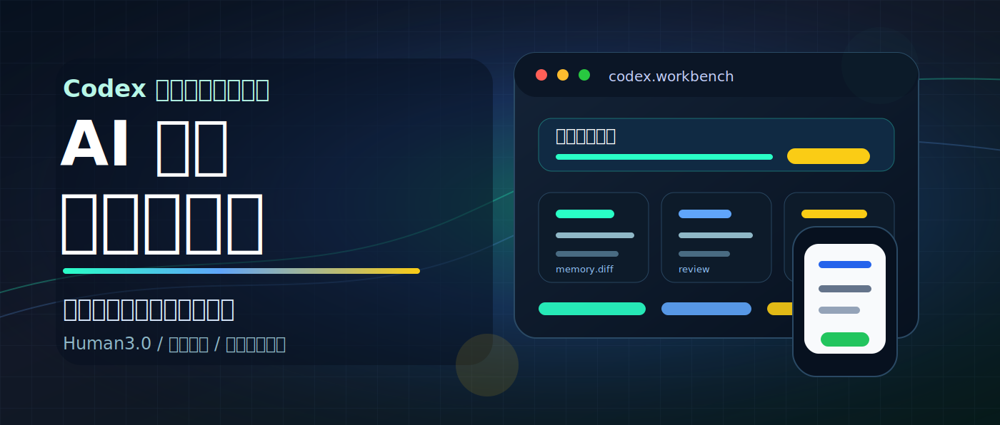

# 我以为 Codex 是写代码的，结果它开始接管我的工作台



## 发布定位

- 平台：公众号
- 账号：AI生命克劳德
- 类型：Human3.0 方法文 / 案例文
- 当前状态：可进入人工选封面 / 配图 / 最终出刊确认
- 素材来源：Jason Liu 的 `Codex-maxxing` 作为外部观察样本，不做翻译，不逐段复述

## 资料来源

1. Jason Liu: [Codex-maxxing](https://jxnl.github.io/blog/writing/2026/05/10/codex-maxxing/)。一手使用复盘，覆盖长期线程、语音输入、steering、memory、browser/computer use、remote control、heartbeats、goals、side panel。
2. OpenAI: [Work with Codex from anywhere](https://openai.com/index/work-with-codex-from-anywhere/)。2026-05-14 官方公告，说明 Codex 进入 ChatGPT mobile app，可从手机查看状态、批准命令、调整方向、查看输出和 diff。
3. OpenAI: [Running Codex safely at OpenAI](https://openai.com/index/running-codex-safely/)。2026-05-08 官方安全文章，说明 sandbox、approval、network policy、identity、telemetry 等治理边界。
4. OpenAI Help Center: [ChatGPT Enterprise & Edu release notes](https://help.openai.com/en/articles/10128477-chatgpt-enterprise-edu-release-notes)。2026-05-14 release notes，说明 remote access、access tokens、管理员开关和企业控制。

## 采证结论

- 是否足够支撑写作：足够
- 核心判断：Codex 的变化可以写成“个人工作台”问题，但必须保留边界。它仍然要求人保留判断权，同时让工作拥有持续线程、工具触点、审查界面和人工确认节点。
- 反向限制：
  - 长期线程可能带来更高成本，尤其是重新打开不在缓存中的长对话。
  - 远程控制、浏览器、电脑控制、连接器和本地文件权限都有配置门槛。
  - 越接近真实工作现场，越需要 sandbox、approval、日志和人工 review。

## 标题备选

1. 我以为 Codex 是写代码的，结果它开始接管我的工作台
2. 别再只把 Codex 当代码助手了
3. AI 的下一站，是你的个人工作台
4. 提示词之后，真正拉开差距的是工作系统
5. Codex 让我重新理解了“会用 AI”
6. 从聊天框到工作台，AI 正在换一个入口

## 摘要

Jason Liu 的 `Codex-maxxing` 真正值得普通人学习的，不在于把 Codex 用得多狠，而在于把反复出现的工作变成可持续运行的工作台。以公众号选题为例，你可以用 Codex 固定线程承接选题、用记忆文件沉淀栏目规则、用 Markdown 和封面文件形成可检查作品，再把关键判断留给自己。

## 正文

最近，Jason Liu 那篇 `Codex-maxxing` 在 AI 实践者圈子里被反复讨论。

很多人看完以后，第一反应是：他太会用 Codex 了。

但如果只停在羡慕，就浪费了这篇文章真正的价值。

Jason 文中最值得学的，是一组可以迁移的能力：长期线程、可审查记忆、真实文件协作、周期性回访、人工 review queue。

换句话说，他已经从一个个提问，走向了搭建一个能持续接住工作的系统。

这篇文章我想换一个写法。

不翻译 `Codex-maxxing`，也不做功能盘点。

我更想回答一个普通用户能立刻用上的问题：

**怎样把 Jason Liu 文中那套能力，落到自己的真实工作里？**

我用自己已经实践过的内容工作流来讲。

比如这篇文章本身：它没有从空白对话里一次写完，而是经过了文昌总控、定题、采证、立骨、起稿、诊文、出刊检查、封面 SVG、Human3.0 成书审查。最终留下的不只是一篇 Markdown 稿，还包括封面文件、`content_state`、素材库条目和后续可复用的流程。

这就是我理解的最小 Codex 工作台。

它不神秘，也不只属于工程师。

如果你有一个反复出现的任务，比如公众号选题、项目周报、读书笔记、家庭计划、产品调研，你都可以按同样方式改造。

### 1. 先选一个反复出现的任务，不要从宏大系统开始

Jason 文中有很多高级用法：Chief of Staff、OpenAI CLI、Twitter 监控、长期项目线程。

普通用户第一步不用照抄。

最好的起点，是选一个你每周都会做、但每次都要重新组织上下文的任务。

比如公众号选题。

过去的做法可能是这样：

打开 AI，问一句“帮我想几个选题”。

AI 给你十个标题。

你挑几个，复制到文档里，自己再改。

下次再来，又从头解释账号定位、读者是谁、什么题不能写、什么题适合沉淀。

这就是聊天框用法。

工作没有地方停留。

改成 Codex 工作台以后，第一步是给这个任务开一条固定工作线：

- 账号定位：AI生命克劳德
- 长期方向：Human3.0
- 常见平台：公众号、知乎、小红书
- 选题原则：不要追热点本身，要回到认知主权、结构杠杆、数字资产沉淀
- 交付物：Markdown 稿、封面、发布包、素材库条目

这条工作线以后可以继续承接新素材。

你下次不再问“帮我想几个选题”，而是说：

“按我的账号定位，判断这个素材能不能写，能写就走文昌流程。”

这一步的能力，是把一次性提问改成长期任务入口。

### 2. 把记忆写成文件，让 Codex 能继承，也能被你审查

Jason 文中很关键的一点，是他把 memory 放进 Obsidian vault 和 GitHub repo。

这个动作比“AI 记住我”重要得多。

因为对话里的记忆很难检查，文件里的记忆可以修改、比较、复用。

我的内容工作流里也做了类似的事。

仓库里有 `AGENTS.md`，约束默认工作方式和 Human3.0 方向；有 `content/CONTENT_STATE.md`，规定选题、采证、起稿、诊文、出刊之间怎么交接；还有 `todo.md`，记录每次内容流程推进到哪里。

这些文件就是工作台的长期记忆。

它们解决的是三个问题：

第一，Codex 不需要每次重新理解我是谁、账号写什么、哪些方向不能碰。

第二，流程不会只留在聊天记录里，下一次任务还可以继续复用。

第三，我可以随时看 diff，发现它有没有把错误偏好、错误判断、错误流程写进去。

普通用户也可以做一个低配版本。

不需要一上来建复杂仓库，只要先建三个文件：

- `profile.md`：写清楚你是谁、你长期做什么、你不做什么
- `workflow.md`：写清楚某个任务从输入到输出的步骤
- `review.md`：记录每次 AI 做得好和做错的地方

这就是你自己的可审查 memory。

一旦记忆变成文件，你就不再只是“让 AI 更懂我”，而是在积累自己的数字生产资料。

### 3. 让作品留在工作台里，而不是散落在聊天记录里

Jason 特别强调 side panel，因为它让 Markdown、CSV、PDF、slides、browser surface 都可以成为同一个协作对象。

这个点对内容创作者尤其重要。

很多人用 AI 写文章，最后只得到一段聊天回答。

但真正能沉淀的作品，应该变成文件。

我这次的 Codex 文章，最后留下了一组真实产物：

- `content/outputs/2026-05-18-codex-workbench-wechat.md`
- `content/assets/2026-05-18-codex-workbench-cover.svg`
- `human3.0_book/entries/2026-05-18-codex-workbench.md`
- `todo.md` 里的流程 review

这些文件有一个好处：它们可以被继续编辑、检查、引用、改写、卡片化、归档。

这就是工作台和聊天框的区别。

聊天框里，结果容易消失。

工作台里，结果会变成资产。

如果你是普通用户，可以先从最简单的规则开始：

凡是值得复用的输出，都不要只停在对话里。

文章放进 Markdown。

图片放进 assets。

流程放进 workflow。

判断放进 review。

素材放进 materials。

这样做的意义，是给未来的自己搭积木，而不是只完成一次 AI 对话。

### 4. 用 Automations 做周期回访，但先保留人工判断点

Jason 在原文里把周期性回访叫 Heartbeats。

放到 Codex App 的产品入口里，更准确的说法是 Automations：让某个线程按时间或触发条件回来，继续检查同一条工作线。

这个能力很容易被误解成“全自动帮我干活”。

我更建议把它理解成：让系统定期把该看的东西推到你面前。

还是拿公众号选题举例。

你可以设计这样一条流程：

- 每天或每周检查 AI / Agent / Human3.0 相关素材
- 把可写素材按账号定位筛一遍
- 给出 3 个候选选题
- 每个选题说明读者能获得什么能力
- 标出风险：是不是太热点、是不是太技术、是不是没有长期沉淀
- 最后停在“是否进入写作”这个节点，等你确认

这里最重要的是让流程跑到该停的地方，而不是追求一路自动到底。

我自己的文昌流程也遵循这个原则。

它可以自动推进定题、采证、起稿、诊文、出刊检查。

但到了标题、封面、个人案例、是否进入成书素材库这些节点，就必须停下来问人。

这才是可靠的工作台。

自动化负责把重复步骤推到前面，人的判断负责决定方向、质量和边界。

### 5. 给 Codex 一个 review queue，让它不替你宣布完成

Jason 的工作流里，还有一个容易被忽略的关键点：review。

长期线程、memory、Automations 都很强，但如果没有 review，它们也可能把错误放大。

所以 Codex 工作台必须有一个“待我确认”的队列。

我在内容流程里一般会保留几个确认点：

- 这个选题值不值得写
- 资料是否足够支撑判断
- 开头有没有读者获得感
- 标题会不会夸大
- 封面是否抓人
- 是否适合进入 Human3.0 成书素材库

这些都不应该让 AI 自己拍板。

这篇文章前面几轮修改，其实就是 review queue 的例子。

一开始，我把它写成了偏观点的判断文。

但在 review 时，我发现一个问题：读者获得感还不够。文章不能只告诉别人“Codex 很重要”，还要让读者知道自己可以用 Codex 完成什么工作。

于是开头改成“把一个反复出现的任务改造成最小 Codex 工作台”。

后来我又继续把方向往前推了一步：文章应该强调如何落地 Jason Liu 文中的能力，并结合我已经实践过的作品。

于是整篇文章从观点文改成方法文。

这个过程本身，就比“AI 一次生成终稿”更接近真实工作。

人的判断不断把方向拉正，Codex 负责承接修改、重组结构、落成文件。

这就是工作台协作。

### 6. 你可以照着搭一个最小版本

如果你想把 Jason Liu 文中的能力落到自己身上，不需要一步到位。

先搭一个最小版本就够了。

第一步，选一个反复任务。

比如：每周公众号选题。

第二步，开一个固定线程。

让 Codex 只服务这个任务，不要什么都聊。

第三步，写三个记忆文件。

`profile.md` 写你是谁，`workflow.md` 写任务步骤，`review.md` 写每次复盘。

第四步，让输出变成文件。

选题池、文章草稿、封面、发布包、素材库条目，都要有落点。

第五步，设置确认节点。

选题、标题、发布、归档这些地方必须让人判断。

做到这五步，你就已经有了一个低配但可用的 Codex 工作台。

它可能没有 Jason 那么复杂，也不一定马上用上所有 Automations、side panel、remote control。

但它已经完成了最重要的转变：

你不再只是向 AI 提问。

你开始用 AI 承接一条真实工作流。

这才是我觉得 `Codex-maxxing` 最值得普通人借鉴的地方。

真正拉开差距的，不是会不会用某个新功能。

是你能不能把自己的重复工作，改造成可以持续运行、可以审查、可以沉淀的个人工作系统。

## 结尾互动

如果让你先选一个任务来搭最小 Codex 工作台，你会选什么？公众号选题、周报、读书笔记、知识库整理，还是别的长期任务？欢迎留言说说你的场景。

## 朋友圈转发文案

Jason Liu 那篇 `Codex-maxxing` 真正值得学的，是一套工作台能力：固定线程、记忆文件、真实作品、周期回访、人工 review。文章里我用自己的文昌内容流拆了一遍，普通用户也可以照着把公众号选题、周报、读书笔记这类重复任务改造成最小 Codex 工作台。

## 封面建议

- 封面标题：AI 开始接管工作台
- 副标题：Codex 给我的一个新判断
- 画面方向：桌面工作台，中心是一块打开的任务面板，周围是文档、表格、浏览器、终端、手机远程控制，不要科幻机器人风。
- 当前封面文件：`content/assets/2026-05-18-codex-workbench-cover.svg`

## 话题标签

- AI工作流
- Codex
- Human3.0
- 认知主权
- 个人工作系统
- 数字生产资料

## 诊文结论

- 建议动作：可发布
- 主要原因：主论点清晰，来源足够，已经从外部素材转成作者自己的 Human3.0 方法文，没有停留在原文翻译或功能转述。
- 最小修改建议：
  1. 发布前肉眼确认封面裁切。
  2. 如需更强实操感，可在文末补一份“最小工作台模板”。
  3. 如需二次分发，可拆成小红书 6 页卡片：任务入口、记忆文件、作品落点、周期回访、人工 review、最小模板。

## 出刊检查

- 建议：可发布，发布前建议肉眼确认封面图在公众号后台的裁切效果
- 阻塞项：
  - [x] 需要确认最终标题。
  - [x] 需要确认封面方向，是否生成封面图。
  - [x] 需要确认是否追加你自己的 Codex 使用案例。
  - [x] 需要确认是否进入 Human3.0 成书素材审查。
  - [ ] 发布前肉眼确认封面裁切和公众号后台样式。

## Human3.0 成书审查

1. 结论：通过
2. 原始标题：我以为 Codex 是写代码的，结果它开始接管我的工作台
3. 书稿备注标题：从聊天框到工作台：AI 如何变成个人生产系统
4. 当前更接近的主线：Part 3《结构杠杆》，同时可关联 Part 5《个人数字生产资料》
5. 偏离点：当前版本已经从产品更新转向方法文，入书时可进一步弱化 Codex 名词，强化“重复工作为什么需要被系统化承接”。
6. 入书判断：可纳入书稿素材库
7. 最小纠偏建议：
   - 入书时减少外部功能枚举，保留 2-3 个关键事实即可。
   - 强化“文昌流程本身就是工作台案例”的段落。
   - 把安全边界收束成“人的判断权如何保留”。
8. 建议章节：Part 3《结构杠杆》中的“从聊天框到工作台”小节
9. 建议归档位置：Part 3

### 素材库存档条目

```md
## 2026-05-18｜我以为 Codex 是写代码的，结果它开始接管我的工作台
> 书稿备注标题：从聊天框到工作台：AI 如何变成个人生产系统

- 审查结论：通过
- 入书判断：可纳入书稿素材库
- 归属主线：Part 3《结构杠杆》
- 建议章节：Part 3《结构杠杆》中的“从聊天框到工作台”小节
- 偏离备注：当前版本已经回到个人工作系统、数字资产沉淀和人的判断权。
- 最小纠偏：入书时弱化 Codex 功能清单，强化“重复内容工作如何流程化、审查化、资产化”。
- 状态标签：#通过 #可入书 #结构杠杆 #个人工作系统 #数字生产资料
```

## content_state

```yaml
content_state:
  project:
    name: 文昌.skill
    account: AI生命克劳德
    long_term_goal: Human3.0
  request:
    raw_intent: 从 Codex-maxxing 素材出发，跑完整文昌内容流程，写成公众号方法文，不翻译原文
    current_stage: 发布前人工确认
    target_platforms: [公众号]
  audience:
    primary: AI 实践者、创作者、工程师、关注 Human3.0 的普通读者
    pain_points:
      - 仍把 AI 当一次性聊天框
      - 不知道 Codex 这类工具和普通问答模型的结构差异
      - 缺少个人工作系统和数字资产沉淀意识
  topic:
    source: 外部文章和官方产品更新
    core_angle: 普通用户如何把 Jason Liu 文中的 Codex 能力落到自己的真实工作里，搭建最小个人工作台
    selected_title: 我以为 Codex 是写代码的，结果它开始接管我的工作台
    why_now: 2026-05-10 外部实践复盘和 2026-05-14 OpenAI remote access 公告共同指向 Codex 工作台化
    long_term_value: 可沉淀为 Human3.0 中个人工作系统、认知主权和数字生产资料案例
  research:
    sources:
      - Jason Liu Codex-maxxing
      - OpenAI Work with Codex from anywhere
      - OpenAI Running Codex safely at OpenAI
      - OpenAI Help Center release notes
    key_facts:
      - Codex 被用于 slides、PDF、spreadsheet、index.html 等非代码 artifact
      - Codex mobile preview 支持远程查看线程、审批命令、调整方向和查看输出
      - Remote SSH、Hooks、access tokens 和企业控制说明 Codex 正在进入长期工作环境
      - Sandbox、approval、network policy、identity 和 telemetry 是工作台化后的安全边界
    contrarian_points:
      - 长线程可能增加成本
      - 工作台化依赖本地环境、权限、连接器和配置
      - Automations 这类自动推进必须保留人工确认和审查
    contradictions:
      - 越自动化，越需要明确人的判断权和审计边界
    confidence: High
  draft:
    status: ready_for_publish
    file: content/outputs/2026-05-18-codex-workbench-wechat.md
    summary: 已形成公众号方法文，强调如何用固定线程、记忆文件、真实作品和人工 review 搭建最小 Codex 工作台
  diagnosis:
    recommendation: 可发布
    key_issues:
      - 发布前需要肉眼确认封面裁切
      - 可选补充最小工作台模板
    minimum_fixes:
      - 发布前确认封面裁切
      - 如需二次分发，拆成小红书卡片
  publish_assets:
    title: 我以为 Codex 是写代码的，结果它开始接管我的工作台
    summary: Jason Liu 的 Codex-maxxing 真正值得普通人学习的，是把重复工作改造成可持续运行、可审查、可沉淀的个人工作台。
    cover_text: AI 开始接管工作台
    tags: [AI工作流, Codex, Human3.0, 认知主权, 个人工作系统, 数字生产资料]
    images:
      - content/assets/2026-05-18-codex-workbench-cover.svg
    share_copy: Jason Liu 的 Codex-maxxing 真正值得学的，是把重复任务改造成最小 Codex 工作台：固定线程、记忆文件、真实作品、周期回访、人工 review。
    comment_prompt: 如果让你先选一个任务来搭最小 Codex 工作台，你会选公众号选题、周报、读书笔记，还是别的长期任务？
  distribution:
    primary_platform: 公众号
    secondary_platforms: [知乎, 小红书]
    card_skill: wechat-to-cards
    image_skill: imagegen 或 md-img-r2
  archive:
    should_review_for_book: false
    material_type: Human3.0 案例文
    suggested_bucket: Part 3《结构杠杆》 / 个人工作系统 / 数字生产资料
    review_result: 通过
  next_step:
    skill: 发布前肉眼检查 / 可选 wechat-to-cards
    reason: 文稿、封面、个人案例和成书审查已补齐
    user_decision_needed: false
  handoff:
    from_stage: 归档
    to_stage: 发布前确认
    accepted_inputs:
      - 当前正文
      - publish_assets
      - archive
    ignored_context:
      - 逐段翻译原文
      - 纯功能清单写法
      - 全自动替人决策叙事
    stop_condition: 发布前只需肉眼确认公众号后台裁切效果
```
