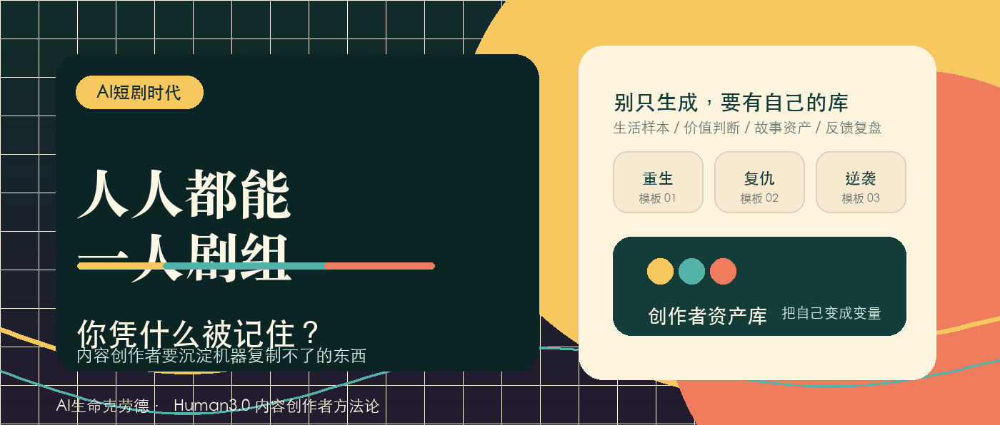

# 人人都能用 AI 做短剧，谁还能被观众记住？



## 发布定位

- 主题：AI 短剧越多，创作者越要有自己的不可替代性
- 目标平台：公众号
- 账号：AI生命克劳德
- 类型：Human3.0 / 内容创作者方法论 / AI 时代创作系统
- 目标读者：短剧、漫剧、短视频、公众号、小红书、IP 内容创作者
- 核心判断：AI 会继续降低生产门槛，但门槛降低后，真正稀缺的是创作者自己的观察、判断、表达、资产和审美责任。
- 长期主线：Human3.0 / 认知主权 / 从消费者到生产者 / 数字生产资料沉淀

## 采证结论

- 是否足够支撑写作：足够。
- 主要原因：近期官方和行业材料都在指向同一个变化：微短剧和 AI 视听内容的“量”已经不是问题，下一阶段竞争会转向精品化、合规、差异化和人的创造性投入。版权和标识规则也在把“人的参与程度”变成创作者必须面对的底层问题。

## 来源清单

1. 国家广播电视总局《国家广播电视总局召开“微短剧精品创作传播计划”工作部署推进会》：https://www.nrta.gov.cn/art/2026/5/14/art_112_73305.html  
   可用价值：支撑 2026 年微短剧行业从数量扩张转向精品扶持、现实题材、地域特色、真人微短剧投入的政策方向。
2. 国家广播电视总局转载人民日报《AIGC浪潮下的微短剧——在“量”的基座上筑起“质”的高峰》：https://www.nrta.gov.cn/art/2025/12/23/art_3731_72179.html  
   可用价值：支撑 AIGC 带来效率革命，同时加剧题材跟风、情节同质、算法强化模板的判断。
3. 澎湃新闻繁星指数《微短剧周报(4.27-5.10)》：https://m.thepaper.cn/newsDetail_forward_33169716  
   可用价值：转述 2026 年第一季度《微短剧创作指引》，提到 AI 微短剧供给占比、真人剧情感表达优势、一站式 AI 短剧平台等行业动态。
4. 中央网信办专家解读《给人工智能生成合成内容贴上数字标识》：https://www.cac.gov.cn/2025-09/05/c_1758792061408012.htm  
   可用价值：支撑 AI 生成内容标识制度已经进入正式实施阶段，内容生产者需要承担声明和可信传播责任。
5. 全国标准信息公共服务平台 GB 45438-2025《网络安全技术 人工智能生成合成内容标识方法》：https://openstd.samr.gov.cn/bzgk/std/newGbInfo?hcno=F32EA2A561F1886CD8D606513512D547&refer=outter  
   可用价值：支撑 AI 生成合成内容标识方法已经发布并于 2025-09-01 实施。
6. U.S. Copyright Office《Copyright Office Releases Part 2 of Artificial Intelligence Report》：https://www.copyright.gov/newsnet/2025/1060.html  
   可用价值：支撑“仅提供提示词通常不足以形成版权意义上的人类作者性，AI 辅助作品是否受保护取决于可感知的人类创造性贡献”。
7. Doshi & Hauser《Generative artificial intelligence enhances creativity but reduces the diversity of novel content》：https://arxiv.org/abs/2312.00506  
   可用价值：支撑 AI 可以提高个体创意表现，但可能降低集体产出的多样性。
8. Wan & Kalman《Diverse AI Personas Can Mitigate the Homogenization Effect in Human-AI Collaborative Ideation》：https://arxiv.org/abs/2504.13868  
   可用价值：提供反向边界：同质化不必然来自 AI 本身，输入多样性和协作设计可以缓解同质化。

## 关键事实

- 广电总局 2026 年推进“微短剧精品创作传播计划”，目标是全年打造千部优秀微短剧，并引导现实生活、中华优秀传统文化、地域特色、国际传播等方向。
- 6 家重点平台将投入至少 60 亿元支持优秀真人微短剧创作传播，说明行业并未简单走向“全 AI 替代真人”，精品、真人情感和内容质量仍在被重新强化。
- 人民日报文章指出，AIGC 极大压缩了剧本、分镜、渲染、合成等流程，但也带来相似海报、雷同片名、模板叙事和算法强化同质内容的风险。
- 繁星指数转述 2026 年第一季度《微短剧创作指引》称，全行业上线微短剧约 12.8 万部，其中 AI 微短剧占比超 95%；同时强调真人微短剧仍有市场需求与情感表达优势。
- 《人工智能生成合成内容标识办法》和 GB 45438-2025 已于 2025 年 9 月 1 日实施，AI 生成合成内容的标识、声明、传播责任成为内容创作的合规变量。
- 美国版权局 2025 年报告认为，生成式 AI 输出只有在人类作者决定了足够表达性元素时才可能受版权保护，仅提供提示词本身通常不够。
- Doshi & Hauser 的实验显示，GenAI 帮助下的故事更容易被评价为写得更好、更有趣，但这些故事彼此之间也更相似。
- Wan & Kalman 的研究进一步提示，通过多样化 AI personas 和输入设计，可以缓解人机协作中的同质化问题。

## 反向数据 / 限制条件

- AI 短剧井喷不等于低质量必然井喷。技术降低门槛也可能让普通人从刷剧人变成产剧人，这是 Human3.0 视角里积极的一面。
- 同质化本来就存在于传统短剧行业，霸总、重生、复仇、穿越等模板长期被复制。AI 只是把复制速度放大。
- 版权规则不能简化成“AI 作品一律没有版权”。更准确的说法是：人类创造性投入越可见，权利归属和作品独创性越有讨论空间。
- “不可替代性”不能写成创作者的自我感动。市场仍然会奖励效率、爽点、分发和数据反馈。人的独特性必须落到可持续产出的系统里。

## 立骨

### 一句话主旨

AI 短剧越多，创作者越不能只做“会生成的人”，而要把自己的生活经验、价值判断、叙事审美和素材系统变成机器复制不了的生产资料。

### 结构

1. 开场：AI 短剧、AI 漫剧井喷，最先被淘汰的会是没有个人判断的流水线创作者。
2. 事实：行业从“量产”转向“精品化”，AI 同时带来效率和同质化。
3. 判断：创作者的护城河从制作能力迁移到不可替代性。
4. 四个不可替代：生活样本、价值判断、表达风格、资产系统。
5. 干货：创作者可以建立四个库和一套 AI 协作流程。
6. 结尾：AI 不会自动让你成为创作者，它只会放大你已经沉淀出来的东西。

## 标题备选

1. AI 短剧越多，创作者越要有自己的不可替代性
2. AI 漫剧井喷后，创作者真正稀缺的是什么？
3. 当人人都能一人一剧组，你凭什么被记住？
4. AI 能批量造剧，但造不出你的生活经验
5. 短剧越卷，创作者越不能只会生成
6. AI 短剧时代，内容创作者的新护城河
7. 别急着批量生成，先问你有什么机器没有
8. AI 让短剧变便宜，也让“像别人”变得更贵
9. 内容创作者的下一课：把自己变成不可复制的素材库
10. Human3.0：AI 短剧时代，创作者要从产出者升级为资产拥有者

## 补充标题备选

1. AI 短剧开始井喷后，创作者最该补的不是工具
2. 当 AI 能批量造剧，内容创作者还剩什么？
3. 人人都能用 AI 做短剧，谁还能被观众记住？
4. AI 让短剧变便宜，也让创作者的“自己”更值钱
5. 短剧进入 AI 量产时代，创作者要先守住这 4 件事
6. AI 短剧越卷，越考验创作者有没有自己的系统
7. 内容创作者别只学 AI 生成，要开始沉淀自己的资产
8. AI 漫剧爆发后，我更担心没有“人味”的创作
9. 会生成不稀缺，有自己才稀缺
10. AI 短剧时代，真正值钱的是机器复制不了的东西

## 推荐标题

人人都能用 AI 做短剧，谁还能被观众记住？

## 摘要

AI 可以把短剧生产变快，但不能替你拥有生活经验、价值判断和长期资产。创作者真正要补的，是不可替代性。

## 公众号正文

最近 AI 短剧、AI 漫剧很热。

热到什么程度？

以前做一部短剧，至少要有剧本、演员、拍摄、场景、后期、投放。现在很多人打开工具，输入一句“重生复仇，女主逆袭，男主追妻火葬场”，几分钟就能拿到人物图、分镜、台词、镜头运动，甚至一整段视频。

短剧创作者以前比的是谁能更快拍出来。

现在开始变成：谁能更快生成出来。

这当然很刺激。

一个人，也许真的可以越来越接近“一人剧组”。一个小团队，也许能做过去几十个人才能做的产能。对普通创作者来说，这不是坏事。它降低了门槛，让很多原本没有预算、没有团队、没有拍摄资源的人，也能把脑子里的故事变成画面。

但我觉得，真正值得警惕的地方也在这里。

当所有人都能快速生成短剧，创作者之间的差距不会消失，反而会被重新拉开。

以前差距可能来自设备、演员、场地、后期。

以后差距会越来越来自一个更残酷的问题：

你这个人，到底有什么是 AI 不能从热门模板里直接复制出来的？

这篇文章写给内容创作者。

这篇不会劝你远离 AI，也不批判 AI 短剧。

恰恰相反，AI 一定会成为内容生产的基础工具。真正的问题是：你把它当成“生成按钮”，还是把它放进自己的创作系统。

读完这篇，你至少可以拿走三件东西：

第一，为什么 AI 短剧越多，同质化会越明显。

第二，创作者真正的不可替代性到底是什么。

第三，怎么把这种不可替代性沉淀成自己的素材库、判断库和创作流程。

### 01 产能越便宜，模板越容易泛滥

AI 对短剧最大的改变，是让产能变便宜。

剧本可以批量生成。

人物可以批量生成。

分镜可以批量生成。

海报可以批量生成。

甚至连“第 3 秒必须反转，第 8 秒必须钩住，第 30 秒必须付费”这种节奏，也可以被工具总结成模板。

这会带来一个很直接的结果：

市面上会出现越来越多“看起来什么都有，但就是记不住”的作品。

它们有冲突。

有反转。

有爽点。

有奇观。

有一句很像爆款标题的片名。

但你看完之后，只觉得自己又刷过了一条差不多的东西。

这不是想象。

国家广播电视总局转载的人民日报文章里，已经明确提到 AIGC 进入微短剧后，会带来题材跟风、情节同质化、相似海报、雷同片名的问题。更麻烦的是，这会和算法形成循环：热门模板被识别，AI 辅助批量生成，内容生态继续同质，算法再强化这类内容曝光。

这句话翻译成创作者能听懂的话就是：

如果你只追着模板跑，AI 会让你跑得更快，但也会让你更快变成别人。

短期看，你可能多产了。

长期看，你可能更不可识别了。

内容行业最怕的不是效率低。

最怕的是你很勤奋地生产了一堆没有你自己的东西。

### 02 AI 不会杀死创作者，但会淘汰“没有自己”的创作者

我不太喜欢“AI 会不会替代创作者”这个问题。

它太粗了。

创作者不是一个统一工种。有人只负责套模板，有人负责找选题，有人负责写人物，有人负责做世界观，有人负责拍摄，有人负责运营账号，有人负责把生活经验变成故事。

AI 替代的不是“创作者”这个身份。

它首先替代的是创作链条里那些可模板化、可重复、可批量执行的部分。

比如：

- 套一个反转结构。
- 改写一段狗血台词。
- 生成十个类似标题。
- 把男频爽文改成女频爽剧。
- 把一个人物设定换皮成古风、赛博、玄幻。

这些事情会越来越便宜。

便宜到最后，它们不再构成你的核心竞争力。

那什么会变贵？

人的真实生活经验会变贵。

人的价值判断会变贵。

人的审美取舍会变贵。

人的长期 IP 资产会变贵。

人的信任关系会变贵。

这也是为什么广电总局在 2026 年推进“微短剧精品创作传播计划”，会强调现实生活、中华优秀传统文化、地域特色、精品创作。平台也在继续投入真人微短剧。

这说明行业并没有简单走向“全 AI 替代”。

相反，当 AI 让产能变得过剩，市场会重新寻找那些更像人的东西：真实的生活质感、稳定的表达风格、可信的创作主体、能持续展开的故事资产。

所以，AI 短剧越多，创作者越要问自己一个问题：

我是在用 AI 放大自己，还是在用 AI 抹掉自己？

### 03 创作者的不可替代性，不是“我有灵魂”这么空

很多人一谈创作者不可替代性，就容易讲得很玄。

比如“人有温度”“人有灵魂”“人有情感”。

这些话当然没错，但对创作者没什么帮助。

因为它们太空了。

真正有用的不可替代性，必须能落到生产系统里。

我建议内容创作者把它拆成四件事。

第一，生活样本。

你见过什么样的人，经历过什么样的关系，观察过什么样的细节。

AI 可以生成“中年男人失业后逆袭”的剧情，但它不知道一个真实中年男人在公司楼下抽烟时，为什么不敢接妻子的电话。

AI 可以生成“婆媳冲突”，但它不知道饭桌上真正刺人的，常常是夹菜时那种故意绕开的沉默。

这些东西来自生活，不来自模板。

第二，价值判断。

你相信什么，反对什么，同情谁，警惕什么。

短剧不是只有爽点。所有爽点背后都有价值排序。

你写复仇，是为了让观众获得情绪释放，还是在鼓励所有关系都用伤害解决？

你写逆袭，是让普通人看到希望，还是只是在复制“有钱就赢”的单一想象？

你写女性成长，是让人物真正拥有选择权，还是给她换一个更有钱的男主？

AI 可以帮你写冲突，但它不会自动替你承担价值判断。

第三，表达风格。

为什么观众看完一段内容，会觉得“这像你写的”？

原因常常在于你的视角稳定。

你总能从一个普通热点里看见结构变化。

你总能在一个技术新闻里问普通人会被怎样影响。

你总能把复杂工具翻译成一个可执行的方法。

这就是风格。

风格不能只靠口头禅、固定句式或故意制造怪话。

风格是你的判断长期重复出现后，读者形成的识别感。

第四，资产系统。

如果你每次创作都从空白页开始，你就会越来越依赖 AI。

如果你有自己的角色库、故事库、选题库、冲突库、金句库、失败案例库、用户反馈库，AI 就会变成你的助理。

区别在这里。

没有资产的人，用 AI 只能生成一条内容。

有资产的人，用 AI 可以放大一套系统。

### 04 给创作者的四个库：别只生成，要沉淀

如果你是内容创作者，我建议你从今天开始建四个库。

不用复杂工具，最简单的文档、Notion、飞书、Obsidian、Git 仓库都可以。

工具不关键，持续沉淀才关键。

#### 1. 生活样本库

记录你真实见过的人和场景。

格式可以很简单：

```md
人物：县城理发店老板娘
场景：晚上 11 点还在给顾客吹头发
冲突：她很想让女儿离开县城，但女儿想回来开店
细节：她每次讲“外面机会多”，手上却一直在整理店里的旧毛巾
可转化题材：母女关系 / 小城女性 / 代际选择
```

短剧真正稀缺的，是能让观众觉得“我见过这种人”的细节。

#### 2. 判断原则库

记录你写内容时坚持什么、不碰什么。

例如：

```md
我不写为了爽而羞辱弱者的桥段。
我不把女性成长简化成换一个更强的男人。
我不把底层困境写成个人不努力。
我允许人物犯错，但要给人物真实动机。
我优先写选择的代价，而不只写胜利的结果。
```

这个库决定你的作品边界。

没有边界的人，最容易被热点和模板牵着走。

#### 3. 故事资产库

记录可复用的人物、关系、世界观和冲突模型。

例如：

```md
人物卡：前短剧编剧，转行做 AI 漫剧审核
核心矛盾：她每天审核几百条 AI 生成剧情，逐渐发现所有角色都在重复同一种命运
关系张力：她的前搭档靠 AI 爆款发财，她坚持原创但收入下降
主题：当创作变成流水线，人还能不能保住自己的判断
```

这类资产积累多了，你就不会每次都问 AI：“帮我想一个故事。”

你会开始问：

“请基于我的人物库，把这个人物放进新的冲突里，生成三个不同方向，但不要破坏她的核心动机。”

这时，AI 才真正变成你的工具。

#### 4. 反馈复盘库

记录哪些内容被喜欢，哪些被划走，哪些评论真正击中了你。

不要只看播放量。

要看观众为什么停留。

是标题？

是人设？

是情绪？

是某句台词？

是某个细节让他们觉得真实？

复盘的目的不在迎合观众，重点是理解你和观众之间真正建立连接的地方。

连接点，才是创作者长期最值钱的资产。

### 05 一套更健康的 AI 创作流程

如果你做 AI 短剧或 AI 漫剧，不建议一上来就让 AI “直接生成完整剧本”。

这很快，但很容易把你带进模板里。

更好的流程是：

第一步，人先定主题。

这条内容到底想讨论什么？

是阶层逆袭、亲密关系、代际冲突、职业困境，还是普通人被系统裹挟后的选择？

第二步，人先给素材。

从你的生活样本库、故事资产库里挑素材。

不要让 AI 只吃热门套路。

第三步，AI 给多个结构。

让 AI 生成 3 到 5 个版本：爽剧版、现实版、荒诞版、反类型版、温情版。

不要只要一个答案。

多个方向之间的差异，能逼你做判断。

第四步，人做取舍。

这一版是不是太像已有爆款？

这个人物是不是只有功能，没有动机？

这个反转是不是为了反转而反转？

这个结尾是不是符合我的价值边界？

第五步，AI 执行细节。

确定方向后，再让 AI 写分场、对白、镜头、海报、短视频切片。

第六步，人做最终审美和责任检查。

版权风险有没有？

AI 生成标识有没有？

人物有没有被工具写成纸片？

价值观有没有为了流量滑向低俗、猎奇、羞辱和仇恨？

这个流程看起来比“一键生成”慢。

但它能让作品保留你的判断。

更重要的是，它会沉淀资产。

每一次创作之后，你都能把好用的人物、冲突、失败教训、观众反馈放回自己的系统里。

下一次，你不是从零开始。

你是在自己的资产上继续生长。

### 06 版权和合规，本质上也在提醒创作者：人要留下痕迹

AI 内容的版权和合规问题，会越来越重要。

中国的 AI 生成合成内容标识规则已经实施。美国版权局也在 2025 年明确过一个方向：AI 辅助创作并不天然排除版权保护，但关键要看人类作者是否决定了足够的表达性元素；仅仅提供提示词，通常不够。

不同法域规则不完全一样，具体项目当然要找专业法务判断。

但对创作者来说，这里有一个很朴素的提醒：

你的创作过程里，要留下人的痕迹。

不是为了装作自己没用 AI。

真正有价值的创作，本来就应该能看见人的选择。

你为什么选这个人物？

为什么删掉那个桥段？

为什么不用最热的爽点？

为什么保留一个不那么讨好算法、但更贴近人物的结尾？

这些选择，构成作品的作者性。

如果一个作品从主题、人物、结构、台词、分镜、审美到发布文案，全都只是平台热点和模型默认值的拼接，那它即使能短期获得流量，也很难成为你的长期资产。

### 07 创作者要从“内容产出者”升级为“资产拥有者”

AI 短剧越多，我越觉得内容创作者要完成一次身份升级。

不要只做内容产出者。

要做资产拥有者。

产出者关心的是：今天发什么？

资产拥有者关心的是：我有没有积累出一个别人拿不走的系统？

产出者关心的是：这个工具能不能帮我快点生成？

资产拥有者关心的是：这个工具能不能帮我沉淀角色、世界观、选题、经验和用户关系？

产出者关心的是：这条能不能爆？

资产拥有者关心的是：这条内容能不能让读者更清楚地识别我？

这就是 Human3.0 里很核心的一件事：

人在 AI 时代不能只做消费者，也不能只做工具操作者。

你要把自己的判断、经验、审美和流程，沉淀成数字生产资料。

AI 会让内容越来越多。

也会让普通内容越来越便宜。

但它同时会放大那些真正有系统的人。

你有生活样本，AI 可以帮你展开。

你有价值判断，AI 可以帮你测试不同表达。

你有故事资产，AI 可以帮你组合和迭代。

你有复盘机制，AI 可以帮你更快发现规律。

如果你什么都没有，AI 给你的大概率就是全网都见过的东西。

### 结尾

我并不担心 AI 短剧变多。

创作门槛降低，本身是一件好事。

我担心的是，很多创作者误以为“会生成”就等于“会创作”。

真正的创作不是按下按钮。

真正的创作，是你带着自己的生活经验、价值判断、审美边界和长期资产，去使用一个更强的工具。

以后短剧会越来越多，漫剧会越来越多，AI 生成的视频会越来越多。

观众也会越来越快地划走那些“看起来很完整，但没有人味”的内容。

所以，创作者接下来最重要的课题，不是追上每一个新工具。

你更该问自己：

如果 AI 把所有套路都免费送给所有人，我还剩下什么？

那个答案，才是你的不可替代性。

## 结尾互动引导

1. 你觉得 AI 短剧时代，创作者最稀缺的能力是什么？
2. 如果你也在做内容，可以从今天开始建一个“生活样本库”，先记录 10 个你真实见过的人。
3. 想继续看 AI 时代内容创作者的方法论，可以关注这个系列：从工具使用，走向个人创作系统。

## 配图建议

1. 封面图：一侧是密密麻麻的 AI 短剧生成窗口，一侧是创作者手里的素材卡片，标题突出“不可替代性”。
2. 正文图 1：AI 短剧生产链路：Prompt -> 人物 -> 分镜 -> 视频 -> 投放。
3. 正文图 2：创作者不可替代性四象限：生活样本、价值判断、表达风格、资产系统。
4. 正文图 3：AI 创作流程：人定主题 -> 人给素材 -> AI 出结构 -> 人做取舍 -> AI 执行 -> 人验收复盘。

## 朋友圈转发文案

AI 短剧越多，越能看出一个创作者到底有没有自己的东西。

工具会让产能变便宜，但生活经验、价值判断、表达风格和长期资产不会自动生成。

这篇写给内容创作者：不要只学会生成，要把自己沉淀成机器复制不了的素材库和创作系统。

## 后续可承接选题

1. AI 时代，内容创作者如何建立自己的素材库？
2. 为什么 AI 写出来的故事总是差一口气？
3. 从爆款模板到个人 IP：短剧创作者的长期路线
4. AI 漫剧创作者如何做版权和标识自检？
5. 内容创作者如何把观众反馈沉淀成资产？

## 诊文

### 诊断结论

- 建议动作：轻改后发布。
- 主要原因：主题清晰，读者对象明确，事实支撑足够，方法论有获得感。当前稿件已经适合公众号发布，但如果要增强“活人感”，建议在发布前补入 1 个用户自己的真实观察或创作案例，例如最近看到的某类 AI 漫剧同质化现象、自己如何用文昌流程处理选题、或一个真实创作者朋友的案例。

### 核心问题

1. 当前正文偏方法论，真实个人场景还可以更强。
2. 对“版权”只做原则性提醒，没有展开具体合规清单，适合后续单独成篇。
3. 标题稳，但爆点不算特别强；如果追求点击率，可考虑用“当人人都能一人一剧组，你凭什么被记住？”作为副封面标题。

### 最小修改建议

1. 在开头或第 03 节补一个真实观察：比如“我最近连续刷到几条 AI 漫剧，人物脸不一样，但命运几乎一样”。
2. 封面建议使用强冲突文案：`人人都能一人剧组，你凭什么被记住？`
3. 发布前把“版权和合规”段落加一个提示：非法律意见，具体商业项目需法务确认。

### 平台适配

- 公众号：适合，属于观点 + 干货 + 方法论型文章。
- 知乎：可改成问题《AI 短剧井喷，内容创作者还有不可替代性吗？》。
- 小红书：适合拆成 8 页图文卡，标题可偏“内容创作者别只会用 AI 生成”。

### 长期资产判断

- 是否适合沉淀：适合。
- 可沉淀为：Human3.0 内容创作者方法论 / AI 时代数字生产资料案例。
- 是否建议进入 Human3.0 成书审查：建议，但需用户确认。

## 出刊检查

### 发布结论

- 建议：可发布。
- 阻塞项：暂无；发布前建议人工预览公众号后台封面裁切。

### 必补项

- [x] 确认最终标题：`人人都能用 AI 做短剧，谁还能被观众记住？`
- [x] 确认封面文案：`人人都能一人剧组，你凭什么被记住？`
- [x] 用户确认本轮不补入作者个人真实观察案例。
- [x] 已生成公众号封面图。
- [x] 用户确认本轮不继续做 Human3.0 成书审查。

### 建议优化

- 正文标题用问题版，封面文案用冲突版。
- 如果补个人案例，建议放在第 01 节之后，不破坏全文结构。
- 版权段落保持提醒尺度，不写成法律结论。
- 发布前在公众号后台确认封面裁切，避免右侧资产库细节被裁掉。

### 平台发布包

- 标题：人人都能用 AI 做短剧，谁还能被观众记住？
- 封面文案：人人都能一人剧组，你凭什么被记住？
- 封面文件：`content/assets/2026-05-22-ai-short-drama-creator-irreplaceability/png/wechat-cover.png`
- 摘要/导语：AI 可以把短剧生产变快，但不能替你拥有生活经验、价值判断和长期资产。创作者真正要补的，是不可替代性。
- 标签/话题：AI短剧、AI漫剧、内容创作、Human3.0、数字生产资料、创作者方法论
- 转发文案：AI 短剧越多，越能看出一个创作者到底有没有自己的东西。工具会让产能变便宜，但生活经验、价值判断、表达风格和长期资产不会自动生成。
- 评论区引导：你觉得 AI 短剧时代，创作者最稀缺的能力是什么？

## content_state

```yaml
content_state:
  request:
    raw_intent: "请使用文昌总控，从主题“AI 短剧越多，创作者越要有自己的不可替代性”开始走后面的内容流程，遇到需要我判断的节点再停下来问我。目标平台：公众号；账号：AI生命克劳德；要求：有趣、引发思考、并且要有干货，让人有获得感。"
    current_stage: "出刊"
    target_platforms:
      - "公众号"
    account: "AI生命克劳德"
  topic:
    title: "人人都能用 AI 做短剧，谁还能被观众记住？"
    audience: "内容创作者"
    angle: "AI 产能过剩后，创作者要把生活经验、价值判断、表达风格和长期资产变成不可替代性。"
  research:
    confidence: "High"
    sources:
      - "国家广播电视总局：微短剧精品创作传播计划"
      - "国家广播电视总局转载人民日报：AIGC浪潮下的微短剧"
      - "澎湃新闻繁星指数：2026 Q1 微短剧创作指引周报"
      - "中央网信办：AI生成合成内容标识解读"
      - "GB 45438-2025 AI生成合成内容标识方法"
      - "U.S. Copyright Office AI report Part 2"
      - "Doshi & Hauser 2024"
      - "Wan & Kalman 2026"
    key_facts:
      - "微短剧行业正在从数量扩张进入精品化、现实题材、地域特色和合规治理阶段。"
      - "AIGC 降低短剧生产门槛，也会放大题材跟风、模板叙事和同质内容循环。"
      - "AI 生成合成内容标识制度已经实施，内容生产者需要承担声明和可信传播责任。"
      - "AI 辅助创作的版权判断越来越关注可感知的人类创造性贡献。"
      - "研究显示 GenAI 可能提高个体创意表现，但也可能降低集体内容多样性。"
    contrarian_points:
      - "AI 降低创作门槛本身有积极价值，不能简单写成威胁。"
      - "同质化本来就存在于传统短剧行业，AI 只是放大复制速度。"
      - "版权规则不是 AI 作品一律没有版权，关键在人的创造性投入和具体法域。"
      - "不可替代性必须落成创作资产和流程，否则容易变成空洞自我感动。"
  draft:
    status: "drafted"
    file: "content/outputs/2026-05-22-ai-short-drama-creator-irreplaceability-wechat.md"
    summary: "已完成公众号草稿、标题、摘要、转发文案、配图建议、诊文和出刊检查。"
  diagnosis:
    recommendation: "轻改后发布"
    key_issues:
      - "最终标题已确认。"
      - "公众号封面已生成，发布前需人工预览后台裁切。"
      - "用户本轮不补个人案例，不做 Human3.0 成书审查。"
    minimum_fixes:
      - "发布前人工预览公众号后台封面裁切。"
  publish_assets:
    title: "人人都能用 AI 做短剧，谁还能被观众记住？"
    summary: "AI 可以把短剧生产变快，但不能替你拥有生活经验、价值判断和长期资产。创作者真正要补的，是不可替代性。"
    cover_text: "人人都能一人剧组，你凭什么被记住？"
    tags:
      - "AI短剧"
      - "AI漫剧"
      - "内容创作"
      - "Human3.0"
      - "数字生产资料"
      - "创作者方法论"
    images: []
    cover_image: "content/assets/2026-05-22-ai-short-drama-creator-irreplaceability/png/wechat-cover.png"
    share_copy: "AI 短剧越多，越能看出一个创作者到底有没有自己的东西。工具会让产能变便宜，但生活经验、价值判断、表达风格和长期资产不会自动生成。"
    comment_prompt: "你觉得 AI 短剧时代，创作者最稀缺的能力是什么？"
  distribution:
    primary_platform: "公众号"
    secondary_platforms: []
    card_skill: null
    image_skill: null
  archive:
    should_review_for_book: false
    material_type: "Human3.0 内容创作者方法论"
    suggested_bucket: "数字生产资料 / 从消费者到生产者"
  next_step:
    skill: "publish-check"
    reason: "标题和封面已确认并生成；下一步仅需发布前人工预览公众号后台裁切。"
    user_decision_needed: true
  handoff:
    from_stage: "出刊"
    to_stage: "发布前人工确认"
    accepted_inputs:
      - "主题"
      - "目标平台"
      - "账号"
      - "写作要求"
      - "近期事实采证"
      - "公众号草稿"
      - "公众号封面"
    ignored_context: []
    stop_condition: "发布前人工预览封面裁切和公众号后台排版。"
```
